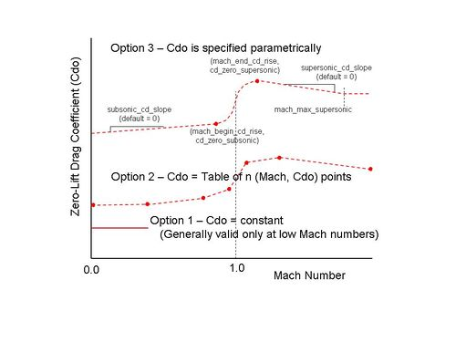
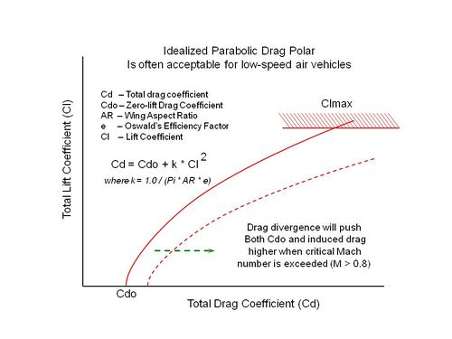

.. ****************************************************************************
.. CUI
..
.. The Advanced Framework for Simulation, Integration, and Modeling (AFSIM)
..
.. The use, dissemination or disclosure of data in this file is subject to
.. limitation or restriction. See accompanying README and LICENSE for details.
.. ****************************************************************************

aero
----

.. command:: aero <new-type-name> <base-type-name> ... end_aero
   :block:

*<new-type-name>*
   Name of the new aero type to be created.  This must be unique among all the aero types.

*<base-type-name>*
   Name of an existing aero type, WSF_AERO, whose definition will be used as the initial definition of the new type.

.. parsed-literal::

   aero *<new-type-name>* *<base-type-name>*
      debug_
      reference_area_  <area-value>
      aspect_ratio_  <float-value>
      oswalds_factor_  <float-value>
      cl_max_  <float-value>
      mach_and_cd_  <float-value> <float-value>
      cd_zero_subsonic_  <float-value>
      mach_begin_cd_rise_  <float-value>
      cd_zero_supersonic_  <float-value>
      mach_end_cd_rise_  <float-value>
      subsonic_cd_slope_  <float-value>
      supersonic_cd_slope_  <float-value>
      mach_max_supersonic_  <float-value>
   end_aero

Overview
========

The aero block allows the user to specify simplistic aerodynamic drag and lift properties to approximate forces
acting upon a body moving through air. It is used by movers to determine the amount of
side force and down force applied to the vehicle which will provide the necessary amount of lateral acceleration to
guide to intercept a target track.  However, at low dynamic pressures, the desired amount of force may physically
exceed the capability of the aerodynamic body.  The class will constrain the desired forces to what the specified Clmax
is able to generate, reducing both side force and vertical force proportionally.  The resulting forces will be made
available to the dynamics engine that sums applied forces, calculates accelerations, and integrates those accelerations
to determine the motion state of the vehicle.

Aerodynamic drag and lift forces roughly follow the relationship F = q S C, or force (F) equals dynamic pressure (q)
times reference area (S) times a coefficient (C), where dynamic pressure is equal to one-half air density times the
airspeed squared.  Lift coefficient (Cl) values tend to vary linearly with angle of attack, up to a maximum.  Drag
coefficient (Cd) values follow a parabolic trend, from a minimum value at zero lift, increasing with the square of lift
coefficient.  A zero-lift drag coefficient of a streamlined body often does not vary significantly until the speed
increases beyond a drag-divergent Mach number, where the drag coefficient increases as the Mach number increases
through one.  (For a far better treatment of these concepts, consult a basic aerodynamics text.)

The first aerodynamic consideration for the user is to estimate a zero-lift drag coefficient (Cdo) of the body under
consideration.  The zero-lift drag coefficient is reflective of parasitic drag, which makes it somewhat synonymous with
how "clean" or streamlined an aero body is.  A Sopwith Camel biplane has a zero-lift drag coefficient of 0.0378 whereas
a P51 Mustang has a smaller coefficient of 0.0161.  There are three ways to specify this Cdo value.

* For low speed use, far below the speed of sound where compressibility of the air
  flow becomes problematic, a single constant value is acceptable.  Consult an experimental drag estimation resource
  (such as Hoerner's book 'Fluid Dynamic Drag') to estimate a Cdo value and supply it to this class instance using the
  zero_lift_cd_ keyword. See the "Measured Drag Coefficients" figure on the right for gross approximations of drag
  coefficients. Other simplistic approximations of Cdo: A hemispheric shell (as in a parachute shape) would have a
  typical Cdo value between 1.1 to 1.4; A flat plat would have a Cdo of 1.28; The flat bottom of a prism (a cone
  reversed) would have a Cdo of 1.14.  Keep in mind that these Cdo values are gross approximations.

* If a zero-lift drag coefficient table (versus Mach number) is already known for the aerodynamic body, provide them to
  the class in increasing Mach number order, using the mach_and_cd_ keyword repeatedly.  The drag coefficient
  values will be interpolated against Mach number during run time.

* If the user can supply two key drag coefficient values, the class will attempt to fill in the rest.  However, the key
  values needed are the subsonic Mach number at which transonic drag rise begins, and the supersonic Mach number at which
  the drag rise levels off, then begins to decrease slightly.  (Drag coefficients tend to "step" up from Mach 0.82 to
  1.15 or so.)  The user-supplied keywords to accomplish this are:  mach_begin_cd_rise_ paired with
  cd_zero_subsonic_, and mach_end_cd_rise_ paired with cd_zero_supersonic_.  The class will then infer
  a typical drag rise shape between these two points in the transonic (around Mach = 1.0) region.  If desired, prior to
  (at lower Mach numbers) and after (at greater Mach numbers), the user may specify curve slope values using
  subsonic_cd_slope_ and supersonic_cd_slope_.  The supersonic_cd_slope_ can be terminated (causing a
  constant Cd0 value beyond) using mach_max_supersonic_.

The three different ways to specify Cdo are mutually exclusive and cannot be intermixed.

The next aerodynamic consideration for the user is to specify how drag due to lift (induced) drag is calculated.  This
is a function of aspect_ratio_, oswalds_factor_, and lift coefficient (as limited by cl_max_).  See
the "Relationship" graphic below for details.

This simple aero implementation does not consider the angle of attack needed to generate a particular lift coefficient.
Platform orientation is placed directly along the velocity vector.

Detailed Process Description:  The Update() method determines platform applied aerodynamic forces corresponding to the
current flight conditions.  Atmospheric density and sonic velocity are obtained from current altitude, and dynamic
pressure is proportional to air density and the square of current velocity.  Mach number is calculated, as drag values
may be specified as a function of Mach.  Maximum lateral force (the vector sum of pitch and yaw components of desired
force) is limited to the current aerodynamic limit; Fmax = DynamicPressure * ReferenceArea * Cl_max.  Desired pitch and
yaw forces are each reduced proportionally if their vector sum exceeds Fmax,
until equal to Fmax.  Then drag values are calculated as a dependent value, given the current lift coefficient
resulting from the applied lateral forces.  The resulting aerodynamic forces is the vector sum of (DragForce, YawForce,
PitchForce).

**Three Options for Specifying Cdo of a Vehicle**

.. .. image:: ./images/800px-cdographic.jpg

**Typical Relationship Between Lift and Drag Coefficients**

.. .. image:: ./images/800px-cdtotalgraphic2.jpg

Commands
========

.. command:: debug

   Enables debug printouts during run time.

.. command:: reference_area  <area-value>

   Aerodynamic reference area. This is usually the platform (top view) wing area for an airplane.  The reference area
   is a means to translate a non-dimensional force coefficient into an actual force (force equals coefficient times
   dynamic pressure times reference area).

.. command:: aspect_ratio  <float-value>

   Aspect ratio (AR) for a wing is the wingspan squared divided by its area, a non-dimensional quantity.  A higher value
   tends to produce lift more efficiently, with a lesser quantity of induced drag (drag due to lift).  Sailplanes
   (gliders) are designed with very long slender wings to minimize induced drag.  For subsonic airplanes, it is often
   acceptable to use an idealized parabolic drag polar approximating reality:  Cd = Cdo + k * Cl^2, where k = 1.0 / (Pi *
   AR * e)

.. command:: oswalds_factor  <float-value>

   Oswald's efficiency factor (usually designated e) is an empirically determined value to calculate an amount of induced
   drag inevitably associated with generation of lift, approximated per the following equation:  Cd = Cdo + k * Cl^2,
   where k = 1.0 / (Pi * AR * e), Cdo is zero-lift drag coefficient, AR is Aspect Ratio, e is Oswald's factor, Cl is lift
   coefficient, and Cd is total drag coefficient.  (For Oswald's factor, it is not likely that any but an experienced
   aerodynamic engineer will have knowledge of what this value is for a given vehicle, so accepting the default is recommended.)

   **Default** 0.95

.. command:: cl_max  <float-value>

   Lift Coefficient Maximum.  This value specifies the maximum lift aerodynamically obtainable by the vehicle.  Full
   airplane Clmax tend to be 1.4 or so.

.. command:: zero_lift_cd  <float-value>

   Zero-lift drag coefficient.  Single value given for low-speed aerodynamics only, when flow is incompressible.

.. command:: mach_and_cd  <float-value> <float-value>

   Mach number and corresponding Cdo at that Mach number.  Specify a drag table by supplying this keyword multiple times,
   in increasing Mach numbers.

.. command:: cd_zero_subsonic  <float-value>

   Zero-lift drag coefficient, just prior to transonic drag rise region.  The corresponding Mach number at which this drag
   rise begins is specified using mach_begin_cd_rise_.

.. command:: mach_begin_cd_rise  <float-value>

   Mach number at which a transonic drag rise begins.  This value must be less than 1.0, and is typically about 0.78 to
   0.86.  The corresponding drag coefficient at which this drag rise begins is specified using cd_zero_subsonic_.

.. command:: cd_zero_supersonic  <float-value>

   Zero-lift drag coefficient at the end of the transonic drag rise.  The corresponding Mach number at which this drag
   rise ends is specified using mach_end_cd_rise_.

.. command:: mach_end_cd_rise  <float-value>

   Mach number at which a transonic drag rise ends.  This value must be greater than 1.0, and is typically in the 1.05 to
   1.2 region.  At Mach numbers greater than this value, Cdo values often begin decreasing, but total drag still increases
   because of the velocity quadratic relationship.  The corresponding drag coefficient at which this drag rise ends is
   specified using cd_zero_supersonic_.

.. command:: subsonic_cd_slope  <float-value>

   Change in zero-lift drag coefficient with increasing Mach number, in the region below the transonic drag rise.

   **Default** 1.0

.. command:: supersonic_cd_slope  <float-value>

   Change in zero-lift drag coefficient with increasing Mach number, in the region above the transonic drag rise.  This
   value may be positive or negative.

   **Default** 1.0

.. command:: mach_max_supersonic  <float-value>

   Specify this value to arrest a continuous rise or decline in drag coefficient with increasing Mach number, in the
   region above the transonic drag rise.  If the Mach number is higher than this specified value, the zero-lift drag
   coefficient will be held constant.
