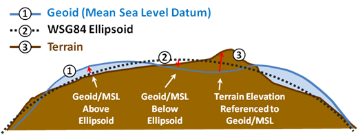

.. ****************************************************************************
.. CUI
..
.. The Advanced Framework for Simulation, Integration, and Modeling (AFSIM)
..
.. The use, dissemination or disclosure of data in this file is subject to
.. limitation or restriction. See accompanying README and LICENSE for details.
.. ****************************************************************************

gravity_model
-------------

.. command:: gravity_model ... end_gravity_model
   :block:

.. parsed-literal::

   gravity_model_
      file_ <egm-database-type> <file-name>
 
      # Testing Points
      test_point_ <latitude-value> <longitude-value>
   end_gravity_model

Overview
========

The gravity_model supplies a file format and database file of geoid deviations (i.e. undulations) from the ellipsoid.  These deviations define the local Mean Sea Level (MSL) zero-elevation coordinate and are used when passing coordinates to and from other applications or interfaces, e.g. DIS network.

The geoid is the shape that the surface of the oceans would take under the influence of Earth's gravitation and rotation alone, in the absence of other influences such as winds and tides.  In simple terms, the geoid represents the datum for Mean Sea Level (MSL). The MIL-PRF-89020B document provides the performance specification for Digital Terrain Elevation Data (DTED).  The document notes that DTED elevations are referenced to Mean Sea Level (MSL) as determined by the geoid undulation database, specifically the EGM96 database in this document. This reference applies for the other EGM database types added post document publishing.

.. note::
   The vertical coordinate for the geoid can be over or under or on the WGS-84 ellipsoid.  The difference in the vertical coordinate can vary from about ~100 meters above and below the WGS84 ellipsoid. This is a relatively small amount but could be significant enough to affect specific situations, e.g. near-surface or below-surface operations.

Commands
========

.. command:: file <egm-type-string> <file-name>

   Specifies the input EGM database type and file, respectively. Supported file formats are grid point access database as supplied by `NGA EGM Databases <http://earth-info.nga.mil/GandG/update/index.php?action=home>`_.
   
   Valid values for <egm-type-string> matching the supplied database file are

   * **EGM96**  -  Database is EGM96.
   * **EGM2008** -  Database is EGM2008.

.. command:: test_point <latitude-value> <longitude-value>

   Specifies a test latitude-longitude pair to perform lookouts and print geoid height value from the database to standard output for debugging purposes. command may be repeated multiple times to test other latitude-longitude pairs as required.

   Example::

     ...
        test_point 89.7n 0.0e
        test_point 89.7s 50.0w
     ...

DIS Application
===============

IEEE 1278.1 DIS specification for coordinate systems requires that locations in the simulated world are identified using a right-handed, geocentric Cartesian coordinate system called the world coordinate system. The shape of the world is described in NIMA TR 8350.2.  The NIMA TR 8350.2 is the document that defines the Department of Defense World Geodetic System 1984 (WGS84).

Altitudes, which are internal to WSF, are referenced to the WGS84 ellipsoid in order to provide computational efficiencies.  The ellipsoid is assumed to be equivalent to mean sea level.  WSF will send Entity State data with altitudes referenced to the WGS84 ellipsoid by default.  Use of the "gravity_model' keyword permits WSF to transform the vertical coordinate to send and receive the Entity State data with the vertical height referenced to the WGS84/EGM96 geoid.
   
Example
=======

.. parsed-literal::

  gravity_model_
     # http://earth-info.nga.mil/GandG/update/index.php?action=home
     #file EGM96 WW15MGH.GRD
     file EGM2008 egm2008_wgs84_2p5min_und.GRD

     # Optional self-test-logic
     test_point_ 89.7n 0.0 e  # Add others as desired.  At run time, will print geoid values to standard output.
  end_gravity_model
