.. ****************************************************************************
.. CUI
..
.. The Advanced Framework for Simulation, Integration, and Modeling (AFSIM)
..
.. The use, dissemination or disclosure of data in this file is subject to
.. limitation or restriction. See accompanying README and LICENSE for details.
.. ****************************************************************************

noise_cloud
-----------

.. command:: noise_cloud <name> <type> ... end_noise_cloud
   :block:

.. parsed-literal::

   noise_cloud <name> <type>
      noise_frequency_ ...
      noise_octaves_ ...
      threshold_ ...
      scalar_ ...
      constant_height_ ...
      thickness_ ...
      use_global_wind_
      origin_ ...
      sensor_modifier_ ...
      comm_modifier_ ...
   end_noise_cloud

Overview
========

The noise_cloud block defines a pseudo-random fractal noise cloud layer.  This layer will attenuate :command:`comm` and
:command:`sensor`.  The :command:`random_seed` with affect the population of the noise function.  If a
line-of-sight check hits a cloud, a penetration distance is returned, which in turn is used to calculate the
attenuation of the device by the clouds.  The base type is WSF_NOISE_CLOUD.

Commands
========

.. command:: noise_frequency <value>

   Specifies the number of posts defined in the noise function at the lowest octave.  Higher noise frequency will result
   in more unique clouds in the function.

   **Default** 1

.. command:: noise_octaves <value>

   Specifies the number of octaves defined in the noise function.  Each octave adds higher frequency and lower amplitude
   noise to the noise function.  Higher octaves will result in more fractal detail.  The table below visually demonstrates
   the effects of noise_frequency and noise_octaves.

   **Default** 1

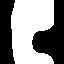
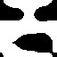
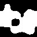

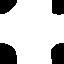
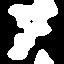
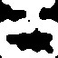
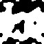

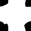

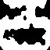
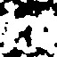

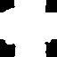
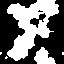
.. |Noise_4_3| image:: ./images/noise_4_3.jpg
   :width:  128px
   :height: 128px
.. |Noise_4_4| image:: ./images/noise_4_4.jpg
   :width:  128px
   :height: 128px

+------------+-------------+-------------+-------------+-------------+
| Frequency  | f=1         | f=2         | f=3         | f=4         |
| vs Octaves |             |             |             |             |
+============+=============+=============+=============+=============+
| O=1        | |Noise_1_1| | |Noise_1_2| | |Noise_1_3| | |Noise_1_4| |
+------------+-------------+-------------+-------------+-------------+
| O=2        | |Noise_2_1| | |Noise_2_2| | |Noise_2_3| | |Noise_2_4| |
+------------+-------------+-------------+-------------+-------------+
| O=3        | |Noise_3_1| | |Noise_3_2| | |Noise_3_3| | |Noise_3_4| |
+------------+-------------+-------------+-------------+-------------+
| O=4        | |Noise_4_1| | |Noise_4_2| | |Noise_4_3| | |Noise_4_4| |
+------------+-------------+-------------+-------------+-------------+

.. command:: threshold <value>

   Specifies the threshold of a step function applied to the noise function.  Every noise function point above the
   threshold will be considered cloud, and everything below will be clear sky.  The table below visually demonstrates the
   effect of the threshold.

   **Default** 0.5

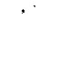
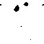
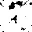
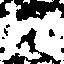
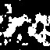
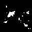

+------------+----------+----------+----------+----------+----------+----------+
| Threshold  | f=0.2    | f=0.3    | f=0.4    | f=0.5    | f=0.6    | f=0.7    |
+============+==========+==========+==========+==========+==========+==========+
|            | |NT_0_2| | |NT_0_3| | |NT_0_4| | |NT_0_5| | |NT_0_6| | |NT_0_7| |
+------------+----------+----------+----------+----------+----------+----------+

.. command:: scalar <length-value>

   The 3D noise function is cyclical.  The scalar value will determine the frequency of the repetition.

   **Default** 10 km

.. command:: constant_height <length-value>

   The constant_height determines how high above sea level the cloud layer will be set.

   **Default** 10 km

.. command:: thickness <length-value>

   When a sensor or comm beam intersects a cloud in the layer, this value will be returned as the penetration length.

   **Default** 300 m

.. command:: use_global_wind

   When this is set, the cloud layer will use the wind_speed and wind_direction defined in the :command:`global_environment`.

.. command:: origin <latitude-value> <longitude-value>

   Defines the wind origin for the cloud.  The wind direction will be most correct around this location.

   **Default** 0n 0e

.. command:: sensor_modifier <name> <value>

   This defines the attenuation effect of a cloud hit.  :command:`sensor` devices will indicate they will be attenuated by the
   cloud layer by using the modifier_category command in their definitions.  The value is a number 0 - 1. 
   The attenuation value is set up to be a percentage loss per meter within the zone.

.. command:: comm_modifier <name> <value>

   This defines the attenuation effect of a cloud hit.  :command:`comm` devices will indicate they will be attenuated by the
   cloud layer by using the modifier_category command in their definitions.  The value is a number 0 - 1. 
   The attenuation value is set up to be a percentage loss per meter within the zone.

