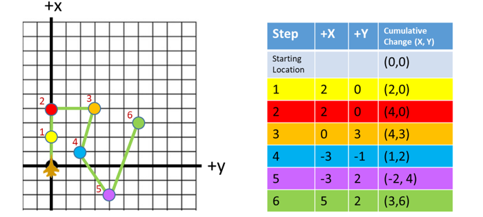

.. ****************************************************************************
.. CUI
..
.. The Advanced Framework for Simulation, Integration, and Modeling (AFSIM)
..
.. The use, dissemination or disclosure of data in this file is subject to
.. limitation or restriction. See accompanying README and LICENSE for details.
.. ****************************************************************************

.. _route:

route
-----

.. command:: route ... end_route
   :block:

.. parsed-literal::

   route_
      # `Commands`_
      navigation_
         # `Navigation Commands`_
         label_ ...
         position_ ...
         mgrs_coordinate_ ...
         offset_ ...
         turn_left_ ...
         turn_right_ ...
         turn_to_heading_ ...
         goto_ ...

         # `Waypoint Commands`_
         altitude_ ...
         depth_ ...
         heading_ ...
         turn_ ...
         speed_ ...
         linear_acceleration_ ...
         radial_acceleration_ ...
         bank_angle_limit_ ...
         turn_g_limit_ ...
         climb_rate_ ...
         dive_rate_ ...
         pause_time_ ...
         execute_ ...
         extrapolate_ ...
         stop_ ...
         remove_ ...
         switch_on_passing_ ...
         switch_on_approach_ ...
         distance_ ...
         time_ ...
         time_to_point_ ...
         node_id_ ...
         aux_data_ ... end_aux_data
      end_navigation

      # :command:`Auxiliary Data Commands <_.aux_data>`
      aux_data_ ... end_aux_data

      # `Route Insertion Commands`_
      transform_route_ ...
      transform_absolute_route_ ...
   end_route

.. parsed-literal::

   # Define a route on a :command:`platform`.
   :command:`platform` ...
      route_
         ...
      end_route
   end_platform

   # Define a route type that can be referenced by the **use_route** command of the :command:`platform` or :command:`route_network`
   # commands, or by transform_route_ or transform_absolute_route_ commands.
   #
   # These occur outside :command:`platform` definitions.

   route_ <name>
      ...
   end_route

Overview
========

A route is a collection of waypoints that define a path, or route, for movers which use routes (e.g.: :model:`WSF_AIR_MOVER`, :model:`WSF_GROUND_MOVER`, :model:`WSF_ROAD_MOVER` and :model:`WSF_SURFACE_MOVER`) or to define a portion of a route within a :command:`route_network`.

The start of a waypoint in indicated by the presence of one of the following commands:

* A specific latitude and longitude (position_)
* An offset relative to the current position (offset_)
* A command to turn (turn_left_, turn_right_ or turn_to_heading_)
* A command to 'goto' another labeled waypoint (goto_)

The definition of the waypoint continues until the next command that starts a new waypoint.

.. note::
   Parameters like speed, altitude, climb_rate, radial_acceleration, linear_acceleration, etc... are used for all subsequent waypoints until overridden.

.. block:: route

Commands
========

.. command:: navigation <navigation-commands> ... end_navigation

   Defines the block input for `Navigation Commands`_ used to enter the route waypoints and other navigational data.

.. command:: aux_data <aux-data> ...  end_aux_data

   Defines auxiliary data for a route.  See :command:`_.aux_data` for more commands and information.

Navigation Commands
===================

A new waypoint is started when a 'navigation' command is entered, which is a position_, offset_, turn_left_, turn_right_, turn_to_heading_, or goto_ command. All commands up until the next 'navigation' command (or the end of the route) are considered part of the definition of the waypoint and define the desired speed and altitude to at the waypoint and what is to be done when that waypoint is encountered.

.. command:: label <string>

   Associates a string label with the immediately following waypoint definition. This can be used as the target of a goto_ command.

   .. note::
      This command should be immediately followed by a navigation command, as it is attached to the next waypoint.

.. command:: position <latitude-value> <longitude-value>

   Specifies the latitude and longitude of the waypoint.

.. command:: mgrs_coordinate <MGRS-value>

   Specifies the coordinate of the waypoint in the Military Grid Reference System.

.. command:: offset <x-offset> <y-offset> <length-units>

   Go to a point relative to the current location of the platform. Each **offset** waypoint is relative to the position of the previous waypoint (or platform's position if it is the first waypoint), and orientation is set using the heading at the first **offset** waypoint and remains constant for all subsequent **offset** waypoints. The +X axis is in the direction of the initial heading and the +Y axis is 90 degrees to the right of the initial heading.

   Example: Route with offset waypoints. The platform starts in the bottom left corner and the platform's heading sets the +X axis. The table shows the offset for each waypoint (how much the platform should move from the previous waypoint along the x-axis and y-axis) and the cumulative change from the starting location. The diagram shows the platform position at each waypoint.

.. command:: turn_left <angle-value>
.. command:: turn_right <angle-value>

   Initiate a turn to effect the specified heading angle change.

.. command:: turn_to_heading <angle-value>

   Initiate a turn to the specified absolute heading angle. The direction of the turn will be in the direction that requires the least amount of heading angle change.

.. command:: goto <string>

   When this waypoint is reached, go to the waypoint with the specified label in the current route.

   .. note::
      This command should follow a navigation command, as it is attached to the previous waypoint.

Waypoint Commands
=================

.. command:: altitude <length-value> [ agl | msl ]

   Specifies the altitude at the waypoint. if **agl** or **msl** is omitted, the default altitude reference is defined by the mover. **msl** is assumed for :model:`WSF_AIR_MOVER` and **agl** for all others.

.. command:: depth <length-value>

   Specifies the sub-surface depth at the waypoint.

.. command:: heading <angle-value>

   Specifies the heading at the waypoint.  This is really only effective for a route with one point.  If more than one waypoint is given then heading will be determined automatically.

.. command:: turn [ left | right | shortest ]

   Specifies the direction to turn if a turn is required.

   **Default** shortest

.. command:: speed <speed-value>

   Specifies the speed at the waypoint.

.. command:: linear_acceleration <acceleration-value>

   Specifies the linear acceleration to be used for changing speed on the route segment that starts with this waypoint. *<acceleration-value>* may also be **default** to use the mover's default linear_acceleration.

   **Default** The default linear acceleration for the mover.

.. command:: radial_acceleration <acceleration-value>

   Specifies the radial acceleration to be used for turns when making heading changes on the route segment that starts with this waypoint. *<acceleration-value>* may also be **default** to use the mover's default radial_acceleration.

   **Default** The default radial acceleration for the mover.

   .. note::
      The radial acceleration is NOT the load factor for the aircraft.  For example, if one desires a maximum load factor of n = 2 for a 2g turn, then the radial acceleration for a desired 2g turn limit would need to be set = :math:`g * sqrt(n^2 -1)` = 1.732g.

.. command:: bank_angle_limit <angle-value>

   Specifies the maximum bank angle to be used for turns when making heading changes on the route segment that starts with this waypoint.  This effectively sets the radial_acceleration to :math:`g * tan(bank\_angle\_limit)`.

.. command:: turn_g_limit <acceleration-value>

   Specifies the maximum turn g-load to be used for turns when making heading changes on the route segment that starts with this waypoint.  This effectively sets the radial_acceleration to :math:`sqrt(turn\_g\_limit^2 - g^2)`.

.. command:: climb_rate <speed-value>
.. command:: dive_rate <speed-value>

   Specifies the rate of climb or dive for changing altitude on the route segment that starts with this waypoint. <speed-value>* may also be **default** to use the mover's default climb_rate.  Note: the commands climb_rate and dive_rate are **synonymous** -- specifying a dive_rate will replace a previously specified climb_rate.

   **Default** The default climb/dive rate for the mover.

.. command:: maximum_flight_path_angle <angle-value>
.. command:: maximum_flight_path_angle default

   Specifies the maximum flight path angle for climbs and dives that happen after this waypoint.  If **default** is specified, the mover will use its default value.

.. command:: pause_time <time-value>

   When the waypoint is reached, stop moving for the specified time.

.. command:: execute <script-name>   <callback-name>

   Specify a script or callback to be executed upon reaching the waypoint.  *<script-name>*/*<callback-name>* must be the name of a 'script' defined for the :command:`platform` or :command:`platform_type <platform>`.

.. command:: extrapolate
.. command:: stop
.. command:: remove

   Indicates to the mover what is to be done when this waypoint is encountered and there are no more waypoints in the route. The possible actions are:

   * **extrapolate** - continue moving at the current speed, heading and altitude.
   * **stop** - stop moving.
   * **remove** - remove the platform from the simulation.

   The default depends on the type of mover as follows:

   * **extrapolate** - :model:`WSF_AIR_MOVER`
   * **stop** - :model:`WSF_GROUND_MOVER`, :model:`WSF_ROAD_MOVER`, :model:`WSF_SURFACE_MOVER`

.. command:: switch_on_passing
.. command:: switch_on_approach

   Defines the condition when the mover should declare that it has reached this waypoint and should start moving towards the next waypoint. **switch_on_passing** is sometimes known as 'turn long' and causes the switch to occur when the platform passes over or along side of the waypoint. **switch_on_approach** is sometimes known as 'turn short' and causes the switch to occur before the waypoint.

   **Default** **switch_on_passing**.

   .. note::
      This is applicable only to position_ and offset_ waypoints.

   .. note::
      **switch_on_approach** is applicable only if the following point is also a position_ waypoint. The user is also responsible for ensuring the target waypoint is such that the turn can be completed properly.

.. command:: distance <length-value>
.. command:: time <time-value>

   If the waypoint is a turn_left_, turn_right_ or turn_to_heading_ and the next waypoint is also one of the same class, this command specifies how long or how far to move until switching to the next waypoint.

   .. note::
      It is an error to specify this command with a position_ or offset_ waypoint.

.. command:: time_to_point <time-value>

   If specified, the mover will change speed in attempt to reach this waypoint after the specified duration. *<time-value>* is the length of time it should take the platform to move from the previous waypoint to the current one. **time_to_point** may only be specified for position_ waypoints.

.. command:: node_id <string>

   This command is used only if the route is part of a :command:`route_network`. Waypoints that share the same node_id within a set of routes within a :command:`route_network` are assumed to intersect or connect at those points.

   .. note::
      It is the responsibility of the user to ensure that waypoints with the same node_id actually have the same spatial location.

.. command:: aux_data <aux-data> ...  end_aux_data

   Defines auxiliary data for a waypoint.  See :command:`_.aux_data`.

Route Insertion Commands
========================

The following commands allow another route to be inserted at the current point within the route. This allows the creation of routes that represent patterns.

.. command:: insert_route <route-name> [ reference_heading <heading> ]
.. command:: insert_route <route-name> <latitude> <longitude> <heading>

   Transforms the named route and inserts its waypoints into the route being defined. The named route should have already been defined as a 'route type'. All points in the named route that were defined using the offset_ command are transformed to a new coordinate system whose origin and orientation are defined below and then internally converted to position_ points.
      
   The first form should be used if the command occurs in a route in which waypoints appear before it. It uses the latitude and longitude of the preceding waypoint as the origin for the transformation coordinate system. If **reference_heading** was specified then it defines the orientation of the transformation coordinate system. If omitted, it will use the heading between the preceding two waypoints, or 0 if there is only one preceding waypoint.

   The second form should be used if the command occurs as the first item in the route. The *<latitude>*, *<longitude>* and *<heading>* values specify the origin and orientation of the transformation coordinate system.

   .. note::
      This command is useful for inserting patterns (e.g.: orbits, etc.) into the route.
      
.. command:: insert_offset_route <route-name> [ reference_heading <heading> ]
.. command:: insert_offset_route <route-name> <latitude> <longitude> <heading>

   The insert_offset_route command is similar to insert_route_. The insert_offset_route command converts offset waypoints to be relative to a single origin. This is different than offset waypoints explicitly defined in a route which are treated relative to the previous waypoint.  This means a route explicitly containing offset waypoints will be a different route than one that implicitly includes those offset waypoints using the insert_route_ command.

.. command:: transform_absolute_route <route-name> <north-length-value> <east-length-value> <down-length-value>

   Translate the named route the specified about and insert it into the current route. Only position_ points will be translated.
   
Deprecated Route Insertion Commands
===================================

.. command:: transform_route <route-name> [ reference_heading <heading> ]
.. command:: transform_route <route-name> <latitude> <longitude> <heading>

   Transforms the named route and inserts its waypoints into the route being defined. The named route should have already been defined as a 'route type'. All points in the named route that were defined using the offset_ command are transformed to a new coordinate system whose origin and orientation are defined below and then internally converted to position_ points.

   The first form should be used if the command occurs in a route in which waypoints appear before it. It uses the latitude and longitude of the preceding waypoint as the origin for the transformation coordinate system. If **reference_heading** was specified then it defines the orientation of the transformation coordinate system. If omitted, it will use the heading between the preceding two waypoints, or 0 if there is only one preceding waypoint.

   The second form should be used if the command occurs as the first item in the route. The *<latitude>*, *<longitude>* and *<heading>* values specify the origin and orientation of the transformation coordinate system.

   .. note::
      This command is useful for inserting patterns (e.g.: orbits, etc.) into the route.
      
.. deprecated:: 2.9
   This command will be replaced by insert_route_.
