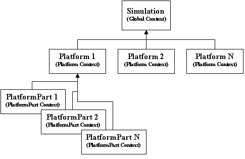

.. ****************************************************************************
.. CUI
..
.. The Advanced Framework for Simulation, Integration, and Modeling (AFSIM)
..
.. The use, dissemination or disclosure of data in this file is subject to
.. limitation or restriction. See accompanying README and LICENSE for details.
.. ****************************************************************************

.. _script:

script
------

Overview
========

Scripts provide a way for the user to execute a complex set of instructions based upon events that occur in the
simulation.  The language is similar to C# and Java and should be familiar to anyone with basic programming skills. It
is block-structured and contains familiar declaration, assignment, and flow control statements that allow the user to
examine and manipulate the simulation environment.

Scripts are essentially a list of instructions that are generated by the script compiler that understands the scripting
language syntax and how to translate that into the appropriate instructions.  Once compiled, scripts can be executed in
a script context (execution context), which is responsible for interpreting the script's instructions and providing the
interface between the script and application (i.e., simulation) layers.  In WSF, the execution contexts are chained
to form a tree structure allowing child contexts to inherit scripts that are defined by their parents (see figure
below).

As shown, the global simulation instance, platforms, and certain platform parts contain a script context allowing them
to execute scripts.  A script defined in the simulations 'global' context is accessible by all platforms and platform
parts.  Just as a script defined in a particular platform is accessible to all of its platform parts.   However, the
reverse situation is not true.  Platforms cannot access scripts defined on their platform parts.

For completion, the script grammar is defined here: :ref:`script_grammar`.

Basic Types
===========

Script has 4 basic types.  Basic types are copied when assigned to variables and passed to functions.  The basic types
are:

int
   A 32-bit integer::

      int prime5 = 11;

bool
   A Boolean value.  Either 'true' or 'false'::

      bool isTrue = true;

double
   A double-precision floating-point value::

     double gravity = 9.8;

string
   A string of characters::

     string text = "Hello World";

Basic types support a number of operators.  'int' and 'double' both support basic arithmetic and comparison::

    // Arithmetic ( +, -, *, / )
    double abc = (5 + 2.5) / 2.0 - 1.0;
    // Arithmetic assignment: ( +=, -=, *=, /= )
    abc += 5.0;  // add 5 to abc
    // Comparison ( >, >=, <, <=, ==, != )
    bool isPositive = abc > 0.0;

'string' supports comparison operators and '+' as concatenation::

 string alphabet = "alphabet";
 string zoo = "zoo";
 bool trueVal = alphabet < zoo;
 string combine = alphabet + " " + zoo;

'bool' supports comparison operators, as expected.::

 bool trueVal = true != false;

Script Classes
==============

All other types are known as script classes.  These types are copied by reference.  A number of types are available,
see :doc:`script_types` for a full list.::

 // Defining a variable with one of the nonbasic types.
 // In this example, val has no value and is 'null'.

 Vec3 val;

 // This creates a new Vec3 value

 Vec3 val2 = Vec3();

 // This is an example of calling a static method which returns a value.

 Vec3 val3 = Vec3.Construct(1,2,3);

Methods
=======

Methods are functions that exist on script classes.  A method may either be static or non-static.  Static methods can
be called without a script object as in::

 Vec3.Construct(1,2,3);

Non-static methods must be called on a valid object, as in Magnitude()::

 Vec3 v = Vec3.Construct(1,2,3);
 double length = v.Magnitude();

Calling a non-static method on an invalid object results in an error at runtime::

 Vec3 v;
 v.Magnitude(); // produces an error, v is uninitialized and therefore 'null'

Objects may be tested for validity like this::

 if (v) {
    double length = v.Magnitude();
 }

Scripts
=======

User-defined functions are called 'scripts'.  Usually scripts have this syntax::

 script <type> <script-name>([<variable-declaration-list>])
    <script-commands...>
 end_script

Scripts may call other scripts defined in the same context or scripts defined in a parent's context.  Take this example::

 script bool global_script()
    writeln("Global script called");
    return true;
 end_script

 platform plat WSF_PLATFORM
    script void local_script()
       writeln("Local script");
    end_script

    // on_initialize is an example of a different script syntax.
    on_initialize
       // Call a global script, accessible anywhere
       global_script();
       // Call a local script, only accessible on this platform
       local_script();

       // To call a script defined later, you must declare it with 'extern'
       extern bool global_later(double);

       global_later(123.0);

    end_on_initialize
 end_platform

 script bool global_later(double value)
    writeln("global_later(", value, ")");
 end_script

 platform plat2 WSF_PLATFORM
    // this platform doesn't have direct access to scripts on 'plat'
    //
    script void call_plat1()
       // Find the platform defined above
       WsfPlatform plat = WsfSimulation.FindPlatform("plat");

       // Here, the '.' operator cannot be used to call local_script() on 'plat'
       // The '->' operator allows access to other objects, but that access is not
       // checked at startup.
       plat->local_script();

       // If a mistake is made, an error is issued at run-time.
       // This would result in a run-time error:
       // plat->bad_script();
    end_script
 end_platform

Global Variables
^^^^^^^^^^^^^^^^

Global variables allow values to be stored and accessed from more than one script.  When a global variable is defined,
it is global only to its parent context.  For instance, defining
a global variable on a platform allows access to that variable from that specific platform only.  There are multiple
ways to define global variables::

 // variables defined in a 'script_variables' block outside of a platform are always global.
 // 'x' is a true 'global' variable available anywhere
 script_variables
    double x = 1.0;
 end_script_variables

 platform plat WSF_PLATFORM
    // y is a global variable only available to scripts located on 'plat'
    script_variables
       double y = x;
    end_script_variables

    script void test()
       // global variables can be used just like regular variables
       y += x;

       // global variables can also be defined in any script using the 'global' keyword:
       global double z = y;
    end_script

 end_platform

 script void test2()
    // Find the platform defined above
    WsfPlatform plat = WsfSimulation.FindPlatform("plat");
    // the '->' operator can be used to access variables belonging to an object.
    plat->y -= x;
 end_script

Static Variables
^^^^^^^^^^^^^^^^

Static variables are variables that only have a single instance and are only initialized once.::

 script void test_static()
    // In this example, x is initialized to 1.0 the first time in this script.
    // x's value is maintained between calls to test_static().
    // This would output 1234... one number for each call to test_static().
    static double x = 1.0;
    write(x);
    x += 1;
 end_script

Casting
^^^^^^^

Casting converts a value from one type to another.  Casting is done with the syntax, (<type>)value.  Basic types may be
casted between freely::

 int five = (int) 5.5;
 string fivePointFive = (string)5.5;

Casting between nonbasic types is allowed, but users should exercise caution.::

 WsfMessage msg = GetControlMessage();
 ((WsfControlMessage)msg).SetResource("my_resource");

Operators
^^^^^^^^^

``.``
   The '.' operator is used to call Methods_ on script class objects, or static methods on script classes.
``->``
   The '->' operator is used to call user-defined scripts on objects, and get/set user-defined script variables on objects.
``+``
   Add numeric values, and concatenate strings
``-``
   Subtract numeric values; 1 - 1
``*``
   Multiply numeric values; 2 * 2
``/``
   Divide numeric values; 4 / 2
``>``
   Test for greater-than; 1 > 0
``>=``
   Test for greater-than or equal to; 1 >= 1
``<``
   Test for less-than; 0 < 1
``<=``
   Test for less-than or equal to; 0 <= 1
``==``
   Test for equal-to; 1 == 1
``!=``
   Test for not-equal-to; 1 != 0
``!``
   Boolean-not; true == !false
``()``
   Ordering expressions; (1+1)*2 == 4
``(<type>)``
   Casting_ operator
``=``
   Assignment operator; double x = 2.0;

Details
=======

This is detailed documentation of the script grammar

Notation
========

 * Angle brackets ( **< >** ) surround category tags.
 * Brackets ( **[ ]** )surround optional items.
 * Curly braces ( **{ }** )surround repetitive items.
 * Single quotes (  ' '  )surround literal items.
 * **Bold text** indicates a reserved word.

.. note::

   The full grammar of the language can be found in :ref:`Scripting Language Grammar <script_grammar>`.

Command Template
================

A script is defined using the following sequence::

   script <type> <script-name>([<variable-declaration-list>])
      <script-commands>
   end_script

Language Description
====================

The language is composed of the following constructs:

<identifier>
^^^^^^^^^^^^

An identifier represents the name of a variable or function. An identifier starts with a letter (upper or lower case),
followed by zero or more letters, digits (0-9) or and underscore ('_'). Identifiers are case-sensitive.  Therefore, the
identifiers 'x1' and 'X1' represent different variables. Examples of valid identifiers::

    i
    X1
    aLongIdentifier
    x_2

<type>
^^^^^^

   Every variable has a 'type', which defines the type of data that it can contain. There are two main types of data:
   **<basic_type>** and **<complex_type>**.  All types derive from a 'base' type called **Object**.

Object
^^^^^^

   A 'base' type that all other types are compatible with.

   For example::

      Object myObject;
      myObject = 'hello';
      myObject = 19;

<basic_type>
^^^^^^^^^^^^

   The Script Language types match those that most modern programming languages provide:

   * int
   * double
   * bool
   * string

<complex_type>
^^^^^^^^^^^^^^

   These are more complex types that are typically composed of several basic_types or other complex types, and typically
   include functions that can access and operate on the data within the type.  Complex types cannot be defined in script;
   they are defined in C++ and exported for use in script.  A complete list of complex types is available in the
   :doc:`script_types` section.

<storage-type>
^^^^^^^^^^^^^^

When variables are declared (see below) a memory storage type is either implicitly or explicitly set.  By default (if
no storage type is specified) variables are considered to be automatic, meaning they are created in the memory space of
the current **<block>**.  This also means that they are only available for use inside the current **<block>** and the
**<block>**\ s nested inside of it.  In addition to automatic variables there are **global** and **static** variables.
**global** variables are allocated in global memory and are available within all scripts. **static** variables work
just like automatic variables, except their memory (and its current value) is preserved between calls to a given script.

<expression>
^^^^^^^^^^^^

An expression is anything that results in a single value.

For example::

   10 * 3
   ('platform-1' == platform.Name()) && (5 < mX)
   Foo()
   mX
   MATH.Pi()
   (9.99 >= 1.0)
   1.23

<expression-list>
^^^^^^^^^^^^^^^^^

A comma separated list of <expression>'s.

<cast>
^^^^^^

Expressions can be cast to another type using the cast operation.  This is necessary in certain cases (see
:class:`Iterator`, :class:`ArrayIterator`, and :class:`MapIterator <Iterator>` in the :doc:`script_types` section).

``'(' <type> ')' <expression>``

For example::

 Object obj = 'my string';
 string = (string)obj;

 int i = 99;
 double d = (double)i;

 WsfMessage msg = GetControlMessage();
 (WsfControlMessage)msg.SetResource('my_resource');

<statement>
^^^^^^^^^^^

A statement is defined as one of the following:

<variable-declaration>
^^^^^^^^^^^^^^^^^^^^^^

Every variable must be declared before it is used.  A variable may be simply declared or it may be declared and
assigned a value. A variable declaration is one of the following:

``[<storage_type>] <type> <identifier> ';'``

``[<storage_type>] <type> <identifier> = <expression> ';'``

Examples of the former are::

   int i;
   static j;
   WsfSensor thisSensor;

Examples of the latter are::

   int i = 0;
   global double x = 10.0 * i;
   string s = 'Hello, world';
   WsfSensor thisSensor = PLATFORM.Sensor('this_sensor');

<variable-assignment>
^^^^^^^^^^^^^^^^^^^^^

Simple values, complex expressions, and script/function return values can be assigned to variables using the assignment
operator.

``<variable> = <expression> ;``

For example::

   int x;
   x = 10;

<if-else>
^^^^^^^^^

The if-else statement allows users to select which statements to execute based on one or more expressions that
evaluates to a boolean.  The first condition that resolves to true executes the statements contained its <block>.

``if '(' <expression> ')' <block> { else if '(' <expression> ')' <block> } [else <block>]``

For example::

   string name = 'platform-1';
   if (name == 'platform-2')
   {
      print('Found platform-2');
   }
   else if (name == 'platform-1')
   {
      print('Found platform-1');
   }
   else
   {
      print('Couldn\'t find platform 1 or 2');
   }

<while-loop>
^^^^^^^^^^^^

The while statement allows users to iterate based on an expression that evaluates to a boolean.  The iteration
continues until the expression resolves to false.

``while '(' <expression> ')' <block>``

For example::

   int i = 0;
   while (i < 10)
   {
      print('i is ', i);
      i = i + 1;
   }

<do-while-loop>
^^^^^^^^^^^^^^^

The do-while statement allows users to iterate based on an expression that evaluates to a boolean.  The iteration
continues until the expression resolves to false.  The difference between the do-while and while loop is the condition
is checked at the bottom of the do-while loop, which guarantees at least on iteration.

``do <block> while '(' <expression> ')'``

For example::

   int i = -1;
   do
   {
      i = i + 1;
      print('i is ', i);
   }
   while (i < 10)

<for-loop>
^^^^^^^^^^

The for statement allows users to iterate based on an expression that evaluates to a boolean.  The iteration continues
until the expression resolves to false.  In addition, it provides space for declaring a loop counter and increment
operation.

``for '(' [<variable-declaration>] ';' [<expression-list>] ';' [<expression-list>] ')' <block>``

For example::

   for (int i = 0; i < 10; i = i + 1)
   {
      print('i is ', i);
   }

<foreach-loop>
^^^^^^^^^^^^^^

The foreach loop allows users to iterate over the elements in a container, while providing access to the key and
data.

``foreach '(' [<variable-declaration> ':'] <variable-declaration> in <expression> ')' <block>``

For example::

   Map<string, double> myMap = Map<string, double>();
   myMap['a'] = 1.1;
   myMap['b'] = 2.2;

   // If two loop variables are declared
   // (separated by a colon), the first must be
   // the key and the second must be the data.
   foreach (string aKey : double aData in myMap)
   {
      print('key, data ', aKey, ', ', aData);
   }

   // If one loop variable is declared
   // it must be the data.
   foreach (double aData in myMap)
   {
      Print('data ', aData);
   }

<break>
^^^^^^^

The break statement allows the user to jump out of the current block.

``break ';'``

For example::

   while (true)
   {
      if (true)
      {
         break;
         }
      }

<continue>
^^^^^^^^^^

The continue statement allows the user to ignore the rest of the statements in a loop and jump to the top of the
loop.

``continue ';'``

For example::

   for (int i = 0; i < 10; i = i + 1)
   {
      if (i == 5)
      {
         continue;
      }
   }

<return>
^^^^^^^^

The return statement allows users to return a value from a script/function call.

``return <expression> ';'``

For example::

   double Multiply(double aA, double aB)
   {
      return aA*aB;
   }

<block>
^^^^^^^

A block is:

* Zero or more statements surrounded by script end_script
* Zero or more statements surrounded by curly braces

An example of the former is::

   script void my_script()
      int i = 1;
      print('i = ', i);
   end_script

An example of the latter is::

   if (true)
      {
      int i = 1;
      print('i = ', i);
   }

<function-declaration>
^^^^^^^^^^^^^^^^^^^^^^

Functions can be declared inside of scripts using the syntax below.  Functions can only be declared inside of a script.
If you need a function that is available to all scripts, define it as a script.

``<type> <identifier> '(' [<variable-declaration-list>] ')' <block>``

For example::

   double Magnitude(double aDx, double aDy)
   {
      return MATH.Sqrt(aDx*aDx + aDy*aDy);
   }

.. note::

      :class:`MATH <Math>` is a system variable that is available to all scripts, which provides access to various math-based utilities.
