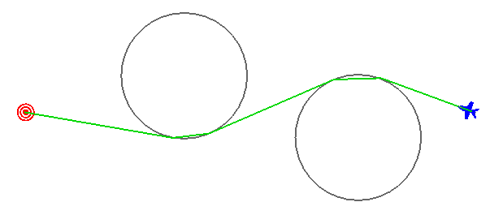
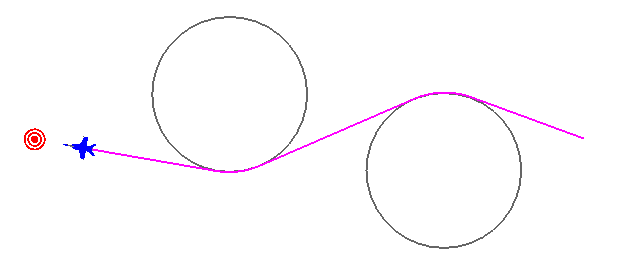
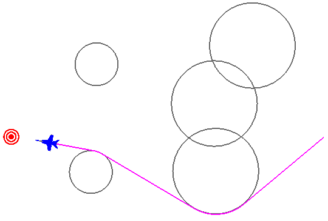

.. ****************************************************************************
.. CUI
..
.. The Advanced Framework for Simulation, Integration, and Modeling (AFSIM)
..
.. The use, dissemination or disclosure of data in this file is subject to
.. limitation or restriction. See accompanying README and LICENSE for details.
.. ****************************************************************************

WsfRouteFinder
--------------

.. class:: WsfRouteFinder inherits WsfObject
   :constructible:

Methods
=======

.. method:: void Avoid(WsfPlatform aPlatform, double aRadius)
            void Avoid(WsfGeoPoint aPoint, double aRadius)

   Tell the route finder to avoid particular locations or platforms by a certain radius distance (meters).

.. method:: void ClearAvoidances()

   Clear all previously defined avoid commands from the route finder.

.. method:: WsfRoute Route(double aTime, WsfGeoPoint aStart, WsfGeoPoint aEnd, double speed)
            WsfRoute Route(double aTime, WsfGeoPoint aStart, WsfGeoPoint aEnd, double speed, int aIndex)

   Computes the best (shortest) route around all avoidance areas and returns it.  Radial accelerations for turns are
   determined by the computed turn arc and the given speed.  If either the starting or ending locations are contained
   within an avoidance region, then those regions are shrunk to accommodate.  If the route is impossible (start and end
   are cut off from each other or surrounded) then the route returned will be empty.

   If an index, 5th argument, is provided then the route at that index is given if it exists.  The route at index zero is
   given by default, it represents the shortest available route.  Index one will be the next shortest route that doesn't
   share the same first leg as the shortest, so for example if the best route went left around an avoidance then the route
   at index one might be the route that goes right around said avoidance. This version of the method is simply to give
   users other route options in case they don't like the shortest.

.. method:: void DrawRoute(double aDuration, Vec3 aColor)
.. method:: void DrawGraph(double aDuration, Vec3 aColor)
.. method:: void DrawAvoidances(double aDuration, Vec3 aColor)

   Draw a datum of the route finder using the given color lasting for the given duration.  DrawRoute simply draws the last
   computed route.  DrawGraph will show all possible routes around the avoidance regions.  DrawAvoidances will display all
   circular avoidance regions.

.. method:: string ImpossibleRouteResponse()
.. method:: void SetImpossibleRouteResponse(string aResponse)

   Returns or sets the identifier for how the route finder handles impossible routes.  Impossible routes would be the case
   where either the start or end point exist inside of an avoidance or when either point is completely surrounded by
   avoidance areas.  All three methods are implemented and have passed initial testing.

   * "SHRINK" = method shrinks the offending avoidance areas, and only those, until a route is possible.
   * "SHIFT"  = this method moves the offending point (starting and/or target point) outside of all avoidance regions so that it is reachable.
   * "IGNORE" = this method simply ignores the offending avoidance areas as if they were not even there.

   Default: "SHRINK"

.. method:: void SetMaxArcLength(double aMaxArcLength)

   Sets the maximum allowable distance between way-points of the returned route that exist on an arc.  This is useful for
   splitting up a route that does a slow "bank" around a very large avoidance region.  Some movers aren't setup well to
   handle way-point routes that are limited by radial acceleration.  A reasonable value might be 5556 (3 nm in meters).

   Default: ~infinity

Example
=======

This example has "player-1" use a WsfRouteFinder to route to the "target" platform while avoiding two static regions.

::

 platform target WSF_PLATFORM
   icon bullseye
   position 00.32075n 01.51704e altitude 10000 ft msl
 end_platform

 platform player-1 WSF_PLATFORM
    side blue
    icon 737
    add mover WSF_AIR_MOVER update_interval 1 sec end_mover
    route position 00.32462n 03.86294e altitude 10000 ft msl speed 250 m/s end_route
    on_initialize2
          WsfGeoPoint src = PLATFORM.Location();
          WsfGeoPoint tgt = WsfSimulation.FindPlatform("target").Location();
          WsfRouteFinder finder = WsfRouteFinder();
          finder.Avoid(WsfGeoPoint.Construct(0.51556, 2.35111, 0), 1852*20);
          finder.Avoid(WsfGeoPoint.Construct(0.18667, 3.27111, 0), 1852*20);
          WsfRoute path = finder.Route(TIME_NOW, src, tgt, 250); //250 met/sec ~500 knots
          PLATFORM.SetRoute(path);
          finder.DrawAvoidances(1200, Vec3.Construct(0.4, 0.4, 0.4)); # 20 minute duration, gray color
          finder.DrawRoute(30.0, Vec3.Construct(0.0, 0.85, 0.0));     # 30 second duration, green color
    end_on_initialize2
 end_platform

Visualization of the example script given here, just a few seconds into the run, showing the calculated route with
green lines.  The debug drawing methods do not worry about "cutting corners" through circles, but the route won't
actually send the player through the circle.

Visualization of the example script given above, notice the platform rounds the avoidance regions properly.

The WsfRouteFinder works for a general case too, with overlapping zones, and even "mazes" of zones.

