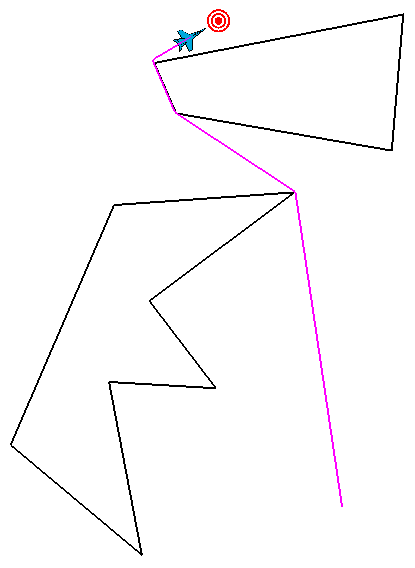

.. ****************************************************************************
.. CUI
..
.. The Advanced Framework for Simulation, Integration, and Modeling (AFSIM)
..
.. The use, dissemination or disclosure of data in this file is subject to
.. limitation or restriction. See accompanying README and LICENSE for details.
.. ****************************************************************************

WsfZoneRouteFinder
------------------

.. class:: WsfZoneRouteFinder inherits WsfObject
   :constructible:

Overview
========

Use the WsfZoneRouteFinder in script to find a safe route around any number and combination of polygonal lat/lon zones.  The WsfZoneRouteFinder works in the general case, meaning that zones can be overlapping, containing, or disjoint and a route is still found if at all possible.

Methods
=======

.. method:: void AvoidZone(WsfZone aZone)
.. method:: void AvoidZone(string aZoneName)

   Tell the zone route finder to avoid a particular zone.  You can provide the zone name or a zone object.

   .. note::
      All zones must be polygonal lat/lon zones.

.. method:: int NumberOfAvoidanceZones()

   Returns the number of avoidance zones.

.. method:: WsfZone GetAvoidanceZone(int aIndex)

   Returns a copy of the entry at the specified *aIndex* in the list of avoidance zones, if *aIndex* is in the valid range; otherwise returns a null reference. 

.. method:: void ClearAvoidanceZones ()

   Clear all previously defined avoid zone commands from the zone route finder.

.. method:: WsfRoute RouteAroundZones(WsfGeoPoint aStart, WsfGeoPoint aEnd, double speed)

   Computes the best (shortest) route around all avoidance zones and returns it.  If either the starting or ending locations are contained within an avoidance zone, then finder intelligently shifts those points to nearby locations outside the zones.  If the route is somehow impossible (start and end are cut off from each other or surrounded) then the route returned will be empty.

.. method:: void DrawGraph (double aDuration, Vec3 aColor)
.. method:: void DrawAvoidances (double aDuration, Vec3 aColor)

   Draw a datum of the zone route finder using the given color lasting for the given duration.  DrawGraph will show all possible routes around the zones.  DrawAvoidances will display all polygonal zones it is avoiding.

Example
=======
This example has "player-1" use a WsfRouteFinder to route to the "target" platform while avoiding two static regions.

::

  end_time 1200 sec
  dis_interface record zone_route_finder_1.rep end_dis_interface

  zone crown_zone
    polygonal
    lat_lon
    point 15:18:03.43s 47:42:50.48e
    point 14:21:32.73s 48:08:10.60e
    point 14:18:34.83s 48:51:40.79e
    point 14:44:05.75s 48:16:38.58e
    point 15:04:40.66s 48:32:42.78e
    point 15:03:11.55s 48:06:50.11e
    point 15:44:09.04s 48:14:38.06e
  end_zone

  zone poly_zone
    polygonal
    lat_lon
    point 13:48:11.27s 48:17:54.76e
    point 13:36:43.68s 49:17:45.98e
    point 14:08:43.62s 49:15:04.57e
    point 14:00:02.04s 48:23:11.21e
  end_zone

  platform  target  WSF_PLATFORM
    side red
    icon bullseye
    position 13:38:39s 48:33:24e altitude 20000 ft
  end_platform

  platform  router  WSF_PLATFORM
    side blue
    icon F-18
    add mover WSF_AIR_MOVER
      at_end_of_path stop
    end_mover
    route
      position 15:31:04s 49:02:50e altitude 35000 ft msl speed 250 m/s
    end_route
    on_initialize2
      WsfZoneRouteFinder finder = WsfZoneRouteFinder();
      finder.AvoidZone("crown_zone");   #avoid zone by name
      WsfZone polyZone = WsfZone.FindZone("poly_zone");
      finder.AvoidZone(polyZone);       #avoid zone by script object
      WsfGeoPoint tgt = WsfSimulation.FindPlatform("target").Location();
      WsfRoute path = finder.RouteAroundZones(PLATFORM.Location(), tgt, 250);
      finder.DrawAvoidances(1200,Vec3.Construct(0,0,0));
      finder.DrawGraph(200,Vec3.Construct(0,0.8,0));
      PLATFORM.SetRoute(path);
    end_on_initialize2
  end_platform

