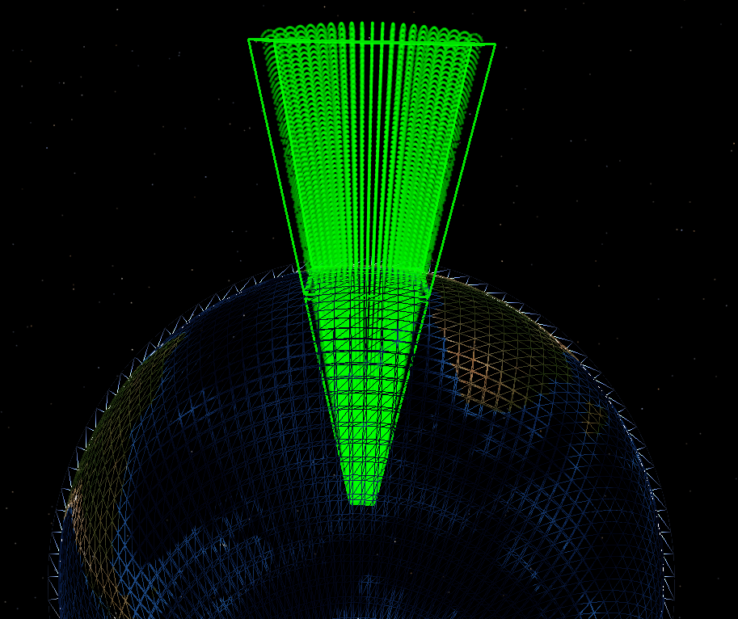

.. ****************************************************************************
.. CUI
..
.. The Advanced Framework for Simulation, Integration, and Modeling (AFSIM)
..
.. The use, dissemination or disclosure of data in this file is subject to
.. limitation or restriction. See accompanying README and LICENSE for details.
.. ****************************************************************************

zone
====

.. command:: zone <zone-name> ... end_zone
   :block:

.. parsed-literal::

   zone_ <zone-name>

      debug_

      position_ <latitude-value> <longitude-value> | reference_platform_ <platform-name>
      heading_ <angle-value>                       |

      references_ <zone-name>

      minimum_altitude_ <length-value>
      maximum_altitude_ <length-value>

      positive_ | negative_

      aux_data_ <aux_data> ... end_aux_data

      fill_color_ <color-value>
      line_color_ <color-value>

      circular_
         minimum_radius_ <length-value>
         maximum_radius_ <length-value>
         start_angle_ <angle-value>
         stop_angle_ <angle-value>

      spherical_
         minimum_radius_ <length-value>
         maximum_radius_ <length-value>
         start_angle_ <angle-value>
         stop_angle_ <angle-value>

      elliptical_
         lateral_axis_ <length-value>
         longitudinal_axis_ <length-value>
         start_angle_ <angle-value>
         stop_angle_ <angle-value>

      polygonal_
         point_ <x-value> <y-value> <length-units>     # if relative (x / y)

         polar_                                        # if relative (bearing / range)
            point_ <angle-value> <length-value>

         lat_lon_                                      # if absolute (lat / lon)
            point_ <latitude-value> <longitude-value>

         mgrs_                                         # if absolute (mgrs)
            point_ <mgrs-value>

         comm_modifier_ | sensor_modifier_ | modifier_ ...
   end_zone

Overview
--------

A zone represents a geographic region. Geographic points may be tested for containment within zones, enabling entities
to behave dynamically based on the result of a given check. A zone is defined by the following properties:

* **Context** - Context determines which entities may access a given zone.
* **Geometry** - The shape and size of a zone.
* **Bounds** - The linear and angular bounds which constrain a given geometry.
* **Reference Frame and Pose** - The position and heading of a zone relative to a defined frame of reference.

Context
-------

A zone is defined in one of the following contexts:

* **Global** - A zone defined in the global context is known as a **Global Zone**.
  A global zone may be accessed for computation by any entity in the simulation.
* **Local** - A zone defined in a local context is known as a **Local Zone** or a **Platform-Defined Zone**.
  Local zones may be created in a platform_type definition or a platform definition.
  For a local zone defined in a platform_type definition, each platform of that type implicitly defines an instance of that zone in its platform definition.
  For a local zone defined directly in a platform definition, only that platform will have access to the local zone for computation.

Geometry
--------

The size and shape of a given zone are determined by the zone's geometry. A given geometry generally falls under one of the following categories:

Planar
""""""

A planar geometry is defined by a point or points in two-dimensions. Planar geometries are naturally unbounded
in the third dimension when defined in three-dimensional space. Further, planar zones defined by coordinates on a curved
three-dimensional surface, such as the Earth's surface, are geometrically conformal to the surface. For absolute zones, this results in cross sections
which converge at the Earth's center, and which diverge above the Earth's surface. For relative planar geometries, zone cross sections are conformal
to the face of the Earth, observing altitude bounds in conjunction with bounds of offsets/ranges/radii, resulting in zones which do not converge/diverge at
different altitudes. Planar geometries are as follows:

* **Polygonal** - A geometry defined by an ordered set of points which make up zone vertices. Points of a given polygonal_ zone may be
  defined by the one of the following coordinate systems:

 * **Relative** - A point_ in a relative coordinate system derives meaning from a defined **origin** point.
   A zone defined by relative points is a **Relative Zone**.

   * **Offset** - An offset defined point_ provides a pair of distance values which define a lateral and a longitudinal distance
     from a given origin.
   * **Polar** - A polar_ defined point_ provides a bearing and range which define a radial distance from a given origin.

 * **Absolute** - A point in an absolute coordinate system, in this case WCS, inherently provides all positional information unambiguously and
   without reference to an **origin**. A zone defined by absolute points is an **Absolute Zone**.

   * **Lat/Lon** - Each point_ is defined by a Latitude and Longitude (lat_lon_) pair.
   * **MGRS** - Each point_ is defined by an alpha-numeric character sequence pair within the *Military Grid Reference System* (mgrs_).

* **Circular** - A circular geometry is defined by a maximum_radius_ (and optionally, a minimum_radius_). Circular zones are always relative.
* **Elliptical** - An elliptical geometry is defined by a lateral and longitudinal axis (and optionally, a minimum_radius_). Elliptical zones are always relative.

The following image depicts a large absolute polygonal zone, the area of which is revealed through the use of point-containment checks.
The zone is tested at extreme altitudes across latitude and longitude, highlighting the impact of conformal geometry when applied to an absolute planar zone on the Earth's surface.

Non-Planar
""""""""""

A non-planar geometry is defined independently, and is thus unaffected by the curvature of the surface on which it is defined.
Non-planar geometries may or may not be inherently bounded in a given dimension.

* **Spherical** - A spherical geometry is defined by a maximum_radius_ (and optionally, a minimum_radius_).
  All points on the surface of the sphere are co-equal in distance from the sphere's center point. Spherical zones are always relative.
  The spherical origin is always zero-altitude relative to the reference frame.
  This means that spherical zones in the WCS appear at an altitude of zero, and spherical zones in the ECS appear at the altitude of the referenced entity.
  minimum_altitude_ and maximum_altitude_ are applied from the WCS reference frame regardless of the zone's reference frame.

Bounds
------

**Bounds**, or **Geometric Bounds**, restrict a geometry in a given domain and fall into one of the following categories:

* **Angular Bounds** - Angular bounds are applicable to Radial geometries. When applied, angular bounds constrain the
  geometry to a specified start_angle_ and stop_angle_ from the planar reference frame of the Earth's surface.
  The zero-angle is determined by the zone's reference frame.
* **Linear Bounds** - Linear bounds are applicable to all geometries. When applied, linear bounds constrain the geometry in a given direction.
  Currently the minimum_altitude_ and maximum_altitude_ commands are available to bound the lower and upper altitude of a given zone,
  where altitude is always in reference to the Earth's surface.

Reference Frame and Pose
------------------------

Pose encapsulates the position and orientation of the object within a reference frame.
Because zones do not observe pitch or roll, the pose of a zone includes the position and heading.

Absolute Zones are inherently defined in the World Coordinate System (WCS) reference frame and maintain a static pose.
Conversely, Relative Zones may be defined in the WCS or Entity Coordinate System (ECS) reference frame.
Relative zones using the WCS reference frame are defined with a static pose which may be altered in script,
while those using the ECS reference frame will observe a dynamic pose which aligns with that of the referenced entity, usually a platform.

Because each point of an absolute zone is defined within the WCS reference frame, the pose of the resulting zone is absolute.
This means that any use of the position_ and heading_ commands in the associated zone definition are ignored.

Unlike absolute zones, a relative zone must define its pose and the reference frame in which that pose applies.
The reference frame and pose are defined by:

* Context of the zone definition.
* The reference_platform_ command.
* The position_ and heading_ commands.

When testing for containment within local relative zones, the point being tested for containment must be in the same hemisphere as the platform which defines zone.
This prevents points that are almost directly on the other side of the Earth as being considered inside the zone.

Commands
--------

Common
""""""

.. command:: debug

   Enables debug messages during run time when performing zone constraint checking. Especially useful when using the
   PointIsInside script methods.

.. command:: minimum_altitude <length-value>

   Minimum altitude constraint (mean sea level).

   **Default:** No minimum altitude constraint.

.. command:: maximum_altitude <length-value>

   Maximum altitude constraint (mean sea level).

   **Default:** No maximum altitude constraint.

.. command:: position <latitude-value> <longitude-value>

   Statically defines the origin of a relative zone.

   The reference_platform_ command should not be used when this command is specified.

   If this command is specified on a platform-defined zone, the zone will use the specified position as it's origin and it will use the WCS as its reference frame.

.. command:: heading <angle-value>

   Used with position_ to statically specify the orientation of the zone.

   The reference_platform_ command should not be used when this command is specified.

   If this command is specified on a platform-defined zone, the zone uses the specified heading and must specify a position_ to be valid.
   If position is specified the zone will use the WCS as its reference frame.

.. command:: reference_platform <platform-name>

   Defines the pose of a relative global zone using the pose of the specified platform and moves using the ECS reference frame of the platform.
   Whenever a zone containment check is performed, the pose of the indicated platform is used as that of the zone.

   If the reference platform has not been created at the time of a containment check, the check will return false. If the
   reference platform has been deleted, but at least one containment check was performed while the reference platform
   existed, the check will be performed using the last known location and heading of the reference platform.

   The position_ and heading_ commands should not be used when this command is specified.

.. command:: references <zone-name>

   A reference to another zone. Zones which specify the references_ command are **Reference Zones**.
   The geometry of the referenced zone is copied and properties may be overridden through the use of other valid geometry commands.
   .. note:: Commands which are unrelated to the inherited geometry should not be used and if used may result in unexpected behavior.

   A Reference Zone is always relative. In order to be valid, a reference zone must do one of the following:

   * Specify position explicitly.
   * Inherit position from a platform (via :command:`platform.use_zone`, or being platform-defined).
   * Inherit position from a reference platform (via reference_platform_).

   If a reference zone references an absolute zone, the reference zone's origin will align with the first point of the absolute zone.
   Alternatively, if a reference zone references a relative zone, the reference zone's origin will align with the origin of the relative zone.
   In either case, position must be provided as indicated above.

.. command:: negative
             positive

   Specifies whether the zone is *negative* or *positive*.  A negative zone has the exact opposite area as would be defined by the zone commands.
   For example, if a circular zone is specified, negating it would represent the area outside the circle.

   **Default:** positive

.. command:: aux_data <aux-data> ... end_aux_data

   Defines auxiliary data for a zone. See :command:`_.aux_data`.

.. include:: zone_color_commands.txt

Radial
""""""

.. command:: circular

   .. parsed-literal::

      zone *<zone_name>*
        circular
           minimum_radius_ <length-value>
           maximum_radius_ <length-value>
           start_angle_ <angle-value>
           stop_angle_ <angle-value>
      end_zone

.. command:: elliptical

   .. parsed-literal::

      zone *<zone_name>*
        elliptical
            lateral_axis_ <length-value>
            longitudinal_axis_ <length-value>
            minimum_radius_ <length-value>
            start_angle_ <angle-value>
            stop_angle_ <angle-value>
      end_zone

.. command:: spherical

   .. parsed-literal::

      zone *<zone_name>*
         spherical
            minimum_radius_ <length-value>
            maximum_radius_ <length-value>
            start_angle_ <angle-value>
            stop_angle_ <angle-value>
      end_zone

.. command:: minimum_radius <length-value>

   Minimum radius constraint.

   **Default:** No minimum radius constraint.

   .. note:: For a spherical zone a 3-D test is performed, otherwise a 2-D test is used.

.. command:: maximum_radius <length-value>

   Maximum radius constraint.

   **Default:** No maximum radius constraint.

   .. note:: For a spherical_ zone a 3-D test is performed, otherwise the a 2-D test is used.

.. command:: start_angle <angle-value>
             stop_angle <angle-value>

   Defines the angular constraint. The angular region starts at start_angle_ and proceeds *clockwise* to stop_angle_.
   An angle of zero degrees points in the direction of the reference heading (North in WCS, entity heading in ECS).

.. command:: lateral_axis <length-value>

   Lateral axis constraint for an elliptically-shaped zone.

.. command:: longitudinal_axis <length-value>

   Longitudinal axis constraint for an elliptically-shaped zone.

.. important:: A given zone definition should contain either Radial zone commands or Polygonal_ zone commands, but not both.

Polygonal
"""""""""

.. command:: polygonal

   A polygonal zone is defined by a sequence of node points. The following conditions must be observed:

   * Points must be ordered in a clockwise direction when viewed from above.
   * First and last point must not repeat (i.e., the connection between the last point and the first point is assumed).
   * All zone points must be of the same type (All relative x, y, all polar_, all lat_lon_, or all mgrs_).

   .. parsed-literal::

      zone *<zone_name>* polygonal
         point_ *<x-value>* *<y-value>* <length-units> # if relative (x / y)

         polar_                                        # if relative (bearing / range)
         point_ <angle-value> <length-value>           # if relative (bearing / range)

         lat_lon_                                      # if absolute (lat / lon)
         point_ <latitude-value> <longitude-value>     # if absolute (lat / lon)

         mgrs_                                         # if absolute (mgrs)
         point_ <mgrs-value>                           # if absolute (mgrs)

         // Repeat point... as many times as needed for each format.
      end_zone

.. command:: point <x-value> <y-value> <length-units>

   A single point in the polygonal-shaped zone, specified using the relative x/y input format. The positive X axis points in
   the direction of the reference heading and the positive Y axis is 90 degrees clockwise.

   .. note:: This is the default point input format. This format is assumed if polar_, lat_lon_, or mgrs_ are not specified.

.. command:: polar

   Indicates the point data are provided using bearing-range format (by default the data are assumed to be in
   relative x/y format).

.. command:: point <angle-value> <length-value>

   A single point in a in the polygonal-shaped zone using the polar_ input format.

.. command:: lat_lon

   Indicates the point data are provided using latitude, longitude format (by default the data are assumed to be in
   relative x,y format). Zones which specify lat_lon are absolute.

.. command:: point <latitude-value> <longitude-value>

   A single point in the polygonal-shaped zone, specified using the absolute lat_lon_ input format.

.. command:: mgrs

   Indicates the point data are provided in the form of an MGRS location format (by default the data are assumed to be in
   relative x,y format). Zones which specify mgrs are absolute.

.. command:: point <MGRS-value>

   A single point in the polygonal-shaped zone, specified using the absolute mgrs_ input format.

.. important:: A given zone definition should contain either Radial zone commands or Polygonal_ zone commands, but not both.

Attenuation
'''''''''''

.. command:: comm_modifier <category-name> <real-value>
.. command:: sensor_modifier <category-name> <real-value>
.. command:: modifier <category-name> <real-value>

   Specify attenuation to be applied to :command:`comm` and :command:`sensor` device detections.
   Computed attenuation is proportional to the penetration distance through the zone along detection lines of sight.
   *<category-name>* is the name used as a corresponding *modifier_category*
   (:command:`comm modifier_category<comm.modifier_category>` and :command:`sensor modifier_category<sensor.modifier_category>`).
   *<real-value>* is a number between 0.0 and 1.0, representing the attenuation value as a percentage loss per meter within the zone.
   For example, a modifier_ value of 0.1 means that 10 meters of penetration will cause 100% attenuation.

.. note:: The modifier_ keywords are only valid within absolute zone definitions. Zone penetration calculations do not take into account any of the minimum_radius_,
   start_angle_, and stop_angle_ inputs for any zone type; as well as the heading_ input for the polygonal_ zone type.

.. note:: Computed attenuation paths are approximate; see :ref:`zone-based_attenuation` for more information.
