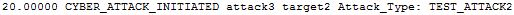

.. ****************************************************************************
.. CUI
..
.. The Advanced Framework for Simulation, Integration, and Modeling (AFSIM)
..
.. The use, dissemination or disclosure of data in this file is subject to
.. limitation or restriction. See accompanying README and LICENSE for details.
.. ****************************************************************************

.. _CYBER_ATTACK_INITIATED:

CYBER_ATTACK_INITIATED
----------------------

This event is generated when a cyber attack has been initiated.

Format
======

::

 <time> CYBER_ATTACK_INITIATED <attacker> <victim> Attack_Type: <attack_type>

Breakdown
=========

<time>
   Simulation time of the event
CYBER_ATTACK_INITIATED
   Name of event
<attacker>
   Name of the attacking platform
<victim>
   Name of the victim platform
<attack_type>
   Name of the :command:`cyber_attack` type.

How it Appears in Output
========================

How to Show Event Messages
==========================

.. parsed-literal::

  :command:`event_output`
     file replay.evt              # write event messages to file "replay.evt"
     enable CYBER_ATTACK_INITIATED
  end_event_output
