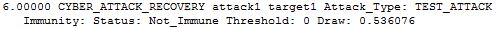

.. ****************************************************************************
.. CUI
..
.. The Advanced Framework for Simulation, Integration, and Modeling (AFSIM)
..
.. The use, dissemination or disclosure of data in this file is subject to
.. limitation or restriction. See accompanying README and LICENSE for details.
.. ****************************************************************************

.. _CYBER_ATTACK_RECOVERY:

CYBER_ATTACK_RECOVERY
----------------------

This event is generated when the victim of a cyber attack has recovered from the attack.

Format
======

::

 <time> _CYBER_ATTACK_RECOVERY <attacker> <victim> Attack_Type: <attack_type> \
   Immunity: Status: <immunity_status> Threshold: <immunity_threshold> Draw: <immunity_draw>

Breakdown
=========

<time>
   Simulation time of the event
_CYBER_ATTACK_RECOVERY
   Name of event
<attacker>
   Name of the attacking platform
<victim>
   Name of the victim platform
<attack_type>
   Name of the :command:`cyber_attack` type.
<immunity_status>
   'Immune' if the victim has gained immunity to future attacks of the same type or
   'Not_Immune' if the victim remains vulnerable.
<immunity_threshold>
   The probability threshold for future immunity.
<immunity_draw>
   The random draw for future immunity.

How it Appears in Output
========================

How to Show Event Messages
==========================

.. parsed-literal::

  :command:`event_output`
     file replay.evt              # write event messages to file "replay.evt"
     enable _CYBER_ATTACK_RECOVERY
  end_event_output
