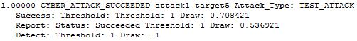

.. ****************************************************************************
.. CUI
..
.. The Advanced Framework for Simulation, Integration, and Modeling (AFSIM)
..
.. The use, dissemination or disclosure of data in this file is subject to
.. limitation or restriction. See accompanying README and LICENSE for details.
.. ****************************************************************************

.. _CYBER_ATTACK_SUCCEEDED:

CYBER_ATTACK_SUCCEEDED
----------------------

This event is generated when an attempted cyber attack has been successfully failed.

Format
======

::

 <time> _CYBER_ATTACK_SUCCEEDED <attacker> <victim> Attack_Type: <attack_type> \
   Success: Threshold: <success_threshold> Draw: <success_draw> \
   Report: Status: <report_status> Threshold: <report_threshold> Draw: <report_draw> \
   Detect: Threshold <detect_threshold> Draw: <detect_draw> 

Breakdown
=========

<time>
   Simulation time of the event
_CYBER_ATTACK_SUCCEEDED
   Name of event
<attacker>
   Name of the attacking platform
<victim>
   Name of the victim platform
<attack_type>
   Name of the :command:`cyber_attack` type.
<success_threshold>
   The probability threshold for attack success.
<success_draw>
   The current random draw.
<report_status>
   'Succeeded' if a status report was provided to the attacker or 'Failed' if not.
<report_threshold>
   The probability threshold for status report.
<report_draw>
   The random draw for status report.
<detect_threshold>
   The probability threshold for attack detection.
<detect_draw>
   The random draw for attack detection.

How it Appears in Output
========================

How to Show Event Messages
==========================

.. parsed-literal::

  :command:`event_output`
     file replay.evt              # write event messages to file "replay.evt"
     enable _CYBER_ATTACK_SUCCEEDED
  end_event_output
