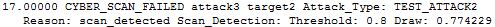

.. ****************************************************************************
.. CUI
..
.. The Advanced Framework for Simulation, Integration, and Modeling (AFSIM)
..
.. The use, dissemination or disclosure of data in this file is subject to
.. limitation or restriction. See accompanying README and LICENSE for details.
.. ****************************************************************************

.. _CYBER_SCAN_FAILED:

CYBER_SCAN_FAILED
-----------------

This event is generated when an attempted cyber scan failed.

Format
======

::

 <time> _CYBER_SCAN_FAILED <attacker> <victim> Attack_Type: <attack_type> \
   Reason: <reason> Scan_Detection: Threshold: <detect_threshold> Draw: <detect_draw>

Breakdown
=========

<time>
   Simulation time of the event
_CYBER_SCAN_FAILED
   Name of event
<attacker>
   Name of the attacking platform
<victim>
   Name of the victim platform
<attack_type>
   Name of the :command:`cyber_attack` type.
<reason>
   Reason for the failure of the scan. This will be
   
   * blocked_by_immunity
   * blocked_by_scan_detection
   * blocked_by_vulnerability
   
<detect_threshold>
   The probability threshold for attack success (valid only if <reason> is blocked_by_scan_detection).
<detect_draw>
   The current random draw. (valid only if <reason> is blocked_by_scan_detection)

How it Appears in Output
========================

How to Show Event Messages
==========================

.. parsed-literal::

  :command:`event_output`
     file replay.evt              # write event messages to file "replay.evt"
     enable _CYBER_SCAN_FAILED
  end_event_output
