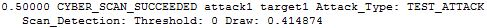

.. ****************************************************************************
.. CUI
..
.. The Advanced Framework for Simulation, Integration, and Modeling (AFSIM)
..
.. The use, dissemination or disclosure of data in this file is subject to
.. limitation or restriction. See accompanying README and LICENSE for details.
.. ****************************************************************************

.. _CYBER_SCAN_SUCCEEDED:

CYBER_SCAN_SUCCEEDED
--------------------

This event is generated when an attempted cyber scan succeeded.

Format
======

::

 <time> _CYBER_SCAN_SUCCEEDED <attacker> <victim> Attack_Type: <attack_type> \
   Scan_Detection: Threshold: <detect_threshold> Draw: <detect_draw>

Breakdown
=========

<time>
   Simulation time of the event
_CYBER_SCAN_SUCCEEDED
   Name of event
<attacker>
   Name of the attacking platform
<victim>
   Name of the victim platform
<attack_type>
   Name of the :command:`cyber_attack` type.
<detect_threshold>
   The probability threshold for scan detection).
<detect_draw>
   The current random draw.

How it Appears in Output
========================

How to Show Event Messages
==========================

.. parsed-literal::

  :command:`event_output`
     file replay.evt              # write event messages to file "replay.evt"
     enable _CYBER_SCAN_SUCCEEDED
  end_event_output
