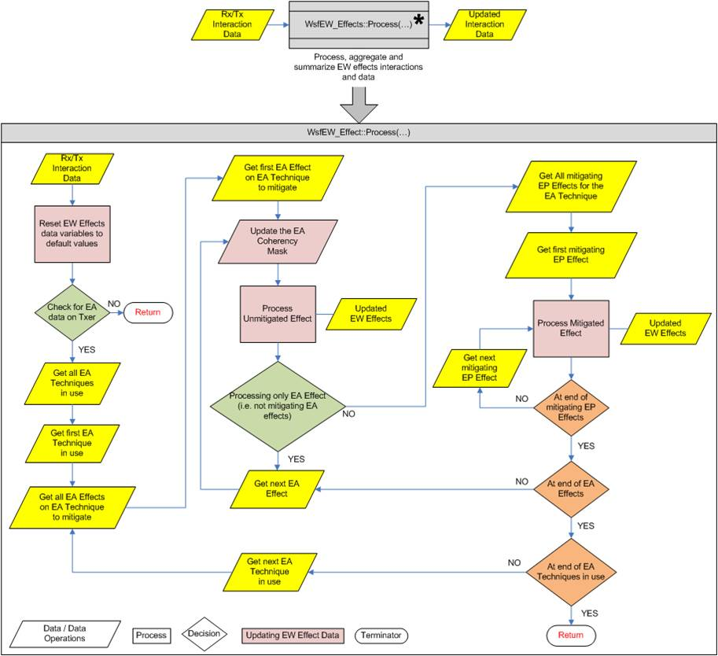

.. ****************************************************************************
.. CUI
..
.. The Advanced Framework for Simulation, Integration, and Modeling (AFSIM)
..
.. The use, dissemination or disclosure of data in this file is subject to
.. limitation or restriction. See accompanying README and LICENSE for details.
.. ****************************************************************************

.. _Electronic_Warfare_Effect_Aggregation:

Electronic Warfare Effect Aggregation
-------------------------------------

.. parsed-literal::

 Overview_
 `Electronic Attack Effect Coherency`_
   `Effect Coherency Types`_
   `Jamming Power Types`_
 `EW Effects Interaction Variables`_
   `Jamming Effects Variable Structure`_
   `Signal Effects Variable Structure`_
   `Track Effects Variable Structure`_
   `Message Effects Variable Structure`_
 `Aggregation Types`_

Overview
========

The Electronic Warfare (EW) effects in WSF include Electronic_Attack_Effects & Electronic_Protect_Effects that are
applied during a transmitter-receiver or transmitter-target-receiver interaction as defined by this effects behavior in
software and user modifiable inputs. During this interaction, the interaction data for the EW are applied by applying
the unmitigated Electronic Attack (EA) effect then applying any mitigating Electronic Protect (EP) effects to the
Electronic Attack effect. This process is repeated until all EA effects on all techniques are applied along with
mitigating EP effects and aggregated into a single data set that is used to modify the interaction between the
transmitter-receiver or transmitter-target-receiver. The aggregation of this EW effects is defined below for more
insight into how WSF is applying these effects.

Electronic Attack Effect Coherency
==================================

Jamming power within an interaction calculation is calculated using general WSF Electromagnetic calculations. Each EA
effect possesses one or more of the coherency type on the individual effect. As the effects are applied the types of
effect coherencies encountered are summed and at the end of all the EW effects calculations the jamming power is
divided into three types of jamming power (non-coherent, non-coherent-pulse, coherent) based on the EA effects
coherencies encountered during the application of the effects. The coherency types available are defined in the table
below along with the jamming power type it is summed into.

Effect Coherency Types
^^^^^^^^^^^^^^^^^^^^^^

   +-------------------------+--------------------------------------------------------+--------------------+
   | Effect Coherency Types  | Description                                            | Jamming Power Type |
   |                         |                                                        |                    |
   +=========================+========================================================+====================+
   |  **None**               | Coherency not specified for the given effect.          |                    |
   |                         | Assumes Non-Coherent                                   | Noise              |
   +-------------------------+--------------------------------------------------------+--------------------+
   |  **Non-Coherent**       | Waveform is non-coherent with the transmit and/or      | Noise              |
   |                         | expected receive waveform. Assumes continuous noise    |                    |
   |                         | type waveform in most basic sense.                     |                    |
   +-------------------------+--------------------------------------------------------+--------------------+
   |  **Non-Coherent Pulse** | Waveform is pulsed and is non-coherent with the        | Pulse Noise        |
   |                         | transmit and/or expected receive waveform. Assumes     |                    |
   |                         | pulsed noise type waveform in most basic sense.        |                    |
   +-------------------------+--------------------------------------------------------+--------------------+
   |  **Coherent**           | Waveform is coherent with the transmit and/or expected | Coherent           |
   |                         | receive waveform. Assumed to be closely representing   |                    |
   |                         | the signal in most basic sense.                        |                    |
   +-------------------------+--------------------------------------------------------+--------------------+
   |  **Coherent-Pulse**     | Waveform is pulse and is coherent with the transmit    | Coherent           |
   |                         | and/or expected receive waveform. Assumed to be        |                    |
   |                         | closely representing the pulsed signal in most basic   |                    |
   |                         | sense                                                  |                    |
   +-------------------------+--------------------------------------------------------+--------------------+

Jamming Power Types
^^^^^^^^^^^^^^^^^^^

   +---------------------+-----------------------------------------------------+---------------------------------+
   | Jamming Power Type  | Description                                         | Mapped Effect Coherency Type(s) |
   |                     |                                                     |                                 |
   +=====================+=====================================================+=================================+
   |  **Noise**          | Jamming induced power that acts like noise          | None & Non-Coherent             |
   |                     | power to a :command:`_.receiver`.                   |                                 |
   +---------------------+-----------------------------------------------------+---------------------------------+
   |  **Pulsed-Noise**   | Pulse jamming power that acts like noise to a       | Non-Coherent Pulse              |
   |                     | :command:`_.receiver`.                              |                                 |
   +---------------------+-----------------------------------------------------+---------------------------------+
   |  **Coherent**       | Coherent (continuous and/or pulsed)jamming power    | Coherent & Coherent Pulse       |
   |                     | that acts like a signal to a :command:`_.receiver`. |                                 |
   +---------------------+-----------------------------------------------------+---------------------------------+

Within most interactions the signal-to-interference (S/I) ratio is calculated using the signal power divided by the
noise power + clutter power + jammer power. The jammer power used for the interference is the noise + pulse
(non-coherent) jammer power.

EW Effects Interaction Variables
================================

The following EW effects variable structure is defined for each of the three types of jamming power as well as a
separate signal, track and message effect structures. The following tables summarize these two structures and
associated variables:

Jamming Effects Variable Structure
^^^^^^^^^^^^^^^^^^^^^^^^^^^^^^^^^^

  +------------------------------+-------------------------+---------------------+-------------------------+-----------------------------------------+
  | Power Effect Variable        | Description             | Aggregation Type(s) | Default/Undefined Value | Modifying Effect(s)                     |
  +==============================+=========================+=====================+=========================+=========================================+
  | **Blanking Factor**          | Jamming blanking        | Multiplicative      | 1.0                     | :model:`WSF_SLB_EFFECT`                 |
  |                              | factor (e.g., sidelobe  |                     |                         |                                         |
  |                              | blanker)                |                     |                         |                                         |
  +------------------------------+-------------------------+---------------------+-------------------------+-----------------------------------------+
  | **Cancellation Factor**      | Jamming cancellation    | Minimum             | 1.0                     | :model:`WSF_SLC_EFFECT`,                |
  |                              | factor (e.g., sidelobe  |                     |                         | :model:`WSF_SLC_DEGRADE_EFFECT`         |
  |                              | canceler)               |                     |                         |                                         |
  +------------------------------+-------------------------+---------------------+-------------------------+-----------------------------------------+
  | **Modulation Factor**        | Jamming                 | Multiplicative      | 1.0                     | :model:`WSF_POWER_EFFECT`               |
  |                              | processing/modulation   |                     |                         |                                         |
  |                              | type factor, not to     |                     |                         |                                         |
  |                              | physical jamming        |                     |                         |                                         |
  |                              | power factor.           |                     |                         |                                         |
  +------------------------------+-------------------------+---------------------+-------------------------+-----------------------------------------+
  | **Jamming power Factor**     | Jamming physical        | Multiplicative      | 1.0                     | :model:`WSF_POWER_EFFECT`,              |
  |                              | power factor.           |                     |                         | :model:`WSF_COVER_PULSE_EFFECT`         |
  +------------------------------+-------------------------+---------------------+-------------------------+-----------------------------------------+
  | **J/X Factor**               | Alternate jamming       | Multiplicative      | 1.0                     | :model:`WSF_POWER_EFFECT`               |
  |                              | processing/modulation   |                     |                         |                                         |
  |                              | type that has a         |                     |                         |                                         |
  |                              | Jamming-                |                     |                         |                                         |
  |                              | to-Signal/Noise         |                     |                         |                                         |
  |                              | dependency.             |                     |                         |                                         |
  +------------------------------+-------------------------+---------------------+-------------------------+-----------------------------------------+
  | **Target Protection Flag**   | Flag to specify         | Undefined           | undefined               | :command:`electronic_warfare_effect`    |
  |                              | whether or not          | Boolean             |                         |                                         |
  |                              | jamming power will be   |                     |                         |                                         |
  |                              | allowed to interact     |                     |                         |                                         |
  |                              | with the receiver for a |                     |                         |                                         |
  |                              | given target or not.    |                     |                         |                                         |
  +------------------------------+-------------------------+---------------------+-------------------------+-----------------------------------------+
  | **Pulse Suppression Factor** | Pulse type jamming      | Multiplicative      | 1.0                     | :model:`WSF_PULSE_SUPPRESS_EFFECT`      |
  |                              | suppression factor.     |                     |                         |                                         |
  +------------------------------+-------------------------+---------------------+-------------------------+-----------------------------------------+
  | **Radius Factor**            | Factor that evaluates   | Multiplicative      | 1.0                     | :model:`WSF_RADIUS_EFFECT`              |
  |                              | the position of the     |                     |                         |                                         |
  |                              | target wrt jammer       |                     |                         |                                         |
  |                              | location to apply a     |                     |                         |                                         |
  |                              | user input factor.      |                     |                         |                                         |
  +------------------------------+-------------------------+---------------------+-------------------------+-----------------------------------------+
  | **Repeater Jamming Factor**  | Physical jamming power  | Multiplicative      | 1.0                     | :model:`WSF_REPEATER_EFFECT`            |
  |                              | factor dependent upon   |                     |                         |                                         |
  |                              | repeater behavior       |                     |                         |                                         |
  |                              | defined.                |                     |                         |                                         |
  +------------------------------+-------------------------+---------------------+-------------------------+-----------------------------------------+
  | **RPJ Factor**               | Random pulse            | Multiplicative      | 1.0                     | :model:`WSF_RPJ_EFFECT`                 |
  |                              | jamming factor.         |                     |                         |                                         |
  +------------------------------+-------------------------+---------------------+-------------------------+-----------------------------------------+

Signal Effects Variable Structure
^^^^^^^^^^^^^^^^^^^^^^^^^^^^^^^^^

   +---------------------------------+------------------------------+---------------------+-------------------------+---------------------------+
   | Signal Effect Variable          | Description                  | Aggregation Type(s) | Default/Undefined Value | Modifying Effect(s)       |
   +=================================+==============================+=====================+=========================+===========================+
   | **Signal Power Factor**         | Signal power factor.         | Multiplicative      | 1.0                     | :model:`WSF_POWER_EFFECT` |
   +---------------------------------+------------------------------+---------------------+-------------------------+---------------------------+
   | **Receiver Noise Power Factor** | Receiver noise power factor. | Multiplicative      | 1.0                     | :model:`WSF_POWER_EFFECT` |
   +---------------------------------+------------------------------+---------------------+-------------------------+---------------------------+

Track Effects Variable Structure
^^^^^^^^^^^^^^^^^^^^^^^^^^^^^^^^

   +------------------------------+--------------------------+---------------------+-------------------------+----------------------------+
   | Track Effect Variable        | Description              | Aggregation Type(s) | Default/Undefined Value | Modifying Effect(s)        |
   +==============================+==========================+=====================+=========================+============================+
   | **Azimuth Error**            | Track azimuth error.     | Maximum (EA) /      | 0.0                     | :model:`WSF_TRACK_EFFECT`  |
   |                              |                          | Minimum (EP)        |                         |                            |
   +------------------------------+--------------------------+---------------------+-------------------------+----------------------------+
   | **Elevation Error**          | Track elevation error.   | Maximum (EA) /      | 0.0                     | :model:`WSF_TRACK_EFFECT`  |
   |                              |                          | Minimum (EP)        |                         |                            |
   +------------------------------+--------------------------+---------------------+-------------------------+----------------------------+
   | **Range Error**              | Track range error.       | Maximum (EA) /      | 0.0                     | :model:`WSF_TRACK_EFFECT`  |
   |                              |                          | Minimum (EP)        |                         |                            |
   +------------------------------+--------------------------+---------------------+-------------------------+----------------------------+
   | **Velocity Error**           | Track velocity error.    | Maximum (EA) /      | 0.0                     | :model:`WSF_TRACK_EFFECT`  |
   |                              |                          | Minimum (EP)        |                         |                            |
   +------------------------------+--------------------------+---------------------+-------------------------+----------------------------+
   | **Track Drop/Maintain Flag** | Track drop/maintain flag | Undefined           | undefined               | :model:`WSF_TRACK_EFFECT`, |
   |                              |                          | Boolean             |                         | :model:`WSF_SLB_EFFECT`    |
   |                              |                          |                     |                         | (target blanking)          |
   +------------------------------+--------------------------+---------------------+-------------------------+----------------------------+

Message Effects Variable Structure
^^^^^^^^^^^^^^^^^^^^^^^^^^^^^^^^^^

   +--------------------------------+------------------------+---------------------+-------------------------+--------------------------+
   | Track Effect Variable          | Description            | Aggregation Type(s) | Default/Undefined Value | Modifying Effect(s)      |
   +================================+========================+=====================+=========================+==========================+
   | **Bit Error Rate (BER)**       | BER for communications | Maximum (EA) /      | 0.0                     | :model:`WSF_COMM_EFFECT` |
   |                                | device to use.         | Minimum (EP)        |                         |                          |
   +--------------------------------+------------------------+---------------------+-------------------------+--------------------------+
   | **Message Drop/Maintain Flag** | Message                | Undefined Boolean   | undefined               | :model:`WSF_COMM_EFFECT` |
   |                                | drop/maintain flag     |                     |                         |                          |
   +--------------------------------+------------------------+---------------------+-------------------------+--------------------------+

Aggregation Types
=================

The aggregation types given in the table below are used to aggregate (i.e., roll-up) the individual EW effect values
into the interaction value to be used by the interaction to apply any EW related effects to the target detection,
tracking process and/or message as applicable. All aggregation is done in standard units (i.e., multiplication is the
same as addition in dB space.)

 +-----------------------+-----------------------------------------------------------------------------------------+
 | Aggregation Type      | Description                                                                             |
 +=======================+=========================================================================================+
 |  **Maximum**          | The maximum of the interaction value and current effect value being applied is taken    |
 |                       | and used as the interaction value.                                                      |
 +-----------------------+-----------------------------------------------------------------------------------------+
 |  **Minimum**          | The minimum of the interaction value and current effect value being applied is taken    |
 |                       | and used as the interaction value.                                                      |
 +-----------------------+-----------------------------------------------------------------------------------------+
 |  **Additive**         | The addition of the interaction value and current effect value being applied is used    |
 |                       | as the interaction value.                                                               |
 +-----------------------+-----------------------------------------------------------------------------------------+
 |  **Multiplicative**   | The multiplied product of the interaction value and current effect value being applied  |
 |                       | is used as the interaction value.                                                       |
 +-----------------------+-----------------------------------------------------------------------------------------+
 |  **Boolean**          | A true/false (i.e., two-state) flag that can be toggled based on the current value and  |
 |                       | logging of the effect.                                                                  |
 +-----------------------+-----------------------------------------------------------------------------------------+
 | **Undefined Boolean** | Similar to the Boolean aggregation type, except an undefined state along with the       |
 |                       | true/false (i.e., three-state) is available as a value. This type can be toggled from   |
 |                       | undefined (its most common default state) to true/false (i.e., defined) and toggled     |
 |                       | between the three states thereafter based on the current value and logic of the effect. |
 +-----------------------+-----------------------------------------------------------------------------------------+

EW Interaction Flowchart
========================

