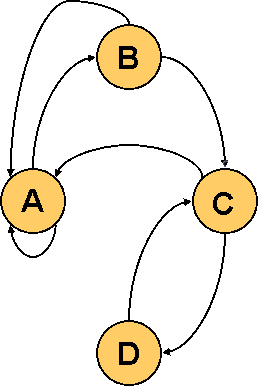
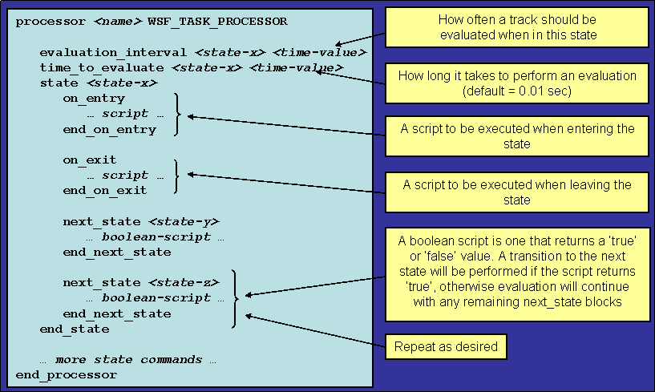

.. ****************************************************************************
.. CUI
..
.. The Advanced Framework for Simulation, Integration, and Modeling (AFSIM)
..
.. The use, dissemination or disclosure of data in this file is subject to
.. limitation or restriction. See accompanying README and LICENSE for details.
.. ****************************************************************************

Task Processor Primer
---------------------

Task Processor
==============

A Task Processor (:model:`WSF_TASK_PROCESSOR`) is an WSF processor that provides the ability to examine data (tracks) in
the track manager and act upon them.  The actions include

* Assignment of tasks to subordinates
* Activation or deactivation of sensors or jammers
* Firing of weapons
* Maneuvering the platform

Every platform that can assign tasks or receive task assignments MUST have an instance of a WSF_TASK_PROCESSOR. The
task processor uses the concept of a "finite state machine' to control the actions to be performed.

The task processor "listens" to the track manager to determine when a new track appears. The track may be from

* A track produced by a local sensor.
* A track received from an off-board source.
* A track embedded within a task assignment.
* A prebriefed track.

When a new track appears, an evaluation event will be scheduled for the "start" state (i.e., the first "state" in the
processor).  Subsequent evaluation events will be scheduled as dictated by the state machine.  Evaluation events for a
given track will cease when BOTH of the following are true:

* No tasks have been received for the track.
* No tasks have been originated for the track.

Each track executes in its own state machine.

Finite State Machine
====================

A finite state machine consists of

* A finite number of "states,' one of which is the "start state.'
* A set of "transition rules' or "transition functions' that define the conditions under which a state will change.

A finite state machine typically can be represented by a state diagram consisting of

* "nodes,' which represent states
* "arcs,' which connect the nodes and represent transition rules.

In WSF, a "state' can represent just about anything

* Waiting for something to come in range.
* Waiting for a sensor to acquire.
* Waiting for a weapon to detonate.

In the following example, a simple state diagram is shown that has nodes (labeled A through D) and arcs connecting the
nodes that represent transition rules.

State "A" is the starting point.  If the transition rules are met, it transitions to "B."  If all transition rules are
met, it eventually will transition to state "C" and then "D."  At states "B" and "C" it can revert back to "A" if
certain transition rules are not met.  An example of a radar system can be made with a state machine.  State "A" could
be the search mode. State "B" could represent the initial acquisition mode. State "C" could represent the secondary
acquisition mode.  State "D" could be the track mode.

State Machine Input
===================

The following graphic shows how a state machine is defined within a task processor in WSF.

Predefined Variables Available in a Task Processor
==================================================

The task processor has access to variables that are predefined to ease the creation of scripts as follows:

* | **TRACK Variable**
  | The TRACK variable is of type :class:`WsfLocalTrack` and refers to the current track being evaluated.  Because
    WsfLocalTrack inherits from WsfTrack, all of the methods in type :class:`WsfTrack` are also available.
* | **PROCESSOR Variable**
  | The PROCESSOR variable (or "this' which is deprecated) is of type WsfTaskManager and refers to the
    :model:`WSF_TASK_PROCESSOR`. All methods of :class:`WsfTaskManager`, :class:`WsfTaskProcessor`, :class:`WsfProcessor`, :class:`WsfPlatformPart`
    and :class:`WsfObject` are available to be used.
* | **PLATFORM Variable**
  | The PLATFORM variable is of the type WsfPlatform and refers to the platform that contains the processor. All methods
    of :class:`WsfPlatform` and :class:`WsfObject` are available to be used.
* | **MESSAGE Variable**
  | The MESSAGE variable is of the WsfMessage type. All methods of :class:`WsfMessage` are available.
* | **TIME_NOW Variable**
  | TIME_NOW is a simple "double' variable that represents the number of seconds since the start of the simulation.
* | **MATH Variable**
  | MATH allows the use of math functions. See :class:`Math`

::

 See :ref:`Common_Script_Interface` for variables available within other components.

The Evaluation Process of a State Machine
=========================================

* | Request a "thinker' process
  | When a thinker becomes available, mark it as busy for the amount of time specified in the "time_to_evaluate" for the
    current state.
  |  Simulates human or machine time needed to do something
  |  Controlled by the "time_to_think' value for the state being evaluated
  |  Can be overloaded
  |   If a thinker is not available (not busy thinking about another evaluation), the evaluation will be put on a "pending
      queue'
  |   Will be processed by the next available thinker.
  |  WSF_TASK_PROCESSOR can be configured with multiple thinkers
  |   Command: "number_of_servers <n>" (Default is 1)

* | When the thinker hits the end of the evaluation time, execute the rules for the current state:
  | Set the reserved script variables
  |  TRACK, PLATFORM, PROCESSOR, MESSAGE, TIME_NOW
  | Execute the "next_state' scripts in order of appearance
  |  If none return true, remain in the current state.
  |   Mark the thinker as "not-busy'
  |   Schedule the next evaluation using "evaluation_interval'.
  |  If one returns true, transition to indicated state.
  |   Execute the "on_exit' script for the current state.
  |   Execute the "on_entry' script for the new state.
  |   Set the "current state' equal to the "new state'
  |   Extend the thinker time by the "time_to_evaluate' for the new state.
  |   Wait for thinker to complete and evaluate the rules.

Assignment and Execution
========================

A task manager can assign (or cancel) tasks to subordinates.  Some methods available within :class:`WsfTaskManager` to
assign or cancel tasks are

* AssignTask (can also use FireAt, StartTracking and StartJamming for weapons)
* CancelTask
* TasksAssignedFor
* AssigneesForTask

Task assign/cancel/status messages are communicated over the comm network (if not a local task), and are subject to
loss (by range or jamming).  If the assignee of a task is killed, all tasks to the assignee will automatically be
canceled on the assigner(s).

**When a task assignment is received:**

* | It updates the track manager with the track that was supplied with the message.
  |  Creates a "local track' if it cannot be correlated to an existing track.
  |  (Track IDs between assigner and assignee are not the same!)
* | Increments the "lock count' for the track
  |  Prevents the local track from being purged while an assignment is active.
* | Add to the received task list.
  |  Will be reflected in the value returned by TasksReceivedFor.
* | If the assignee did not already "know' about the target, a state machine will be created and started for the target.
* | An immediate evaluation is requested, pending thinker availability.
  |  No delay waiting for the next evaluation cycle.

**When a task cancel is received:**

* | Purges the entry from the received task list.
  |  No longer reflected in the value returned by TasksReceivedFor.
* | Sends a confirmation to the assigner.
* | Invokes the "on_task_cancel' script (if defined)
* | Releases any sensor or weapon associated with the task
  |  (Applicable only to FireAt, StartTracking and StartJamming tasks.)
* | Decrements the lock count on the local track.
  |  Allows the local track to be purged if there are no other assignments and the track is older than the purge interval.
  |  If the local track is purged
  |   Destroys the state machine associated with the track.
  |   Invokes the "on_track_drop' script (if defined).
