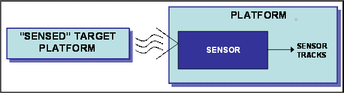
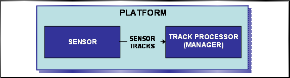
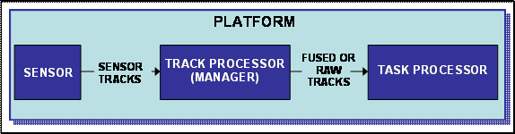
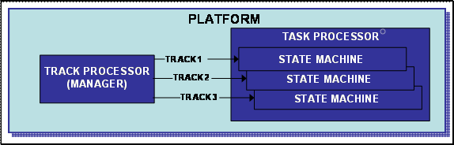
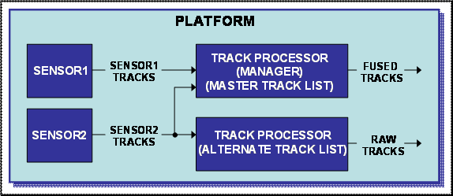
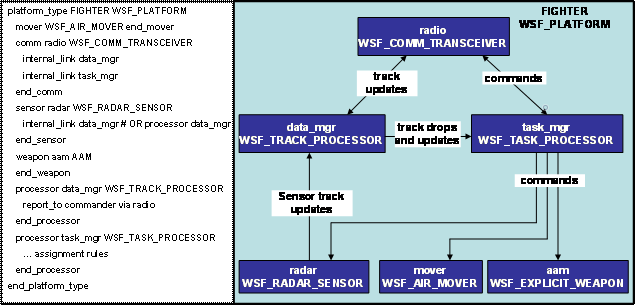

.. ****************************************************************************
.. CUI
..
.. The Advanced Framework for Simulation, Integration, and Modeling (AFSIM)
..
.. The use, dissemination or disclosure of data in this file is subject to
.. limitation or restriction. See accompanying README and LICENSE for details.
.. ****************************************************************************

Tracking Primer
---------------

Track Flow
==========

Unlike platforms in WSF, tracks are not instantiated entities in a simulation.  Typically, tracks are created as a
direct result of a sensor on a platform detecting another platform.  If a platform can 'see' another platform by way of
a sensor, a 'track' is created. The created 'track' has information that describes how it was created, what sensor
created it, what the target is, where the target is located, etc.  Each track has truth as well as perceived
information about the 'sensed' target platform.

On a platform, sensors ordinarily send their tracks to a track processor.  For simplicity, the combination of track
manager and track processor is defined to be the track processor. A track manager in the track processor stores the
track and also makes the track information available to other platforms as well as to the platform's task processor(s).
The track processor sends track updates to designated onboard or offboard parties at specified intervals. The track
processor can fuse tracks or provide raw tracks and even delete tracks if the sensor is no longer providing sensor
track updates. In some cases, the track processor is also referred to as a "data manager".

The track processor retains the tracks for the task processor to read.  In WSF, a task processor is programmable in
that a user can write unique platform scripts to make behaviors based on what tracks are in the tracklist within the
track manager/processor. A task processor is made up of a finite state machine (a subject not covered in this paper).

Important to note is that a task processor only works on one track at a time.  Many occurrences of the state machine
within the task processor can occur on a platform if multiple tracks are being provided by the track manager/processor.

Track Manager vs Track Processor
================================

Every platform that deals with tracks should have a track manager.  At the platform level, the
track_managerend_track_manager block configures track maintenance and fusion for the platform's master track list.  If
a platform only has one track processor it should also be the master track processor else the master track list will
not be accessible via scripting.  The distinction between the track manager and track processor becomes readily
apparent when multiple track processors exist.  If a platform has multiple track processors, a subordinate
track_manager end_track_manager block within a track processor defines an alternate track list that is maintained
separately from the master track list. In this example, the second track processor provides tracks only from sensor2
and it would maintain an alternate track list distinct from the master.

Linking Sensors, Comms, and Processors to Pass Tracks
=====================================================

In order for an object on a platform (sensor, comm, or processor) to provide or send tracks to another object on the
same platform, the use of 'internal_link' or 'processor <processor-name>' subcommands are used.  These subcommands
specify that messages that originate from this object are to be routed to the specified comm or processor object on the
same platform.

To pass tracks offboard (to a separate platform), the use of 'report_to' or 'external_link' is used.  In the example
shown, the track processor named 'data_mgr' does not have an internal_link to the task processor.  This is because task
processors have implicit access to track managers within WSF.  The FIGHTER definition in this example is simplified
for illustrative purposes.

Types of Track Names and Definitions
====================================

* **Local Track**
   A local track is any track stored in a track processors local track list.  If a track processor is a master, the local
   track list is identical to the master track list.

* **Raw or Non-local Track**
   A raw track is a preprocessed track that has not been stored in a processors track list

* **Fused Tracks**
   A fused track is a track that has been processed by the :command:`track_manager` which has been correlated and then fused by
   tracking algorithms.  The default is to use perfect correlation and then replacement track fusion.  Several track
   fusion algorithms are available to be used, but that is a discussion beyond this paper.

* **Filtered Tracks**
   A sensor or track manager can :command:`filter` tracks by using a Kalman, Alpha Beta, or Alpha Beta Gamma filter.  A filter
   converts the measurement's range, bearing and elevation data into an X-Y-Z position.

::

 These basic definitions do not define the relationship to each other.
 For instance, a local track can also be a fused track.

Using Track Information in a Task Processor
===========================================

As mentioned previously, a task processor is programmable in that a user can create WSF scripts to create platform
behaviors based on received tracks.  The behavior could be to do things such as fire a weapon, modify its route, send a
message, or to assign a task to a subordinate based on tracks.  Within a task processor, WSF provides access to the
local track it is currently operating on by the predefined **TRACK** variable ONLY IF THE SCRIPT IS CALLED WITHIN THE
CONTEXT OF A STATE MACHINE.  Simply stated, the **TRACK** variable is not available to be used by other processors or
scripts or even the Task Processor itself if the defined script is part of an on_update/on_initialize/on_message
script.  The script must be specifically called from the state machine to use the **TRACK** variable.
Example statements of using a **TRACK** variable in a task processor::

 weapon.CueToTarget(TRACK); # command a weapon to cue to a TRACK
 return (TimeSinceWeaponLastTerminatedFor(TRACK.TrackId()) > 0.0); # return a boolean
 return (WeaponsActiveFor(TRACK.TrackId()) > 0); # return a boolean

Using Track Information outside of a Task Processor
===================================================

In the cases of other processors and scripts (outside of a task processor), track information must be extracted by
casting and assigning a variable using the complex type WsfTrack first.  These are a couple of example statements of
casting and setting a variable named 'track' using the complex type WsfTrack::

 WsfTrack track = msg.Track(); # msg previously defined
 WsfTrack track = aPlatform.CurrentTargetTrack(); # aPlatform previously defined

Script example setting the track variable and using it::

 WsfLocalTrackList trackList = PLATFORM.MasterTrackList();
 if (trackList.TrackCount() > 0)
   {
    print("T=", TIME_NOW, " Turning sensor on");
    WsfTrack track = trackList.TrackEntry(0);
    sar.CueToTrack(track);
    sar.TurnOn();
   }

Track Information
=================

Depending on how a track was created, information or 'attributes' about the track can be extracted.  The following
illustrates how information can be extracted to set variables from track data in a task processor (see the :class:`WsfTrack`
for the complete list)::

 string targetname = TRACK.TargetName(); # Gets target name (truth data)
 double targetlat = TRACK.Latitude(); # Gets target latitude
 double targetlon = TRACK.Longitude(); # Gets target longitude
 double lastupdate = TRACK.TimeSinceUpdated(); # Gets last track updated time
 string targettype = TRACK.TargetType(); # Gets target type (truth data)
 double reltgtalt = TRACK.Altitude() - PLATFORM.Altitude(); # Gets track alt less my alt
 double trackquality = TRACK.TrackQuality(); # Gets track quality
 int signalcount = TRACK.SignalCount(); # Gets how many times we detected this emitter

Also note that several script types have access to track information besides WsfTrack.  For instance, :class:`WsfPlatform`
has several methods available to extract track information such as the following::

 double slantrangetotarget = PLATFORM.SlantRangeTo(TRACK);
 double relativebearingtotarget = RelativeBearingTo(TRACK);

Track Truth vs Perception
=========================

Track information within the simulation can either be based on truth or perceived information.  Perceived information
about a track contains sensor sigma (location) errors as well as track velocity errors.  If a track was created using a
perfect geometric sensor, the track location information is also based on truth and not perception.  Other information,
such as the target name and type will also be based on truth whether the sensor is providing perfect track location or
not.

Tracks from Non Sensors
=======================

It was stated earlier that tracks typically are created from sensors.  However, tracks can be created by other means.

* **Prebriefed Tracks**
   Tracks can be created in scenario input files (:command:`track` end_track block).  For instance, a bomber has a target located
   (such as a building or sam site) that is the assigned target (or targets) that the platform is to attack before the
   simulation starts.  Prebriefed tracks represent those targets.  Obviously, prebriefed tracks do not have all of the
   same attributes as a track generated by a sensor.

* **Tracks made from Platforms**
   In WSF, tracks can be created with a method called MakeTrack() from the WsfTrack type.  For example, a commander
   flying in formation can create a track of all subordinate platforms:

::

 foreach (WsfPlatform sub in PLATFORM.Subordinates(""))
   {
   WsfTrack track = sub.MakeTrack();
   writeln("Platform:       ", sub.Name());
   writeln("Slant  Range:   ", PLATFORM.SlantRangeTo(track));
   writeln("Ground Range:   ", PLATFORM.GroundRangeTo(track));
   }

Another way to create a track at the simulation level::

 WsfTrack track = WsfSimulation.FindPlatform("target_1").MakeTrack(); # target_1 must exist

Or course, a track of a platform could be made::

 WsfTrack track = PLATFORM.MakeTrack();

Script Types to Access Track Information
========================================

* **WsfTrack()**
   :class:`WsfTrack` is the base object that defines a track.  Several examples have already been shown.

* **WsfTrackList()**
   The script type :class:`WsfTrackList` holds the references to all of the WsfTrack objects.

* **WsfLocalTrack()**
   :class:`WsfLocalTrack` represents a processor's local perception of a track, and is the combination of one or more
   contributing WsfTrack objects. The contributing tracks are sometimes called 'raw' tracks and represent the products of
   a sensor or some other platform. The WsfLocalTrack contains all the information that WsfTrack does but adds additional
   contributor information. The predefined TRACK variable is a WsfLocalTrack.

* **WsfLocalTrackList()**
   :class:`WsfLocalTrackList` is a container of references to WsfLocalTrack objects.  If only one track manager is present on
   a platform and it contains the master track list, the local track list will be the same as the master track list. Here
   is an example on how to access the container:

::

 WsfLocalTrackList trackList = PLATFORM.MasterTrackList();

* **WsfTrackId()**
   :class:`WsfTrackId` objects are used to identify tracks as defined by WsfTrack and WsfLocalTrack.  Each track has a track
   ID associated with it to uniquely identify tracks.  To access the track ID, the use of TrackId() is used.  Example uses
   would be:

::

 WsfTrackId trackid = TRACK.TrackId();
 WsfTrackId currenttargetid = PLATFORM.CurrentTarget();#CurrentTarget method from WsfPlatform

For further explanation of task processors, see :doc:`task_processor_primer`.
