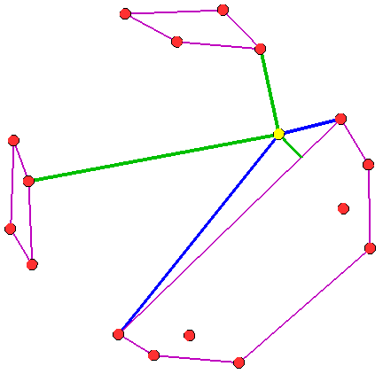
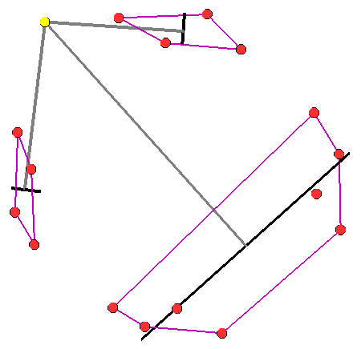

.. ****************************************************************************
.. CUI
..
.. The Advanced Framework for Simulation, Integration, and Modeling (AFSIM)
..
.. The use, dissemination or disclosure of data in this file is subject to
.. limitation or restriction. See accompanying README and LICENSE for details.
.. ****************************************************************************

WsfClusterManager
-----------------

.. class:: WsfClusterManager inherits Object

WsfClusterManager provides access to various clustering algorithms.  It accepts arrays of objects as input and 
forms clusters (other arrays) that best fit the groupings of the objects provided.  WsfClusterManager can be 
configured to cluster the objects according to a K-Means or a Hierarchical Tree clustering method.  WsfClusterManager 
creates and returns arrays of clusters (arrays of arrays).  When determining the best fit, WsfClusterManager can use 
2D position, 3D position, or a custom user score as a similarity measurement between objects.  WsfClusterManager
can cluster the following object types: WsfTrack, WsfLocalTrack, WsfPlatform, WsfGeoPoint, & WsfAssetPerception.  It
accepts arrays of said objects and it also accepts these types:  WsfTrackList, WsfLocalTrackList, & WsfPlatformList.

Configuration Methods
=====================

Configuration methods provide a way to create and/or modify the settings of the WsfClusterManager.  These settings
determine how the manager will cluster.  In many cases, the choices here will be ineffectual because the groupings of
the objects are obvious and any algorithm choice or similarity measure will produce the same results.  Only in special
cases will there be noticeable differences.  If no distance limit or number of clusters are specified, the cluster 
manager will make a guess for you on the best number of clusters of generate. Example: if clustering 10 objects, then 
3 clusters will be generated, and if clustering 21 objects, then 5 clusters will be generated, etc.  Please set the 
distance limit for best usage.

.. method:: WsfClusterManager Create()
   
   Returns an instance of a WsfClusterManager.  See "Construction" example above.

.. method:: void SetClusterMethod(string methodName)
   
   Allows the user to tell the cluster manager which clustering algorithm to use.  Options:

   * "H_TREE_MAX", a complete linkage agglomerative method. Provides tight groupings with diameter no larger than the limit.
   * "H_TREE_MIN", a single linkage agglomerative method. Can provide longer strings of objects linked together.
   * "H_TREE_AVG", a dynamic linkage agglomerative method, average between min and max, but takes longer.
   * "K_MEANS", not dynamic, but best suited for when you know how many clusters you want.  Use: SetClusterCount(int).

   Default: "H_TREE_MAX".
   
   Example Clustering: H_TREE_MAX, H_TREE_MIN, and K_MEANS (with K = 2):
   
   .. image:: ../images/cluster_htree_max.png
   .. image:: ../images/cluster_htree_min.png  
   .. image:: ../images/cluster_kmeans_3.png 

.. method:: void SetDistanceFunction(string measure)
   
   Allows the user to tell the cluster manager what measure to use while computing similarity between tracks.  Options:

   * "POSITION_ONLY", uses 3D position.
   * "2D_POSITION_ONLY", only uses 2D position, no altitude.

   Default: "POSITION_ONLY".

.. method:: void SetScriptDistanceFunction(string functionName)
   
   Allows the user to specify a script method to be used in scoring the similarity (or distance) of potential cluster
   members. The argument types of the function need to match the type of objects you will be clustering. Users can override
   the script function as often as they like.
   Warning - only used for cluster methods "H_TREE_MAX" and "H_TREE_MIN".
   
   Example::

    script double MyTrackFunction(WsfTrack t1, WsfTrack t2)
      return t1.GroundRangeTo(t2);
    end_script
    
    script double MyPlatformFunction(WsfPlatform p1, WsfPlatform p2)
    	return p1.SlantRangeTo(p2);
    end_script
    
    on_update
      WsfClusterManager cm = WsfClusterManager.Create();
      cm.SetScriptDistanceFunction("MyTrackFunction");
      Array<Array<WsfLocalTrack>> trackClusters = cm.GetClusters(PLATFORM.MasterTrackList());
      //now use a custom function to cluster a different object type
      cm.SetScriptDistanceFunction("MyPlatformFunction");
      Array<Array<WsfPlatform>> platformClusters = cm.GetClusters(PLATFORM.Subordinates());
    end_on_update

.. method:: void SetDistanceLimit(double newLimit)
   
   Default: not used.  Reasonable starting value: 46300 (meters == 25 nm).
   Informs the cluster manager how close a potential member has to be to a cluster in order to be considered part of that
   cluster.  How this value is actually used depends on the clustering method.  For example: if "H_TREE_MIN" is chosen as
   your clustering method, then a potential member can be considered part of a cluster if it's within the distance limit
   to any of the current members.  "H_TREE_MAX" requires members to be within the limit to all other members.

.. method:: void SetNumClustersToCreate(int count)
   
   Allows the user to tell the cluster manager how many clusters to form.  Warning: only use this function if you want a
   specific number of clusters because this might not allow the manager to best fit the data.

Cluster Methods
===============

A cluster can be thought of as an array of objects.  When you get clusters from the manager, it will provide you an 
array of clusters (an array of arrays).  The cluster manager does not record or maintain any clusters inside 
of itself; the manager calculates them when you call one of these methods and it gives them back to you immediately.
The cluster manager generates clusters based on how it has been configured.

.. method:: Array<Array<WsfTrack>> GetClusters(WsfTrackList objects)
            Array<Array<WsfLocalTrack>> GetClusters(WsfLocalTrackList objects)
            Array<Array<WsfPlatform>> GetClusters(WsfPlatformList objects)
            Array<Array<WsfTrack>> GetClusters(Array<WsfTrack> objects)
            Array<Array<WsfLocalTrack>> GetClusters(Array<WsfLocalTrack> objects)
            Array<Array<WsfPlatform>> GetClusters(Array<WsfPlatform> objects)
            Array<Array<WsfGeoPoint>> GetClusters(Array<WsfGeoPoint> objects)
            Array<Array<WsfAssetPerception>> GetClusters(Array<WsfAssetPerception> objects)
   
   Performs a clustering algorithm on the objects and returns an array of clusters.  A cluster is an array of objects.

Utility Methods
===============

These methods provide addition data about your clusters.

.. method:: int UniqueId(Array<WsfTrack> cluster)
            int UniqueId(Array<WsfLocalTrack> cluster)
            int UniqueId(Array<WsfPlatform> cluster)
            int UniqueId(Array<WsfGeoPoint> cluster)
            int UniqueId(Array<WsfAssetPerception> cluster)

   Returns a unique ID for the cluster based on the cluster members.  If another cluster happens to have the same exact
   members (no more, no less) then it will have the same ID.

.. method:: Array<WsfTrack> ConvexHull(Array<WsfTrack> cluster)
            Array<WsfLocalTrack> ConvexHull(Array<WsfLocalTrack> cluster)
            Array<WsfPlatform> ConvexHull(Array<WsfPlatform> cluster)
            Array<WsfGeoPoint> ConvexHull(Array<WsfGeoPoint> cluster)
            Array<WsfAssetPerception> ConvexHull(Array<WsfAssetPerception> cluster)

   Returns the convex hull bounding shape that encapsulates the members of the cluster.
   The hull is comprised of cluster member objects that form the shape.

.. method:: WsfGeoPoint MeanLocation(Array<WsfTrack> cluster)
            WsfGeoPoint MeanLocation(Array<WsfLocalTrack> cluster)
            WsfGeoPoint MeanLocation(Array<WsfPlatform> cluster)
            WsfGeoPoint MeanLocation(Array<WsfGeoPoint> cluster)
            WsfGeoPoint MeanLocation(Array<WsfAssetPerception> cluster)

   Returns the average position of the members in the cluster.
   Similar to center of gravity of the cluster (assuming all members have the same "mass").

.. method:: WsfTrack NearestMember(Array<WsfTrack> cluster, WsfGeoPoint refPt)
            WsfLocalTrack NearestMember(Array<WsfLocalTrack> cluster, WsfGeoPoint refPt)
            WsfPlatform NearestMember(Array<WsfPlatform> cluster, WsfGeoPoint refPt)
            WsfGeoPoint NearestMember(Array<WsfGeoPoint> cluster, WsfGeoPoint refPt)
            WsfAssetPerception NearestMember(Array<WsfAssetPerception> cluster, WsfGeoPoint refPt)

   Returns the nearest cluster member object to the given reference point.

.. method:: Array<Object> NearestEdgePoint(Array<WsfTrack> cluster, WsfGeoPoint refPt)
            Array<Object> NearestEdgePoint(Array<WsfLocalTrack> cluster, WsfGeoPoint refPt)
            Array<Object> NearestEdgePoint(Array<WsfPlatform> cluster, WsfGeoPoint refPt)
            Array<Object> NearestEdgePoint(Array<WsfGeoPoint> cluster, WsfGeoPoint refPt)
            Array<Object> NearestEdgePoint(Array<WsfAssetPerception> cluster, WsfGeoPoint refPt)

   Returns the nearest cluster edge point of the cluster to the given reference point; it also returns
   the two indices of cluster members that share the edge of the nearest point.  If the nearest edge point
   is on a corner (on a member), then the indices will be the same.
   Example::

         //Array<WsfTrack> cluster;	//filled with tracks somehow
         Array<Object> vals = manager.NearestEdgePoint(cluster, PLATFORM.Location());
         int         index1 = (int)        vals[0];
         int         index2 = (int)        vals[1];
         WsfGeoPoint point  = (WsfGeoPoint)vals[2];
         WsfTrack member1 = cluster[index1];
         WsfTrack member2 = cluster[index2];
         
   Image key: three clusters rendered (type: hull) with draw() using a purple color. The yellow point is the reference point. The green line is drawn to the nearest edge point. The blue lines are drawn to the members that share the edge point (given by the two indices returned).

.. method:: void Draw(Array<WsfTrack> cluster, double duration, Vec3 color, string type)
            void Draw(Array<WsfLocalTrack> cluster, double duration, Vec3 color, string type)
            void Draw(Array<WsfPlatform> cluster, double duration, Vec3 color, string type)
            void Draw(Array<WsfGeoPoint> cluster, double duration, Vec3 color, string type)
            void Draw(Array<WsfAssetPerception> cluster, double duration, Vec3 color, string type)
            
   Draws the given 'cluster' for 'duration' with the 'color'.  Type can be "hull" or "star".  Default: "hull".

.. method:: Array<Object> CrossLength(Array<WsfTrack> cluster, WsfGeoPoint refPt)
            Array<Object> CrossLength(Array<WsfLocalTrack> cluster, WsfGeoPoint refPt)
            Array<Object> CrossLength(Array<WsfPlatform> cluster, WsfGeoPoint refPt)
            Array<Object> CrossLength(Array<WsfGeoPoint> cluster, WsfGeoPoint refPt)
            Array<Object> CrossLength(Array<WsfAssetPerception> cluster, WsfGeoPoint refPt)

   Returns the length of the cross beam of the cluster relative to the reference point; it also returns the two end points of the cross beam.
   Example::

      Array<Object> vals = manager.CrossLength(cluster, PLATFORM.Location());
      double      length = (double)     vals[0];
      WsfGeoPoint left   = (WsfGeoPoint)vals[1];
      WsfGeoPoint right  = (WsfGeoPoint)vals[2];

   Image key: three clusters rendered (type: hull) with draw() using a purple color. The yellow point is the reference point. The gray lines are to the mean locations of the clusters. The black line is the cross beam line (relative to the yellow point) which is drawn between the two points returned.

Example
=======

::

  end_time 5 min
  dis_interface
     record replay.rep
  end_dis_interface

  platform tracker WSF_PLATFORM
    add mover WSF_AIR_MOVER
    end_mover
    route position 0.0n 0.1w altitude 10 km heading 90 deg speed 400 kts end_route
    add sensor geom-1 WSF_GEOMETRIC_SENSOR
       frame_time 1 s
       maximum_range 20 km
       azimuth_error_sigma 10 deg
       elevation_error_sigma 10 deg
       range_error_sigma 1000 m
       reports_location
       reports_velocity
       processor track_processor
       on
    end_sensor
    add processor track_processor WSF_TRACK_PROCESSOR end_processor

    script_variables
       WsfClusterManager manager = WsfClusterManager.Create();
    end_script_variables

    execute at_time .1 s absolute
        manager.SetClusterMethod("H_TREE_MAX");
        manager.SetDistanceFunction("POSITION_VELOCITY");
        manager.SetDistanceLimit(9260); # 5nm
    end_execute

    execute at_interval_of 5.0 s
      WsfLocalTrackList tracks = PLATFORM.MasterTrackList();
      Array<Array<WsfLocalTrack>> trackClusters = manager.GetClusters(tracks);
      foreach(Array<WsfLocalTrack> cluster in trackClusters)
      {
         manager.Draw(cluster, 5, Vec3.Construct(1,0,1), "hull");  #draw purple colored cluster hull for 5 seconds
         int id = manager.UniqueId(cluster);
         foreach(WsfLocalTrack member in cluster)
         {
            writeln("cluster ", id," member: ", member.TargetName());
         }
         Array<WsfLocalTrack> hull = manager.ConvexHull(cluster);
         WsfGeoPoint mean = manager.MeanLocation(cluster);
         WsfTrack member = manager.NearestMember(cluster, PLATFORM.Location());
         Array<Object> vals = manager.NearestEdgePoint(cluster, PLATFORM.Location());
         Array<Object> vals = manager.CrossLength(cluster, PLATFORM.Location());            
      }
    end_execute
  end_platform
  
  //put at least 2 targets out there, to make it interesting (why cluster just one?).
  platform target WSF_PLATFORM
    add mover WSF_AIR_MOVER end_mover
    route position 0.0n 0.0e altitude 10 km heading 90 deg speed 400 kts end_route
  end_platform
  platform target_2 WSF_PLATFORM
    add mover WSF_AIR_MOVER end_mover
    route position 0.0n 0.05w altitude 10 km heading 90 deg speed 400 kts end_route
  end_platform
