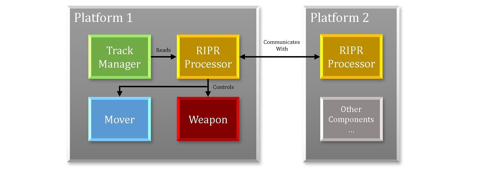
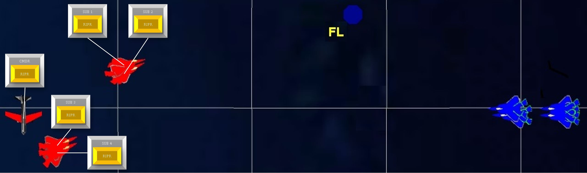
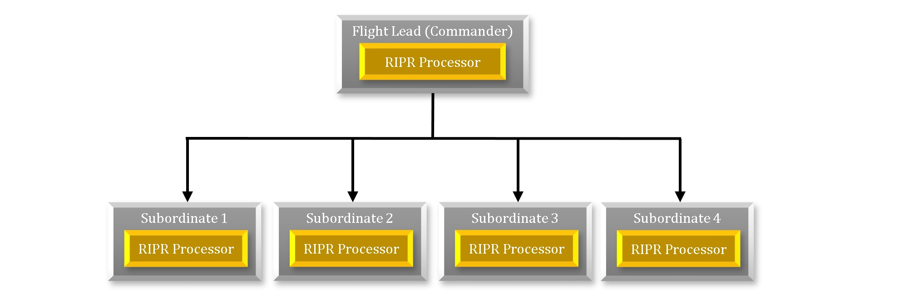

.. ****************************************************************************
.. CUI
..
.. The Advanced Framework for Simulation, Integration, and Modeling (AFSIM)
..
.. The use, dissemination or disclosure of data in this file is subject to
.. limitation or restriction. See accompanying README and LICENSE for details.
.. ****************************************************************************

.. _RIPR_Scenarios:

RIPR Scenarios
--------------

What is a RIPR scenario?
========================

A :ref:`RIPR` scenario is any scenario or simulation that uses RIPR in any capacity for artificial intelligence or
decision making of some kind.  For a scenario to use RIPR, it must have at least one RIPR agent because RIPR is an
architecture for intelligent agents.  RIPR agents can do anything you design them to do, and RIPR provides a few great
AI features to help you tweak your agent to your liking.  A RIPR agent can exist on any kind of platform and it can
perform any kind of platform task.  A task to be performed might be as simple as flying towards a point, or maybe even
firing a weapon.  A common application of the RIPR framework is to make a regular platform into a RIPR agent by adding
a RIPR processor to it.  The RIPR processor can control the platform's maneuvering and weapons in order to move towards
the right locations and engage the right targets.  A platform's weapons might include missiles, bombs, or even jamming
emitters.  A RIPR agent can act in conjunction with other other RIPR agents (often through a commander) or it can act
solo.  Much of the communication between RIPR agents is in the form of job bidding and job allocation; this is
described in more detail below. RIPR agents can retrieve data from any aspect of the platform and can control any
aspect of the platform.  It is typical to make your RIPR agent control some kind of weapon targeting.

Here is an example of a simple platform structure of a RIPR agent:

Example Scenario
================

We will use a simple example RIPR scenario to further explore this topic.  Our example contains a few blue & red
squadrons.  We will focus on the blue squadrons because they are made up of RIPR agents. You'll notice a blue AWACS in
the rear providing support, a couple strike bombers, four Airborne Interceptors (AI) that are flying in two pairs, and
one Flight Lead (FL).  The only platforms list here that are RIPR agents are the four AIs and the FL.

What do agents do? What decisions are to be made?
=================================================

A player in a scenario, such as our example scenario, commonly needs to answer the question "which targets or threats
should I be engaging?".  The best answer isn't always obvious or intuitive, and sometimes requires a fair amount of
intelligence.  In this example scenario, focusing on the blue force, the hierarchy in place is a flight lead (FL)
platform with four airborne interceptor (AI) subordinates.  The other blue platforms in play are not agents and will
only perform their simple scripted function.  The RIPR agents should intelligently decide what tasks there are to
perform, and who will carry them out.

Example hierarchy
=================

A very simple hierarchy has just one commander and one or more subordinates.  Here is the simple command structure from
our example scenario:

The flight lead agent should be in control of the tasking for his squadron, so he will create the jobs to perform and
his subordinates will carry them out.  The jobs this example flight lead will create are simply "pursue or engage the
target" jobs.  If one of it's airborne interceptor agents is tasked with that kind of job, it will be responsible for
performing it.  The interplay between job creator/owner and job bidder/performer is described more fully in the next
section.

Interaction between agents
==========================

The diagram below demonstrates a simple interaction between a subordinate RIPR processor and it's commander.  You can
see on the commander's job board that a few jobs have already been created.  You can see that the subordinate processor
has made bids on those jobs, and you can see the subordinate processor has won a job.  The jobs can be anything, any
kind of task you can think of.  The jobs can contain whatever data and information you want to attach to them.  Typical
things to attach to a job are tracks, geodetic locations, and qualifying parameters (such as required weapons or
frequencies).  Subordinates should only bid on jobs they recognize, either by name or by description.

When a subordinate bids on a job, it is essentially "responding" to it's commander and saying "this is how good I can
do".  It's bid represents a dialogue between itself and the commander as they assess the situation and their
capabilities.  The commander is in control of it's job board, and determines what job's exist on the board, and what
it's allocation strategy is.

.. image:: ./images/ripr_processor_interaction.jpg

Creating, Bidding on, and Winning Jobs
======================================

For this commander/subordinate interaction to take place, a few things have to happen.  First, jobs need to be created
and put onto the commander's job board during it's update.  Here is an example to create "pursue or engage target"
jobs, and such script might exist inside of the commander's on_update routine:

::

   WsfLocalTrackList localTracks = PLATFORM.MasterTrackList();
   foreach (WsfTrack x in localTracks)
   {
      if (x.IsValid() && (job does not already exists))  //pseudo code
      {
         WsfRIPRJob temp = WsfRIPRJob.Create( PROCESSOR, "pursue-target", x.TargetName(), 2.3, 1);
         temp.SetData("targetTrackName", x.TargetName());
         AddJob(temp);
      }
   }

A job is created for each track on the platform's master track list, it is given a priority of 2.3 (relative to other
jobs on the job board) and is specified as a job only to be won by "1" subordinate.  An enhancement to this script
would be to remove jobs from the board as tracks disappear from the track list, but that was left out for simplicity.

Now that the commander has jobs on its job board, it's subordinates should be able to bid on them.  Here is some
example script that should exist on a subordinate:

::

   query_bid
      if (!JOB.IsValid()) {
         return -MATH.DOUBLE_MAX();
      }
      return 500.0;
   end_query_bid

   on_update

      ...

      Array<WsfRIPRJob> jobs = GetRIPRCommanderProcessor().GetJobs();
      foreach (WsfRIPRJob aJob in jobs)
      {
         double bidVal = QueryBid(aJob);
         aJob.BidJob(PROCESSOR,bidVal);
      }

      ...

   end_on_update

The query_bid script block on a platform is called through the QueryBid() method.  This shows that it's owning platform
bids a value of 500.0 on every valid job on it's commander's job board.
