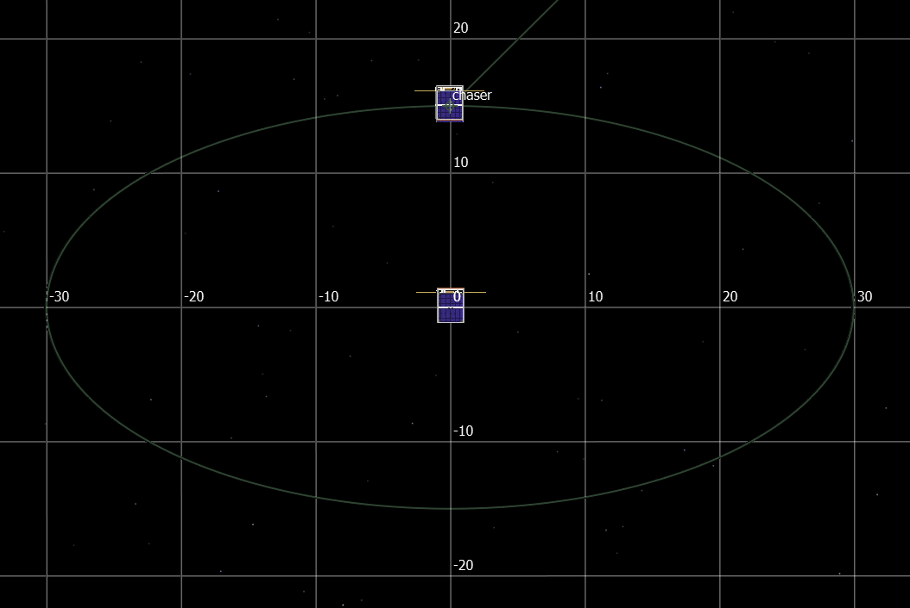
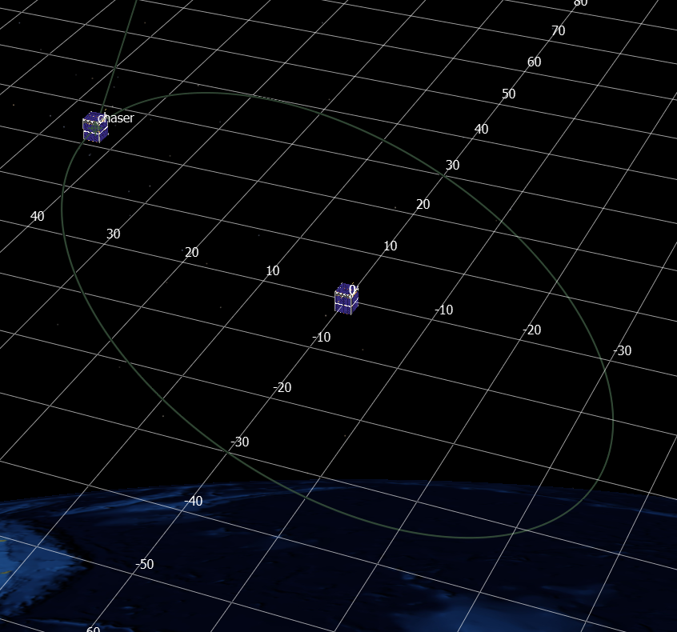

.. ****************************************************************************
.. CUI
..
.. The Advanced Framework for Simulation, Integration, and Modeling (AFSIM)
..
.. The use, dissemination or disclosure of data in this file is subject to
.. limitation or restriction. See accompanying README and LICENSE for details.
.. ****************************************************************************

Natural Motion Circumnavigation Details
=======================================

A Natural Motion Circumnavigation (NMC) is an orbit for one platform that is
specified relative to another platform. One platform, called the target or
chief, executing a circular orbit becomes the center point of a relative orbit
by another platform, called the chaser. When the chaser is given the correct
state, over the course of an orbit for the chief, the chaser will execute an
orbit that, from the perspective of the chief, will circumnavigate the chief.

Once the chaser attains one of a number of orbital states, the NMC will proceed
without the need for any subsequent expenditure of propellant. This feature is
what makes this a *natural motion* circumnavigation.

Description of the Relative Motion
----------------------------------

In a frame of reference fixed to the chief, the motion of a chaser executing
NMC decomposes into a motion in the orbital plane of the chief, and a motion
in the out-of-plane direction.

The in-plane relative motion is an ellipse with a semi-major-axis aligned with
the local horizontal direction (also know as in-track). The semi-minor axis is
aligned in the radial direction and has half the magnitude of the
semi-major-axis. The period of the relative orbit is equal to the orbital period
of the chief.

   An example NMC with a semi-major-axis of 30 m. The radial direction is up, and the in-track direction is to the right. The platform 'chaser' is pictured at the point of insertion into the NMC, and it will orbit the chief counterclockwise.

The out-of-plane relative motion is that of a harmonic oscillator with a period
equal to the orbital period of the chief. Because the periods of the in-plane and
out-of-plane motions are equal, the resulting relative orbit is closed, and
appears to tilt the ellipse out of the orbital plane of the chief.

   The NMC from the previous image, but with an out-of-plane motion. The grid shows the in-track and cross-track distances. The relative orbit still appears elliptical, but is tilted out of the radial, in-track plane.

Entering into the NMC
---------------------

The initial state of the chaser is not constrained in any way, so the
:doc:`natural_motion_circumnavigation` maneuver first
performs a rendezvous-like maneuver to transfer the chaser into an orbit that
intersects the NMC. Once the chaser travels to the point of intersection with
the NMC orbit, a point called the insertion point, another maneuver is executed
to bring the chaser onto the NMC orbit. The rendezvous portion of the NMC maneuver
carries over many of the same parameters as a :doc:`rendezvous`
maneuver.

Options Describing the NMC Relative Orbit
-----------------------------------------

The relative motion in the plane is described by the following expressions, where
:math:`x(t)` is the relative radial position of the chaser, :math:`y(t)` is the
relative in-track position of the chaser, :math:`n` is the mean motion of the
chief's orbit, :math:`A` is the semi-major-axis of the relative orbit, and
:math:`\phi` is a phase angle:

.. math::
   \begin{split}
   x(t) & = \frac{A}{2} \cos{(n t + \phi)} \\
   y(t) & = -A \sin{(n t + \phi)}.
   \end{split}

Note that the sign in front of :math:`\phi` is chosen so that increases in that
phase angle correspond to an advance around the relative orbit in the same sense
as the chaser proceeds through the NMC.

The out-of-plane motion is described similarly, where :math:`z(t)` is the relative
cross-track position of the chaser, :math:`B` is an amplitude, and :math:`\lambda`
is a phase.

.. math::
   z(t) = B \cos{(n t - \lambda)}.

The :doc:`natural_motion_circumnavigation` maneuver has
two parameters each for the in-plane and out-of-plane motion,
:command:`natural_motion_circumnavigation.orbit_size`,
:command:`natural_motion_circumnavigation.orbit_phase`,
:command:`natural_motion_circumnavigation.out_of_plane_amplitude`,
and :command:`natural_motion_circumnavigation.out_of_plane_phase`,
which correspond to :math:`A`, :math:`\phi`, :math:`B`, and :math:`\lambda`,
respectively.
