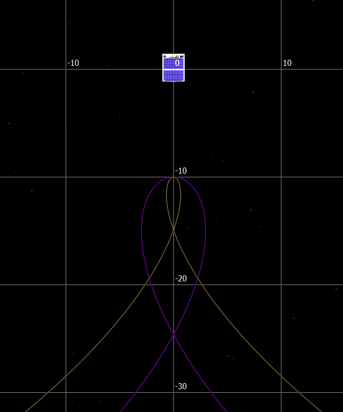
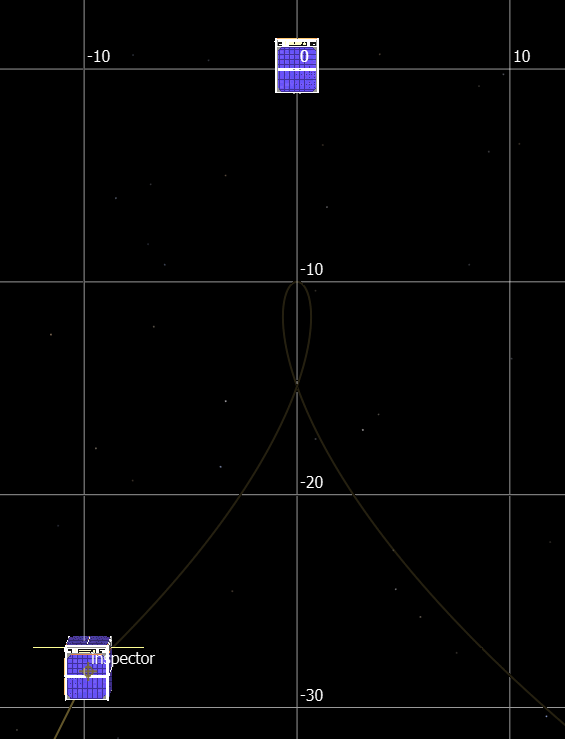

.. ****************************************************************************
.. CUI
..
.. The Advanced Framework for Simulation, Integration, and Modeling (AFSIM)
..
.. The use, dissemination or disclosure of data in this file is subject to
.. limitation or restriction. See accompanying README and LICENSE for details.
.. ****************************************************************************

Teardrop Details
================

A teardrop relative orbit allows one platform, called the inspector, to hover
near another platform, called the target or chief. The name of the orbit comes
from the characteristic shape the orbit makes relative to the chief.

The orbit shape is parameterized by the distance at the point of closest approach (POCA),
and the time it takes to traverse the teardrop, also called the period. The POCA is
at the 'apex' of the teardrop, and will have a relative position that is entirely
radial. This can be either a positive separation, defined to mean the inspector is
farther from the central body than the chief, or negative, when the inspector is
closer to the central body. The teardrop is not defined for a separation at POCA
of zero, so this case is explicitly disallowed. The period of the teardrop is
constrained to be smaller than about 40.6 percent of the chief's period.

   Two teardrop orbits with the same POCA, and different periods. The grid shows the in-track and radial distances.

Entering into the Teardrop
--------------------------

The initial state of the inspector is not constrained in any way, so the
:doc:`teardrop` maneuver first performs a rendezvous-like
maneuver to transfer the inspector into an orbit that intersects the teardrop
orbit. Once the inspector travels to the point of intersection, called the insertion
point, another maneuver is executed to bring the inspector onto the teardrop orbit.
As a result, the transfer portion of the teardrop maneuver carries over many of
the same parameters as a :doc:`rendezvous` maneuver.

The insertion point on the teardrop orbit can be any point before the start of
the teardrop. To determine where exactly the insertion point will be, users will
specify a time to POCA for their maneuvers. This will be the duration between
the end of the transfer and reaching the POCA. To allow for there to be at least
one full repetition of the teardrop, the time to POCA must be at least half of
the period.

   A teardrop orbit showing the inspector at the insertion point. The time taken for the inspector to get to POCA is a specifiable parameter for a teardrop maneuver. The grid shows the in-track and radial distances.

Repeating the Teardrop
----------------------

To extend the time spent hovering near the chief, the teardrop can be traversed
multiple times. Any teardrop will have at least one repetition, but more can
be specified, with each repetition beyond the first repeating the teardrop
portion of the orbit.
