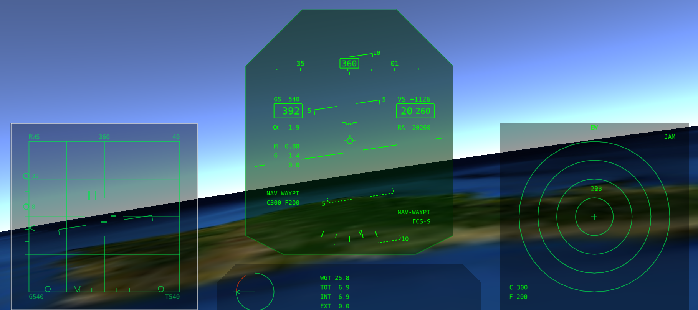
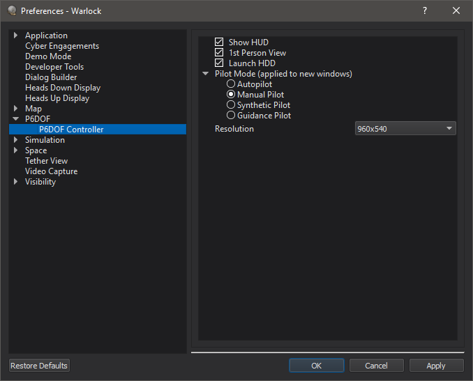
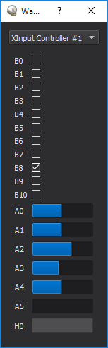

.. ****************************************************************************
.. CUI
..
.. The Advanced Framework for Simulation, Integration, and Modeling (AFSIM)
..
.. The use, dissemination or disclosure of data in this file is subject to
.. limitation or restriction. See accompanying README and LICENSE for details.
.. ****************************************************************************

P6Dof Controller - Warlock
--------------------------

.. note:: P6DOF Controller is deprecated in favor of the Joystick and HeadUpView plugins. As a result, P6DOF controller is disabled by default and must be enabled through the :doc:`Plugin Manager <../warlock_plugin_manager>`.

The P6DOF Controller dialog allows the user to take manual control of an AFSIM platform with a pseudo-6DOF (P6DOF) mover.
The tool provides an out-the-window (OTW) view that includes a head-up display (HUD) overlay. It also includes several
experimental features, such as Multi-Function Displays (MFDs) that are provided in early access form, which may be
enhanced or removed in future releases. The tool is available after right clicking on a platform with a P6DOF mover
in the context-menu.

Right Click Menu
================

* ShowHUD - Display the heads-up-display
* FirstPersonView - Toggle to/from a first person view
* ActivateAutoPilot - Activate the pseudo-6DOF autopilot.
* ActivateManualPilot - Activate the pseudo-6DOF manual pilot, allowing user control.
* ActivateSyntheticPilot - Activate the pseudo-6DOF synthetic pilot
* ActivateGuidance - Activate the pseudo-6DOF guidance control.
* Controllers - Choose from attached and defined controllers.
* Full Screen - Makes the window full screen.

These actions may be mapped to key-bindings in the preferences.

Preferences
===========

* Show HUD - Sets the default initial state of the HUD in new controllers.
* 1st Person View - Sets the default initial view in new controllers.
* Launch HDD - Sets whether to automatically launch the Heads-Down-Display when starting a controller.
* Pilot Mode - Sets the default initial pilot mode in new controllers.
* Resolution - Sets the resolution of the controller window.

Controller Mapping
==================

Controllers mappings for the P6DOF Controller Warlock plug-in are defined in xml files stored in resources/data.

Warlock is delivered with mappings for:

* Thrustmaster T-160000M Stick (preferred controller)
* HOTAS Warthog Stick and Throttle
* Logitech X3D Pro Stick
* Playstation 4 Gamepad
* Saitek x45 Stick
* Saitek x52 Stick
* XBox 360/One Gamepad

Not all mappings will be complete.  Refer to the individual mapping files to see how the controller are used.

The xml files contain a devicelist which will contain one or more devices.  Each device defines a control scheme for the plug-in.  While
a file may contain many devices, it is recommended to maintain a single device per file.

Devices have a name, which defines how it will be displayed in the plug-in.

::

   <devicelist>
      <device name="My new controller>
         ...
      </device>
      <device name="My other controller>
         ...
      </device>
   </devicelist>

The devices contain:

id_string(s) - These define how the controller is identified in the operating system.  Wildcards are permissible.  A single control scheme may make
use of multiple controllers (i.e. a stick and throttle), in this case a subdevice should be defined on the id_string.  If a controller has
multiple possible id_strings, or has different id_strings on different supported operating systems multiple id_strings may be defined.

Single subdevice:

::

   <device name="My single controller">
      <id_string name="Controller*"/>
      ...
   </device>

Multiple subdevices:

::

   <device name="My Stick and Throttle">
      <id_string name="Stick*" subdevice="0"/>
      <id_string name="Throttle*" subdevice="1"/>
      ...
   </device>

values - These define the bindings between the application and the controller.  The name of the value comes from the plug-in.  The value in turn
may contain various control mechanisms:

axis - an axis is a control on a device that returns a range of values.  By default the range will be [-1,1].
button - a button is a control that returns a binary value. Unless otherwise specified it will return 0 by default, and 1 when pressed.
toggle_button - a toggle button will cycle through states.  By default it will cycle through the values 0 and 1 as it is pressed.
hat - is a two axis control with a default range of [-1,1] on each axis.
state_key - will take keyboard input and treat it like button.
toggle_key - will take keyboard input and treat it like a toggle_button.

Each control mechanism should have a name value.  For an axis, button, toggle_button or hat, these are defined by how the controller expresses to
the operating system.  For a key, these are strings representing the key of interest (K, Shift, F2, etc...).  Key strings come from Qt's
QKeySequence class's fromString conversion.

Buttons may define values.  For an axis, this defines the range.  For a button or state_key, it defines the inactive and active values.  For a HAT,
it defines the lower and upper value (inactive hats will return the average of the two.)  For a toggle_button or toggle_key it is a list of values
that it will cycle through.

If subdevices are defined, the subdevice must be specified in the control mechanism.

A hat mush have an axis (either h or v) defined.

deadzone may be defined on an axis to avoid noise that occurs near the zero value.

If multiple control mechanisms are defined in a value, their return values are summed to make the return value, unless a mult field is defined, in
which case the value is multiplied after summing all other values.

A simple button value:

::

   <value name="button_activate_on_press">
      <button name="0"/>
   </value>

Use two (shoulder) buttons to simulate an axis or hat-axis

::

   <value name="rudder">
      <button name="0" value="0,1"/>
      <button name="1" value="0,-1"/>
   </value>

Using subdevices:

::

   <value name="button_on_stick">
      <button name="0" subdevice="0"/>
   </value>
   <value name="button_on_throttle">
      <button name="1" subdevice="1"/>
   </value>

Using a toggle to assign three operations to a single button

::

   <value name="operation1">
      <toggle_button name="0" value="1,0,0" mult="1"/>
      <button name="1"/>
   </value>
   <value name="operation2">
      <toggle_button name="0" value="0,1,0" mult="1"/>
      <button name="1"/>
   </value>
   <value name="operation3">
      <toggle_button name="0" value="0,0,1" mult="1"/>
      <button name="1"/>
   </value>

Using a hat axis as two buttons:

::

   <value name="action_on_left">
      <hat name="0" axis="h" value="1,-1"/>
   </value>
   <value name="action_on_right">
      <hat name="0" axis="h" value="-1,1"/>
   </value>

In the plug-in context menu under controllers you can select the desired device when multiple are available.  In addition, if you need help
identifying your device or controls on the device, the "Device Monitor..." option will open a gui which will show the configuration of all
OS identified controllers on the system.

Currently recognized values in the pseudo-6DOF controller are:

* roll
* pitch
* rudder
* throttle
* afterburner
* spd_brake_up
* spd_brake_down
* landing_gear_up
* landing_gear_down
* trim_el
* trim_az
* trim_view_button
* pinkie_paddle
* view_az_accum
* view_el_accum
* view_az
* view_el_accum

Not all values will be functional on all movers.

In addition, script_values may be defined.  When the components add up to 0.5 or more, the named script will be executed once on the platform.

::

   <script_value name="myPlatformsScript">
      <axis name="0"/>
   </value>

Audio Support
=============

The tool currently includes an early access audio support for simple warning tones, but this is experimental, and not supported at this time.

Multi-Function Displays (MFDs)
==============================

The tool also includes experimental MFDs that, although functional, are not yet documented and supported at this time.
