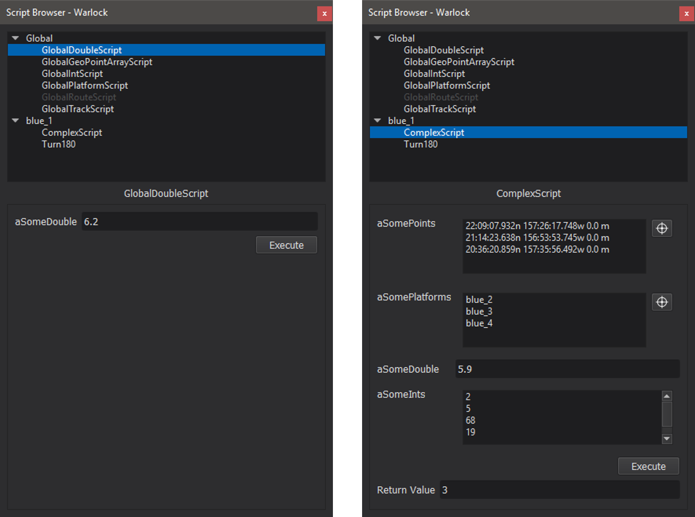

.. ****************************************************************************
.. CUI
..
.. The Advanced Framework for Simulation, Integration, and Modeling (AFSIM)
..
.. The use, dissemination or disclosure of data in this file is subject to
.. limitation or restriction. See accompanying README and LICENSE for details.
.. ****************************************************************************

Script Browser - Warlock
------------------------

The Script Browser provides an interface through which the user can execute AFSIM scripts on platforms. The Script Browser is context sensitive and will display available scripts to execute for the selected platform, along with all global scripts for the local scenario.

For a script to be available for execution from the Script Browser, it must be prefixed with WARLOCK\_ and have only arguments of the following types:

* bool
* int
* double
* :class:`string`
* :class:`WsfGeoPoint`
* :class:`WsfPlatform`
* :class:`WsfTrack`
* :class:`Array\<T\>` where T is any of the above types

If an argument type is not a supported type, the script will appear grayed-out in the script browser (e.g. WsfRoute in the images to the right).

To add items to an array of simple types, double click near the top of the empty list (next to the variable name).

Whenever a value is entered, a new item is automatically created at the next index. The Tab key will advance to the next element in the array.An item can be removed by selecting it and pressing the Delete key.

To add items to an array of complex types (e.g. WsfGeoPoint, WsfTrack, WsfPlatform), use the selector tool to select the desired item from the Map Display. If no element is currently selected in the array, the selector tool will append the item to the array; otherwise, it will replace the element with the new selection. Text may be entered directly in lieu of using the selector tool, as long as it is formatted correctly (see the table below).

.. list-table::
   :header-rows: 1
   :widths: 20 80

   * - Argument Type
     - Input Format
   * - WsfGeoPoint
     - :argtype:`<latitude-value><latitude-value>` :argtype:`<longitude-value><longitude-value>` :argtype:`<length-value><length-value>`
   * - WsfPlatform
     - <platform-name>
   * - WsfTrack
     - <platform-name>\ **:**\ <track-number>

Once the execute button is pressed, the script will be executed. If a script returns a value of a supported type, it will be displayed beneath the script arguments when the script is executed; however, if it returns a value of a type that is not supported, "<unknown-type>" will be displayed as the return value.
