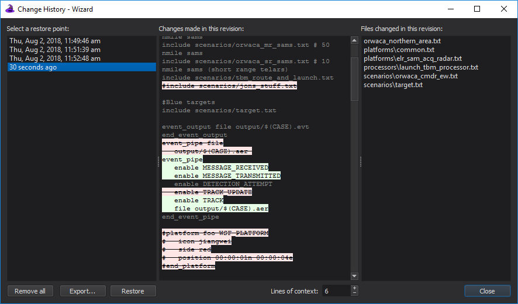

.. ****************************************************************************
.. CUI
..
.. The Advanced Framework for Simulation, Integration, and Modeling (AFSIM)
..
.. The use, dissemination or disclosure of data in this file is subject to
.. limitation or restriction. See accompanying README and LICENSE for details.
.. ****************************************************************************

Change History - Wizard
-----------------------

To use the automatic change history option, it must first be enabled in the
`Preferences <wizard_preferences.html>`_.

The **Change History** window provides an interface to backing up a
project and restoring a project to earlier points of time. It is
accessible by opening a project and selecting
Project --> Change History...

By default, project backup is disabled. If this is undesirable, it can be
enabled by checking the "Enable project backup" checkbox. All restore
points can be deleted with the "Remove all" button.

The database file name is based on the associated Wizard project file
name and is located in the same directory as the project file. For
example, if the project file name is ``myproject.afproj``, then the
database file name will be ``myproject.afproj.changes.db``. If
there is no project file, then the database file name will be
``wizard_change_history.db`` and will reside in the directory
of the file that was opened. The database file can safely be deleted
with the feature disabled or while Wizard is not running.

The window consists of three panes. The left pane shows a list of all
available project restore points, or revisions, sorted from oldest to
newest. After making a selection, you may :doc:`export the project <wizard_export_project>`
as it existed at the selected revision to an external folder, or you can restore
your files to the selected revision. Your current files will be backed up before
performing the restore.

When a revision is selected in the left pane, the middle pane will show
the changes that were recorded for the revision with respect to its
direct predecessor. The changes include changes to files, the project
working directory, and the project startup files. The file changes are
shown as a unified diff. Lines of context (the number of unchanged lines
shown around changed lines) are shown for assistance. The number of
lines of context can be adjusted below the middle pane.

The right pane shows the list of files that were added, deleted, or
modified in the selected revision. When selecting a file in this pane,
the middle pane will automatically scroll to the appropriate section in
the diff to view the changes for that file.

Current Limitations
===================

Currently, Wizard only monitors *included files* for backup purposes.
When a file is not included (potentially when switching startup files, for
example), its data will remain in the database but changes to the file
will no longer be recorded until it is included again.
