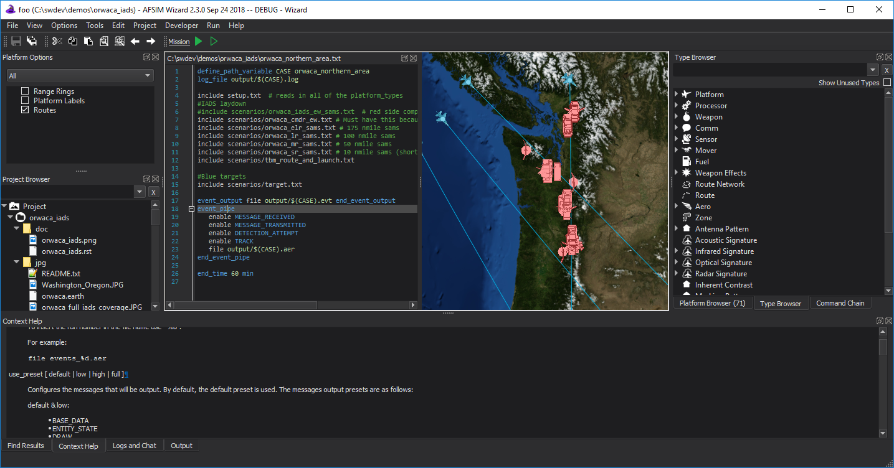

.. ****************************************************************************
.. CUI
..
.. The Advanced Framework for Simulation, Integration, and Modeling (AFSIM)
..
.. The use, dissemination or disclosure of data in this file is subject to
.. limitation or restriction. See accompanying README and LICENSE for details.
.. ****************************************************************************

Main Window - Wizard
--------------------

The main parts of the Wizard Main Window are the following:

.. contents::
   :local:
   :depth: 1

Title Bar
=========

The title bar contains the standard controls to close, minimize, and maximize on the right, and the name of the application on the left. The current root directory of the project displayed if a project or file is open.

Menus
=====

Menus appear below the title bar. The majority of the Wizard tools, commands, and settings are available within these menus.

Toolbars
========

The toolbars are below the menus. The toolbars can be toggled on or off via View menu.

Browsers
========

The browsers appear on the left or right side of the application and provide a variety of views into and navigation of your scenario data. They may be made docked or free-floating.

Text Editor
===========

The :doc:`Text Editor <wizard_text_editor>` provides a tabbed interface for editing your scenario files. It provides syntax highlighting, auto-completion, quick file and type navigation, context sensitive command lookup, and other features.

Map Window
==========

The Map Display shows the current scenario's platform laydown.

.. _Wizard_Main_Window.OutputPanel:

Output Panel
============

The output panel is located in the lower region of the Main Window and is where the Command Documentation, Error List, Find Results, Output, and Script Console are initially displayed. Each of the tabs can be undocked and redocked if desired.

Status Bar
==========

The status bar displays information such as the current line and column number of the cursor and the parsing progress.
