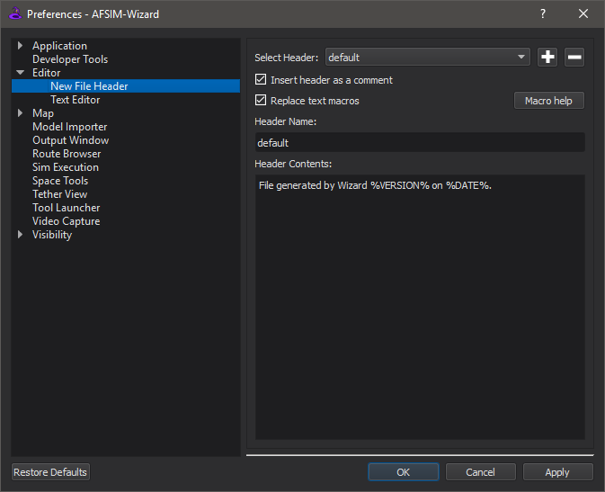

.. ****************************************************************************
.. CUI
..
.. The Advanced Framework for Simulation, Integration, and Modeling (AFSIM)
..
.. The use, dissemination or disclosure of data in this file is subject to
.. limitation or restriction. See accompanying README and LICENSE for details.
.. ****************************************************************************

New File Preferences - Wizard
-----------------------------

The **New File** preferences can be used to set custom file headers for files generated by AFSIM.

The user may create as many profiles as desired and switch between them using the drop-down menu on the top of the window.

The *Add header* button (+) creates a new blank item.
The *Remove header* button (-) removes the currently selected item.

Checking *Insert header as a comment* will cause a # to be inserted at the beginning of every line.
Checking *Replace text macros* will cause certain words looking like %THIS% to be replaced by other text when the file is created.

The list of available macros can be found by clicking the *Macro help* button. The available macros can also be found here.

============ ===============================================================
Macros       Replaced by
============ ===============================================================
%%           %
%YEAR%       The current year.
%MONTH%      3-letter abbreviation for the current month.
%DAY%        The current day of the month.
%DATE%       The current date. Format: Jan 1, 1970
%VERSION%    The version of AFSIM.
%FILE%       The name of the file generated, with extension.
%DIR%        The directory the generated file is in.
%PATH%       The complete path to the generated file.
============ ===============================================================

When creating a new file, if there is/are...

* No headers: the file is generated without a header.
* One header: the file is generated with that header.
* Multiple headers: the user is prompted for which header to use.

