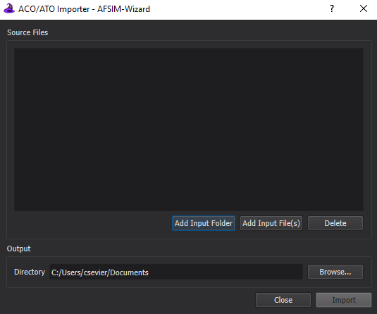

.. ****************************************************************************
.. CUI
..
.. The Advanced Framework for Simulation, Integration, and Modeling (AFSIM)
..
.. The use, dissemination or disclosure of data in this file is subject to
.. limitation or restriction. See accompanying README and LICENSE for details.
.. ****************************************************************************

ACO Importer - Wizard
------------------------

Overview
********
The Airspace Control Order (ACO) Importer provides the capability to extract zones from a valid, well-formed ACO file and produce an AFSIM scenario file with the extracted zones.

Quick Start
***********
Within Wizard, select the ACO Importer option from the Tools -> Importers menu (Figure 1).  The main dialog box used for converting ACO/ATO files will appear (Figure 2).

.. image:: ../images/wiz_tool_menu.png

*Figure 1.  Opening the ACO/ATO Importer Dialog from the Wizard Tools Importers menu*

The Importer has a few user entry options.

* Source Files (Required entry) - The user adds files to this text list using the Add File/Folder buttons for input files that are to be converted to AFSIM Scenario files.
* Alternatively to the use of Add File/Folder you can drag and drop files in the Source Files display box.
* Delete Button will remove selected files from the menu.
* Directory - Specifies the folder in which the generated AFSIM Scenario files will be placed in.

*Figure 2.  The ACO/ATO Importer Dialog.*

* Import Button
   The importer will then process each file specified and will place potentially two files in the selected output directory. One file indicating any errors that occurred in the process.
   And another which is the scenario file with the extracted zones. Each file will be prepended with the name of the input file that was processed.

   For example:
   If you select an ACO file named myAco.txt then the result will be potentially be two files:

   * myAco_Export.txt - The Scenario file for inclusion in your simulation.
   * myAco_ImportErrors.txt - If errors occurred this file will be produced outlining what they were.

   A few dialog boxes may appear indicating success or failure of import for each file being processed.

   .. note:: The ACO Importer will extract correct zones despite encountering errors in others. When this occurs, it will inform the user how many zones it was unable to extract in the summary section of the _ImportErrors.txt  and include the details of the specific issue.

* Close Button - There is a close button on the status dialog and the main importer dialog, which will close the respective dialog box.

Supported Zone Types
********************

.. list-table:: Supported Zones
   :widths: 30 50 50
   :header-rows: 1

   * - ACO Zone Type
     - Example
     - AFSIM Zone Type
   * - Circle
     - .. image:: ../images/circle.png
          :width: 200
     - Circular
   * - Corridor
     - .. image:: ../images/corridor.png
          :width: 200
     - Polygonal
   * - Orbit
     - .. image:: ../images/aorbit.png
          :width: 200
     - Zone Set consisting of two Circular and one Polygonal zone
   * - Point
     - .. image:: ../images/point.png
          :width: 200
     - Circular zone with a radius of 1 KM
   * - Polyarc
     - .. image:: ../images/polyarc.png
          :width: 200
     - Zone Set consisting of on Circular and one Polygonal zone
   * - Polygon
     - .. image:: ../images/polygon.png
          :width: 200
     - Polygonal
   * - Radarc
     - .. image:: ../images/radarc.png
          :width: 200
     - Circular
   * - 1Track
     - .. image:: ../images/onetrack.png
          :width: 200
     - Zone Set consisting of multiple Polygonal zones
   * - Line
     - .. image:: ../images/line.png
          :width: 200
     - Polygonal

Limitations
***********
* Zones within an ACO document can have a period which defines the time at which the zone is valid.  This time period is saved as a comment in the generated AFSIM input file, but does not affect the simulation in any way.
* Multiple ACO files which define the same zones but for different days will not work due to the limitation of time period not being supported.  Multiple ACO files that define different zones do work together.
* The ACMSTAT set has a field for status that determines whether zones listed in the file are to be added, removed, or modified. This field is ignored and all zones are added to the AFSIM input file.
* Control Points (CNTRLPT) for the zones are not processed and thus not available in the AFSIM input file.

