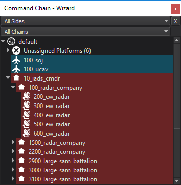

.. ****************************************************************************
.. CUI
..
.. The Advanced Framework for Simulation, Integration, and Modeling (AFSIM)
..
.. The use, dissemination or disclosure of data in this file is subject to
.. limitation or restriction. See accompanying README and LICENSE for details.
.. ****************************************************************************

Command Chain Browser - Wizard
------------------------------

The **Command Chain Browser** is accessible from the View menu. The browser may be docked in the left or right docking areas of the main window or be free-floating.

The browser shows a command-chain centric view. For each command chain, the top-level commander platforms are shown leftmost. For each platform, the subordinates are shown as child nodes. Platforms that are not assigned to a command chain are grouped under the *Unassigned Platforms* entry.

Drag-and-drop may be used to change the command chain structure. Select and drag platforms onto the desired commander platform entry. Once a change is made, the text editor will be locked for direct editing until changes are either applied or aborted. Applying changes modifies the scenario input files to reflect the new command chain.

Filters at the top of this control may be applied to limit shown platforms based on side or command chain name.
