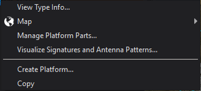
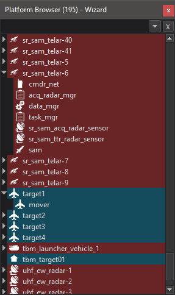

.. ****************************************************************************
.. CUI
..
.. The Advanced Framework for Simulation, Integration, and Modeling (AFSIM)
..
.. The use, dissemination or disclosure of data in this file is subject to
.. limitation or restriction. See accompanying README and LICENSE for details.
.. ****************************************************************************

.. |PLATFORM_BROWSER| replace:: Platform Browser - Wizard

.. include:: wkf_platform_browser.txt

The Wizard Platform Browser context menu also has options for displaying the type info for the platform. Selecting this option will show the file and line number where the platform is defined, as well as its types and the locations of their definitions in the file. Platform components may be added and edited with the 'Manage Platform Parts...' option in the platform context menu. This will open the :doc:`Platform Part Manager <wiz_platform_part_manager>`. Each platform item in the Platform Browser may by expanded to show its components. Double-clicking on a platform or platform-component will open the :doc:`Text Editor<../wizard_text_editor>` and navigate to the appropriate definition.

The number of platforms in the scenario is shown in parentheses in the platform browser title bar. The browser contains a search field at the top. Typing in this field will filter to show platforms or platform components with names containing the entered text.
