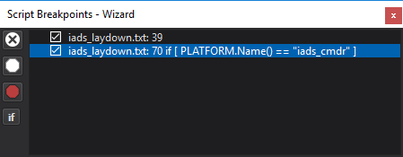
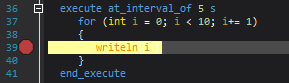
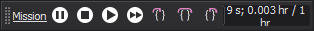
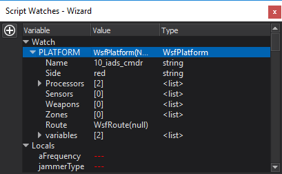
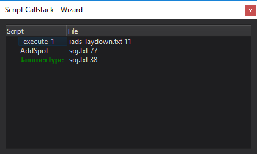

.. ****************************************************************************
.. CUI
..
.. The Advanced Framework for Simulation, Integration, and Modeling (AFSIM)
..
.. The use, dissemination or disclosure of data in this file is subject to
.. limitation or restriction. See accompanying README and LICENSE for details.
.. ****************************************************************************

Script Debugger - Wizard
------------------------

The Wizard Script Debugger provides the ability to debug WSF scripts while executing a WSF application. Features include setting breakpoints, stepping execution into, out of, and over script commands, and inspecting variable values.

.. contents::
   :local:
   :depth: 1

Running in Debug Mode
=====================

If an executable is associated with your project, simply click **Run with Debugging** from the Run menu. This will execute the scenario with an additional file that configures a connection to the debugger.

.. _Wizard_Script_Debugger.Debugging_Settings:

To launch the executable in debug mode from outside Wizard, click **Debugging Settings** from the Run menu. The text shown can be copy/pasted into a scenario file. To run from another host, simply update the connection parameters to point to the machine running Wizard.

.. _Wizard_Script_Debugger.Breakpoints:

Breakpoints
===========

Breakpoints are lines of code that halt execution of script. Breakpoints may be set by left or right-clicking the left margin of the text editor, or pressing **F9**. Conditional breakpoints will test some condition before halting execution, only halting if the condition evaluates to 'true'.

All breakpoints are shown in the 'Script Breakpoints' control. Breakpoints may be temporarily disabled or re-enabled by clicking the check boxes or 'Enable-all' / 'Disable-all' buttons. Breakpoint conditions may be changed by selecting a breakpoint and pressing the **if** button.

Execution Control
=================

When a WSF application connects to Wizard, the run control is shown. This control allows you to pause, play (realtime) and fast-forward the simulation. When in debug mode, the *step into*, *step over*, and *step out* buttons are available to give fine-grained control over script execution. Once a breakpoint is hit, the active line will appear in the text editor with a yellow highlight. The following buttons are available on the control:

Pause
   Pause the simulation (aka Break All)
Stop
   Stop the simulation.
Play
   Play the simulation in real-time.
Fast Forward
   Fast forward the simulation (non-real-time).
Step Into
   Run the script until the next line of any script is active.
   This allows stepping into functions called.
Step Over
   Run the script until the next line is active.
Step Out:
   Run the script until function exists.

.. _Wizard_Script_Debugger.Watches:

Watch Variables
===============

::

   script void test_script(double aValue)
      double timeDifference = TIME_NOW - aValue;
      if (timeDifference < 0) { writeln("Sim-time has passed ", aValue); }
   end_script

The **Watch Control** allows inspection of script variable values. There are three top-level
items: 'Watches,' 'Local,' and 'Global.'

Watches show all user-defined watch expressions. New watch expressions may be added by pressing the *New Watch* button on the left. The variable name or expression may be changed for each watch by double-clicking the text. Most script expressions valid at the current location are valid watch expressions:

Global variables
   Any global variable name may be added to a watch. Example: **TIME_NOW**
Local variable
   Local variables at the active line may be added to a watch. The callstack control can be used to change which function is active. Example: **aValue**
Script Expressions
   Any script expression that results in a value may be used, including calls to scripts and built-in functions. Example: **TIME_NOW - aValue** or **PLATFORM.MasterTrackList()**

Additionally, there are pre-populated *Local* and *Global* entries:

Local
   Displays a list of all local script variables in the current context.
Global
   Displays a list of platforms in the simulation. Custom subitems may be added to the global list by adding a script to the scenario. See _wsf_debug_scripts_.txt distributed with Wizard for more information.
Expanded values
   Variables are expanded to show additional information. Extra information may be added to these expanded values by modifying the
   scripts in _wsf_debug_scripts_.txt, distributed with Wizard. 

   .. note:: Variables that would expand recursively are marked as "<recursive>".

.. _Wizard_Script_Debugger.Call_Stack:

Call Stack
==========

The **Call Stack** provides the capability to view script call stack when a breakpoint is hit.

