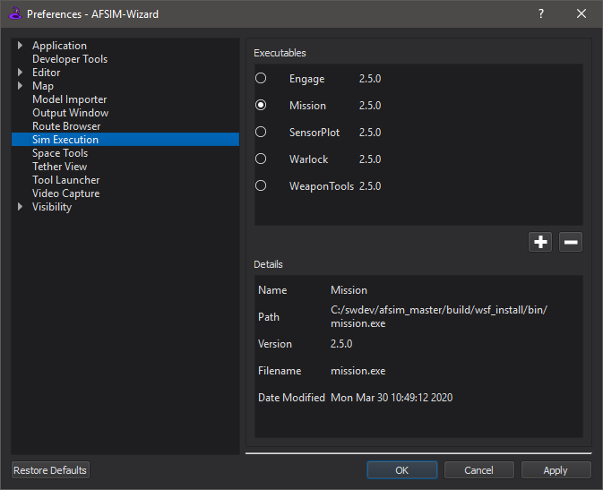
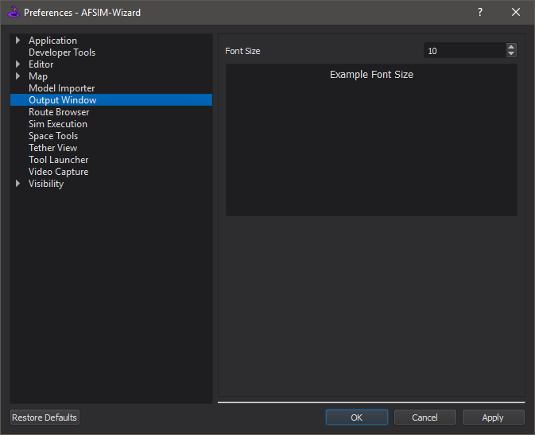

.. ****************************************************************************
.. CUI
..
.. The Advanced Framework for Simulation, Integration, and Modeling (AFSIM)
..
.. The use, dissemination or disclosure of data in this file is subject to
.. limitation or restriction. See accompanying README and LICENSE for details.
.. ****************************************************************************

Simulation Manager - Wizard
---------------------------

The **Simulation Manager** is accessible from the preferences dialog from the Options menu or the sim name on the run toolbar.

Sim Execution
=============
   
Wizard will automatically populate with the simulation in its release, if additional simulations are needed they must first be added here. Adding simulation applications provides the ability to run them from Wizard, as well as take advantage of the input syntax allowed by that application and version.

To add a new application, click **Add**, and browse to the executable file (*.exe* on windows). Information about the application will be generated, and the application will be added to the list. To remove an application, simply click **Remove**.

Hovering over an application will display its path.

The selected application will be used for execution in wizard.

As mentioned above, the **Simulation Manager** is also available by clicking on the run toolbar |WIZARD_EXE_TOOLBAR|.

New projects will use the selected default application. Existing projects will override this setting and use the saved settings in the .afproj file.

If profiling is supported by the application, performance profiling is enabled by setting the "Profiling Output Path" setting.  If used in conjunction with debugging, profiling results will be inaccurate.  Profiling is disabled for the default application configurations.  Users may manually add additional instances of those applications to use profiling.

Extra command line arguments specific to the application may be added to the "Extra arguments" setting.

Output Window
=============

When a simulation is executing the results are displayed in the **Output Window** at the bottom of the main window. The font size of the text displayed in the Output Window can be changed from the preference dialog in the Options menu.

