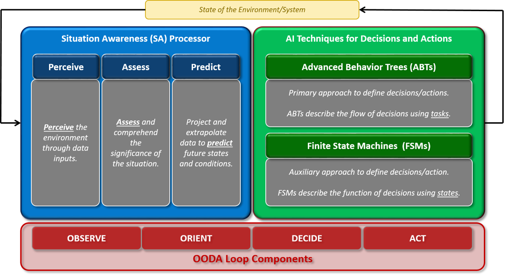
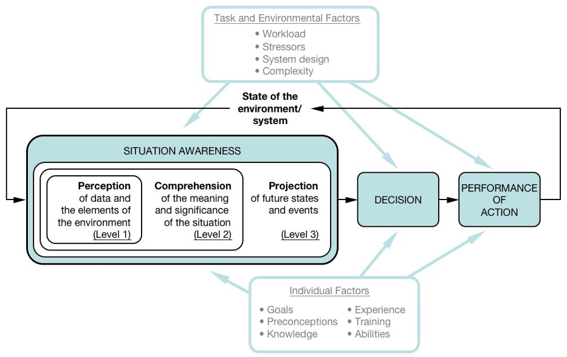
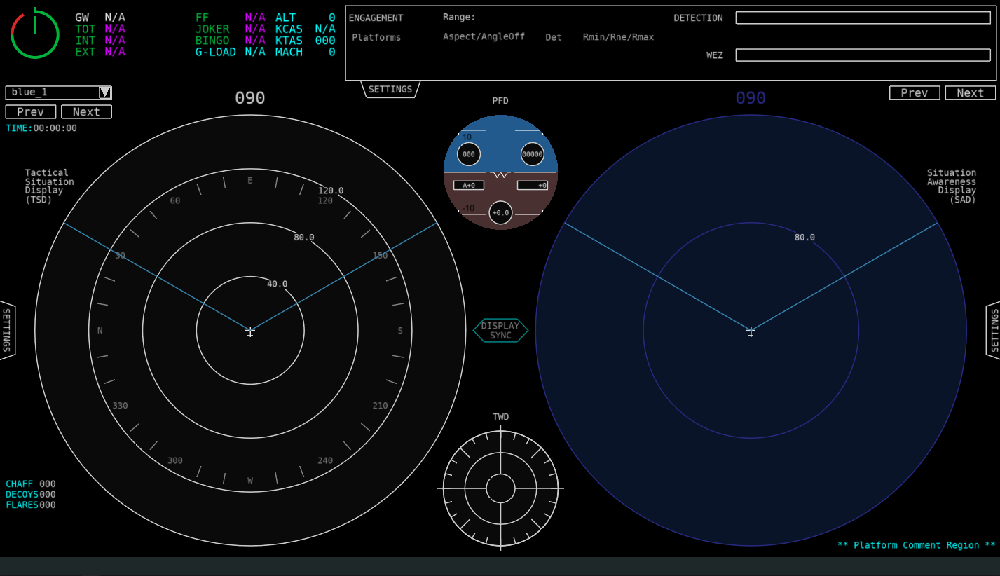
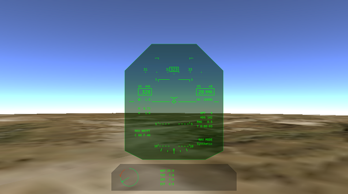
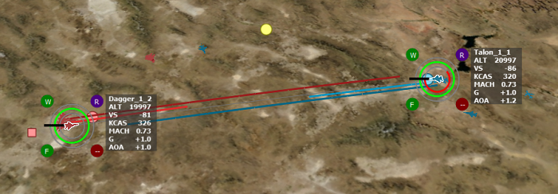
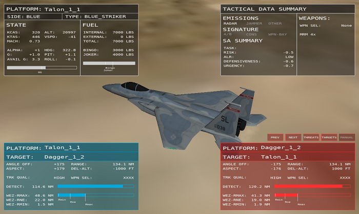

.. ****************************************************************************
.. CUI//REL TO USA ONLY
..
.. The Advanced Framework for Simulation, Integration, and Modeling (AFSIM)
..
.. The use, dissemination or disclosure of data in this file is subject to
.. limitation or restriction. See accompanying README and LICENSE for details.
.. ****************************************************************************

WSF_SA_PROCESSOR
----------------

.. contents::
   :local:

**Derives from:** :model:`WSF_SCRIPT_PROCESSOR`

**Script Class:** :class:`WsfSA_Processor`

.. model:: processor WSF_SA_PROCESSOR

.. parsed-literal::

   processor <name> :model:`WSF_SA_PROCESSOR`
      // `Update Interval Commands`_
      report_interval_ ...
      engagement_data_update_interval_ ...
      flight_data_update_interval_ ...
      fuel_data_update_interval_ ...
      nav_data_update_interval_ ...
      flight_controls_data_update_interval_ ...
      weapons_data_update_interval_ ...
      asset_data_update_interval_ ...
      asset_purge_lifetime_ ...
      perceived_item_data_update_interval_ ...
      prioritized_item_data_update_interval_ ...
      perceived_item_calculation_update_interval_ ...
      prioritized_item_calculation_update_interval_ ...
      behavior_calculation_update_interval_ ...

      // `Update Interval Group Commands`_
      cognitive_update_interval_ ...
      platform_update_interval_ ...
      universal_update_interval_ ...

      // `Enemy/Friendly Types`_
      enemy_side_ ...
      friendly_side_ ...
      neutral_side_ ...
      enemy_type_ ...
      friendly_type_ ...
      neutral_type_ ...
      missile_type_ ...
      asset_ignore_ ...
      filter_assets_from_tracks_ ...
      use_iff_id_ ...
      use_simple_id_by_type_ ...
	  
      // `Missile Identification Filters`_	  
      missile_speed_any_alt_ <speed-value>
      missile_alt_any_speed_ <length-value>
      missile_speed_with_alt_ <speed-value>
      missile_alt_with_speed_ <length-value>
      missile_nose_angle_ <angle-value>
      missile_time_to_intercept_ <time-value>
      missile_distance_ <length-value>

      // `Range Settings`_
      max_range_for_perceived_assets_ ...
      max_range_for_perceived_bogies_and_bandits_ ...
      max_range_for_engagement_data_ ...
      assumed_range_for_angle_only_targets_ ...

      // `Filter Settings for Engagement Assessment`_
      filter_requires_same_side_ ...
      filter_requires_not_same_side_ ...
      filter_requires_air_domain_ ...
      filter_requires_not_air_domain_ ...
      filter_requires_land_or_surface_domain_ ...
      filter_requires_not_subsurface_domain_ ...
      filter_requires_not_space_domain_ ...
      filter_requires_sa_processor_ ...

      // `Optional Track Processors`_
      esm_track_processor_ ...
      mws_track_processor_ ...
      radar_track_processor_ ...
      irst_track_processor_ ...
      das_track_processor_ ...
      flir_track_processor_ ...
      eyes_track_processor_ ...
      perception_master_track_processor_ ...

      // `Optional IDs`_
      flight_id_ ...
      id_flag_ ...

      // `Fuel Data`_
      bingo_fuel_ ...
      joker_fuel_ ...

      // `Perception Commands`_
      reports_self_ ... | reporting_self_ ...
      reports_others_ ... | reporting_others_ ...
      asset_perception_ ...
      perceive_self_ ...
      max_threat_load_ ...
      max_asset_load_ ...
      asset_coast_time_ ...
      bandit_coast_time_ ...
      bogey_coast_time_ ...
      use_simple_countermeasures_ ...
      num_chaff_ ...
      num_flares_ ...
      num_decoys_ ...
      filter_assets_from_bogies_ ...
      consideration_score_randomness_ ...
      display_perception_delay_ ...
      visual_perception_delay_ ...

      // `Assessment Commands`_
      bogie_threat_score_multiplier_ ...
      bogie_target_score_multiplier_ ...
      ignore_bogies_when_grouping_ ...
      mission_task_ ...
      max_prioritized_threats_ ...
      max_prioritized_targets_ ... 
      max_grouping_distance_centroid_ ...
      max_grouping_distance_neighbor_ ...
      max_grouping_speed_difference_ ...
      max_grouping_heading_difference_ ...
      min_group_radius_ ...
      use_centroid_grouping_ ...
      use_neighbor_grouping_ ...
      use_speed_grouping_ ...
      use_heading_grouping_ ...
      use_type_grouping_ ...
      ignore_missiles_as_threats_ ...
      ignore_bogies_as_threats_ ...
      ignore_missiles_as_targets_ ...
      ignore_bogies_as_targets_ ...
      missile_wez_parameters_ ...
      aircraft_signature_parameters_ ...

      // `Custom Scripts`_
	  
      script double :command:`WSF_SA_PROCESSOR.AssetConsiderationScoring` ...
      script double :command:`WSF_SA_PROCESSOR.BogieBanditConsiderationScoring` ...
      script double :command:`WSF_SA_PROCESSOR.MissileConsiderationScoring` ...	  
      script double :command:`WSF_SA_PROCESSOR.UnfocusedGroupConsiderationScoring` ...
      script Array<WsfSA_PerceivedItem> :command:`WSF_SA_PROCESSOR.CreatePerceivedItemPruningArray` ...
      script double :command:`WSF_SA_PROCESSOR.CalculateRisk` ...
      script double :command:`WSF_SA_PROCESSOR.CalculateSelfRisk` ...
      script double :command:`WSF_SA_PROCESSOR.CalculateFlightRisk` ...
      script double :command:`WSF_SA_PROCESSOR.CalculatePackageRisk` ...
      script double :command:`WSF_SA_PROCESSOR.CalculateMissionRisk` ...
      script double :command:`WSF_SA_PROCESSOR.CalculateDefensiveness` ...
      script double :command:`WSF_SA_PROCESSOR.CalculateUrgency` ...
      script bool   :command:`WSF_SA_PROCESSOR.CalculateWeaponSupport` ...	  
      script double :command:`WSF_SA_PROCESSOR.CalculateThreatLevel` ...
      script double :command:`WSF_SA_PROCESSOR.CalculateMissileThreatLevel` ...
      script double :command:`WSF_SA_PROCESSOR.CalculateGroupThreatLevel` ...
      script double :command:`WSF_SA_PROCESSOR.CalculateTargetValue` ...
      script double :command:`WSF_SA_PROCESSOR.CalculateMissileTargetValue` ...
      script double :command:`WSF_SA_PROCESSOR.CalculateGroupTargetValue` ...
      script double :command:`WSF_SA_PROCESSOR.CalculateRiskPosedByEntity` ...
      script double :command:`WSF_SA_PROCESSOR.CalculateDefensivenessInducedByEntity` ...
      script double :command:`WSF_SA_PROCESSOR.CalculateUrgencyInducedByEntity` ...
      script WsfGeoPoint :command:`WSF_SA_PROCESSOR.ProjectPositionInTime` ...
      script WsfGeoPoint :command:`WSF_SA_PROCESSOR.ProjectPositionForward` ...
      script WsfGeoPoint :command:`WSF_SA_PROCESSOR.ProjectPositionLevelTurnLeft` ...
      script WsfGeoPoint :command:`WSF_SA_PROCESSOR.ProjectPositionLevelTurnRight` ...
      script WsfGeoPoint :command:`WSF_SA_PROCESSOR.ProjectPositionTurnToHeading` ...
      script WsfGeoPoint :command:`WSF_SA_PROCESSOR.ProjectPositionGoToPoint` ...
      script WsfGeoPoint :command:`WSF_SA_PROCESSOR.ProjectPositionSlice` ...
      script WsfGeoPoint :command:`WSF_SA_PROCESSOR.ProjectPositionSliceToHeading` ...
      script WsfGeoPoint :command:`WSF_SA_PROCESSOR.ProjectPositionSplitS` ...

   end_processor

Overview
========

The Situation Awareness (SA) Processor is a critical component of AFSIM's cognitive model, providing perception, assessment/comprehension, and prediction/projection functions. The SA Processor is based on Endsley’s Model of Situational Awareness, and provides the means to perform the Observe and Orient (OO) components of the OODA loop, while :doc:`Advanced Behavior Trees<advanced_behavior_tree>` (ABTs) provide the means to perform the Decide and Act (DA) components of the OODA loop.

Perceived Items are the primary approach in the SA Processor for modeling cognitive load and limits. Perceived Items include both groups and entity perceptions.
Pilots utilize groups or clusters of threats/targets to reduce the number of items being perceived.
In some cases, rather than perceiving and remembering each item in a group, the pilot instead perceives and remembers the group. Hence, rather than perceiving a collection of four aircraft, the pilot instead perceives a single group, reducing the number of perceived items from 4 to 1. We call this an unfocused group perception, and it is a means to reduce the number of perceived items while still maintaining some SA.
However, in other cases, the pilot may want to have detailed perception of each item in a group, and in this case, the pilot may perceive that the items form a "conceptual" group, simply as a means of organization. We call this focused or detailed group perception, since it maintains the full details of the members of group and the pilot is focused on the members of the group. This type of group does not affect the number of perceived items.

There are two ways of looking at detailed groups: entity-centric, or group-centric. From an entity-centric perspective, a detailed group neither increases nor reduces the number of perceived items, and each of the entities it contains increase the number of perceived items by one. From a group-centric perspective, a detailed group increases the number of perceived items by the number of entities that it contains. Similarly, from an entity-centric perspective, detailed groups have no consideration score, but from a group-centric perspective, a detailed group's score is equivalent to that of its highest scoring member.

.. note:: Groups and cognitive limits are meant to be used for human pilots – synthetic pilots on autonomous vehicles typically do not use groups to reduce cognitive loads, since they often have rather large limits and do not need to reduce cognitive load in this manner.

Groups can be formed, disbanded, focused, or unfocused automatically by the SAP. However, many of its automatic functions can be overridden with custom scripts.

.. note:: The SA Processor replaces some functionality previously performed by the :model:`WSF_PERCEPTION_PROCESSOR`. Although a Perception Processor is allowed on a platform with an SA Processor, that is not the intended configuration and should be avoided, whenever possible.

The cognitive model is shown in the image below. Across the bottom, in red, is Boyd's OODA (Observe, Orient, Decide, and Act) model. In AFSIM, the OODA loop is divided into two modules, displayed just above the OODA block. SA Processors, in blue, handle observation and orientation, and :doc:`Advanced Behavior Trees<advanced_behavior_tree>` (ABTs), in green, carry out decision and action.

   Above: AFSIM Awareness Cognitive Model, including SA Processor and ABTs
	
The image below presents Endsley's Model of Situational Awareness. The SA Processor closely parallels the concept of perception, comprehension, and projection.
	

   Above: Endsley's Model of Situational Awareness, Endsley et al (2000), drawn by Dr. Peter Lankton (May 2007)

The table below defines common technical terms used throughout the documentation for air-to-air combat related concepts.

.. list-table::
   :stub-columns: 1
   :align: left
   :widths: 10 120

   * - bogie
     - A perceived entity (unknown) that has yet to be identified as a bandit, friendly, or neutral
   * - bandit
     - A perceived entity that is known to be an enemy
   * - friendly
     - A perceived entity that is known to be friendly
   * - neutral
     - A perceived entity that is known to be neutral (often a non-combatant)
   * - asset
     - Another term for "friendly". This term is typically used to denote friendly forces that could provide support
   * - threat
     - A bandit/bogie that has been prioritized by threat scoring and maintained in a prioritized/ordered list
   * - target
     - A bandit/bogie that has been prioritized by target scoring and maintained in a prioritized/ordered list

Visualization Tools
===================

There are several visualization tools to support the :model:`WSF_SA_PROCESSOR`, including (click on the name of each tool for more information)

:doc:`Air Combat Engagement Summary (ACES) Display<wkf_plugin/wk_aces_display>`

* The ACES Display is intended to provide an integrated display that provides several sets of air combat data for a platform that contains a WSF_SA_PROCESSOR in a single, reconfigurable display, including:

  * Tactical Situation Display
  * Stores Management System
  * Tactical Warning System
  * Engine Systems
  * Fuel Systems
  * Situation Awareness Display which shows a variety of data, including:
    
    * Perceived Assets, Bogies, and Bandits
    * Prioritized Threats
    * Prioritized Targets
    * Perceived Groups
    * "Truth" locations of platforms in the simulation
    * Allows users to quickly toggle between the perceived "picture" and the true state of the world.

:doc:`Head Up View<wkf_plugin/wk_head_up_view>`

* This is an out-the-window (OTW) view with a generic Head-Up Display (HUD).

:doc:`Air Combat Visualization - Map Display<wkf_plugin/wk_air_combat_visualization>`

* This is a collection of visualization items for the Map Display, including:

  * Data Rings, which provide a means to shown normalized data in a concise manner.
  * Data Accents, which provide another means to shown discrete, state-based data in a concise manner.
  * State Data, which is a summary of top-level state data
  
    * Displayed in a similar manner to that on air traffic control screens
    * Provides altitude, vertical speed, airspeed, Mach, g-load, and angle of attack at a glance.
	
  * Engagement Lines, which provide an alternative to typical AFSIM track lines

    * Shows detection and WEZ data between two (or more) platforms

:doc:`Air Combat Visualization - Air Combat Overlays (Tether View)<wkf_plugin/wk_air_combat_visualization>`

* This is a summary of engagement data using an overlay on a tether display, providing:

  * Engagement data for focus aircraft versus target/threat aircraft (lower left)
  * Engagement data for focus target/threat versus focus aircraft (lower right)
  * Kinematic state data for focus aircraft (upper left)
  * Fuel state data for focus aircraft (upper left)
  * Tactical data summary for focus aircraft, including weapons state (upper right)

  .. _sa_update_interval_commands:

Update Interval Commands
========================

The SA Processor has multiple responsibilities which can be carried out at different rates. These rates can be given initial values and can also be changed during the simulation through script.

Some of these only determine the rate at which data is sent through the event pipe. These have the suffix ``data_update_interval``. However, others determine the rate at which information is processed internally. These use the suffix ``calculation_update_interval``.

Updates can only happen when the processor itself (whose update rate is set by :command:`WSF_SCRIPT_PROCESSOR.update_interval`) updates. As a result, best practice is to make sure that the following update intervals are each multiples of :command:`WSF_SCRIPT_PROCESSOR.update_interval`.

.. warning:: All update interval settings in this section will be rounded to the nearest multiple of the :command:`WSF_SCRIPT_PROCESSOR.update_interval` value. To prevent rounding to zero, a positive setting less than :command:`WSF_SCRIPT_PROCESSOR.update_interval`/2 will be rounded to :command:`WSF_SA_PROCESSOR.asset_perception`; however, a value of zero can be used to disable a specific update type.

.. command:: report_interval <time-value>

   Specifies the update interval for reporting asset status data

   **Default:** 0 seconds (no data sent)

.. command:: engagement_data_update_interval <time-value>

   Specifies the update interval for reporting engagement data (:ref:`msg_sa_engagement_summary_data` messages)

   **Default:** 0 seconds (no data sent)

.. command:: flight_data_update_interval <time-value>

   Specifies the update interval for reporting flight data (:ref:`msg_sa_flight_kinematics_data` messages)

   **Default:** 0 seconds (no data sent)

.. command:: fuel_data_update_interval <time-value>

   Specifies the update interval for reporting fuel data (:ref:`msg_sa_fuel_data` messages)

   **Default:** 0 seconds (no data sent)

.. command:: nav_data_update_interval <time-value>

   Specifies the update interval for reporting navigational data (:ref:`msg_sa_nav_data` messages)

   **Default:** 0 seconds (no data sent)

.. command:: flight_controls_data_update_interval <time-value>

   Specifies the update interval for reporting controls data (:ref:`msg_sa_flight_controls_data` messages)

   **Default:** 0 seconds (no data sent)

.. command:: weapons_data_update_interval <time-value>

   Specifies the update interval for reporting weapons data (:ref:`msg_sa_weapons_data` messages)

   **Default:** 0 seconds (no data sent)

.. command:: track_data_update_interval <time-value>

   Specifies the update interval for reporting track data (:ref:`msg_sa_track_data` messages)

   **Default:** 0 seconds (no data sent)

.. command:: asset_data_update_interval <time-value>

   Specifies the update interval for reporting asset data (:ref:`msg_sa_asset_data` messages)

   **Default:** 0 seconds (no delayed interval, uses current truth or received asset messages; see :command:`WSF_SA_PROCESSOR.asset_perception`)

.. command:: asset_purge_lifetime <time-value>

   Specifies the maximum lifetime of assets that lack an update. Assets will be automatically purged if they have not been updated within the specified lifetime limit.

   **Default:** The default value depends on whether asset_update_interval has been specified. If so, the default purge lifetime is 2.5 times the asset_update_interval. If not, a default of 5 seconds is used.

.. command:: perceived_item_data_update_interval <time-value>

   Specifies the update interval for reporting bogie, bandit, and group data (:ref:`msg_sa_threat_data` and :ref:`msg_sa_group_data` messages).

   **Default:** 0 seconds (no data sent)

.. command:: prioritized_item_data_update_interval <time-value>

   Specifies the update interval for reporting prioritized threat data (:ref:`msg_sa_prioritized_data` messages).

   **Default:** 0 seconds (no data sent)
   
.. command:: perceived_item_calculation_update_interval <time-value>

   Specifies the update interval for calculating bogie, bandit, and group data.

   **Default:** 0 seconds (no data calculated)

.. command:: prioritized_item_calculation_update_interval <time-value>

   Specifies the update interval for calculating prioritized threat data.

   **Default:** 0 seconds (no data calculated)

.. command:: behavior_calculation_update_interval <time-value>

   The SA Processor is unique in that the rate at which :class:`WsfAdvancedBehaviorTree`\s and :class:`WsfStateMachine`\s update can be optionally set separately from the processor's update rate. As a result, the default value of 0 means that it will update at the same rate as the processor, as opposed to never updating.

   **Default:** 0 seconds (updates whenever the processor itself updates)

   .. _sa_update_interval_groups:

Update Interval Group Commands
==============================

Some of the above interval commands can be set to a common value within pre-defined groups: cognitive_update_interval_, platform_update_interval_, and universal_update_interval_.

.. note:: Only data update intervals can be set this way. Calculation update intervals must be set individually.

.. command:: cognitive_update_interval <time-value>

   The following group of :ref:`sa_update_interval_commands` is set to a common value by this command:

      asset_data_update_interval_

      perceived_item_data_update_interval_

      engagement_data_update_interval_

      prioritized_item_data_update_interval_

.. command:: platform_update_interval <time-value>

   The following group of :ref:`sa_update_interval_commands` is set to a common value by this command:

      flight_controls_data_update_interval_

      flight_data_update_interval_

      fuel_data_update_interval_

      nav_data_update_interval_

      report_interval_

      track_data_update_interval_

      weapons_data_update_interval_

.. command:: universal_update_interval <time-value>

   All :ref:`sa_update_interval_commands` are set to a common value by this command (excludes asset_purge_lifetime_ and all calculation update interval commands).

Enemy/Friendly Types
====================

The :model:`WSF_SA_PROCESSOR` supports the use of multiple techniques to determine if a 
:class:`WsfSA_EntityPerception` is perceived as a friend, foe, neutral, or unknown. The commands below allow perception based on the side of the platform, the type of platform, and whether IFF should be used. In addition, missile types can be specified and if the platform type is used for perception, it may also be perceived as a missile, rather than the default, which is an aircraft. A :class:`WsfSA_EntityPerception` may also be perceived as a missile if the platform is a category *missile*.

.. command:: enemy_side <string>

   Specifies the name(s) of the enemy's side(s). If a track has the same side identification as the `enemy_side`_, then the track is considered to be a bandit. Note that multiple entries allows multiple sides to be enemy.

.. command:: friendly_side <string>

   Specifies the name(s) of the friendly side(s). If a track has the same side identification as the `friendly_side`_, then the track is considered to be a friendly. Note that multiple entries allows multiple sides to be friendly. In addition, the same side of the platform containing the SA Processor is always considered friendly, even without specifying it in this manner.

.. command:: neutral_side <string>

   Specifies the name(s) of the neutral side(s). If a track has the same side identification as the `neutral_side`_, then the track is considered to be a neutral. Note that multiple entries allows multiple sides to be neutral.

.. command:: enemy_type <string>

   Adds the enemy type to the list of known enemy types. If a track has the same type identification as the `enemy_type`_, then the track is considered to be a bandit. Note that the type does not necessarily have to be a platform type, it may also be a sensor type, since some sensors will report a sensor type rather than a platform type.

.. command:: friendly_type <string>

   Adds the friendly type to the list of known friendly types. If a track has the same type identification as the `friendly_type`_, then the track is considered to be friendly. Note that the type does not necessarily have to be a platform type, it may also be a sensor type, since some sensors will report a sensor type rather than a platform type.

.. command:: neutral_type <string>

   Adds the neutral type to the list of known neutral types. If a track has the same type identification as the `neutral_type`_, then the track is considered to be neutral. Note that the type does not necessarily have to be a platform type, it may also be a sensor type, since some sensors will report a sensor type rather than a platform type.

.. command:: missile_type <string>

   Adds the missile type to the list of known missile types. If a track has the same type identification as the `missile_type`_, then the track is considered to be a missile. Note that the type does not necessarily have to be a platform type, it may also be a sensor type, since some sensors will report a sensor type rather than a platform type.

.. command:: asset_ignore <category-name>

   Adds the platform category to a list of assets that will be ignored on the :doc:`ACES Display<wkf_plugin/wk_aces_display>`.

.. command:: filter_assets_from_tracks <boolean-value>

   If true, assets/friendlies will be filtered from track lists

   **Default:** true

.. command:: use_iff_id <boolean-value>

   If true, includes the use of IFF in determining identification. When used, :command:`iff_mapping` must be defined.

   **Default:** false

.. command:: use_simple_id_by_type <boolean-value>

   If true, a simple identification-by-type approach will be used. In this case, rather than specifying list of enemy, friendly, and neutral types using `enemy_side`_, `friendly_side`_, and `neutral_side`_, a much simpler approach is used, where identification-by-type is performed merely if the track supports *type id*.

   **Default:** false

Missile Identification Filters
==============================

These commands provide a means to identify/classify tracks as missiles. Any track meeting these conditions will be considered to be a missile.

In addition, using the missile types defined in `Enemy/Friendly Types`_ allows the entity to be perceived as a missile, rather than the default, which is an aircraft. A :class:`WsfSA_EntityPerception` may also be perceived as a missile if the platform is a category **missile**.

.. command:: missile_speed_any_alt <speed-value>

   If the speed of the track is greater than the specified speed and at any altitude, it will be considered to be a missile/weapon (not an aircraft).

.. command:: missile_alt_any_speed <length-value>

   If the altitude of the track is greater than the specified altitude and at any speed, it will be considered to be a missile/weapon (not an aircraft).

.. command:: missile_speed_with_alt <speed-value>

   If the speed of the track is greater than the specified speed at (or greater than) the altitude specified in `missile_alt_with_speed`_, it will be considered to be a missile/weapon (not an aircraft).

.. command:: missile_alt_with_speed <length-value>

   If the altitude of the track is greater than the specified altitude at (or greater than) the speed specified in `missile_speed_with_alt`_, it will be considered to be a missile/weapon (not an aircraft).

These commands provide a means to filter-out tracks from consideration as missiles. Any track meeting these conditions will not be considered to be a missile (they will be filtered-out).

.. command:: missile_nose_angle <angle-value>

   If the ownship lies outside of the specified angle off the nose of the track, it will not be considered to be a missile/weapon (not an aircraft). This allows filtering-out tracks that are not heading towards the ownship.

.. command:: missile_time_to_intercept <time-value>

   If the time to intercept of the track is greater than than the specified time, it will not be considered to be a missile/weapon (not an aircraft). This allows filtering-out tracks that will not intercept the ownship within the specified time.

.. command:: missile_distance <length-value>

   If the distance to the track is greater than the specified distance, it will not be considered to be a missile/weapon (not an aircraft). This allows filtering-out tracks at a long distance from being considered as missiles.

Range Settings
==============

.. command:: max_range_for_perceived_assets <length-value>

   Range limit to include an asset in the perceived asset list. If not specified, no range filter will be used for assets.

.. command:: max_range_for_perceived_bogies_and_bandits <length-value>

   Range limit to include a bogie/bandit in the perceived bogie/bandit list. If not specified, no range filter will be used for bogies or bandits.

.. command:: max_range_for_engagement_data <length-value>

   Range limit to report engagement data. If not specified, no range filter will be used on the reporting of engagement data.

.. command:: assumed_range_for_angle_only_targets <length-value>

   Range assumed for angle-only tracks. If not specified, the range for angle-only tracks will be assumed to be 2.0E+13 meters, which is greater than 100 times the distance from the Earth to the Sun.

   **Default:** 2.0E+13 meters

Filter Settings for Engagement Assessment
=========================================

.. command:: filter_requires_same_side <boolean-value>

   If true, filters out platforms that are not on the same side

   **Default:** false

.. command:: filter_requires_not_same_side <boolean-value>

   If true, filters out platforms that are on the same side

   **Default:** false

.. command:: filter_requires_air_domain <boolean-value>

   If true, filters out platforms that are not in the air domain

   **Default:** false

.. command:: filter_requires_not_air_domain <boolean-value>

   If true, filters out platforms that are in the air domain

   **Default:** false

.. command:: filter_requires_land_or_surface_domain <boolean-value>

   If true, filters out platforms that are not in the land or surface domains

   **Default:** false

.. command:: filter_requires_not_subsurface_domain <boolean-value>

   If true, filters out platforms that are in the subsurface domain

   **Default:** false

.. command:: filter_requires_not_space_domain <boolean-value>

   If true, filters out platforms that are in the space domain

   **Default:** false

.. command:: filter_requires_sa_processor <boolean-value>

   If true, filters out platforms that lack a :model:`WSF_SA_PROCESSOR`

Optional Track Processors
=========================

These optional definitions define track processors that are used for various sensor system functionality. These assist visualization tools to determine which tracks are associated with a particular sensor system, such as an ESM/RWR.

.. command:: esm_track_processor <string>

   Optional name of a track processor for ESM/RWR tracks. This allows perception of tracks related to ESM and/or RWR sensor systems.

.. command:: mws_track_processor <string>

   Optional name of a track processor for Missile Warning System (MWS) tracks. This allows perception of tracks related to MWS sensor systems.

.. command:: radar_track_processor <string>

   Optional name of a track processor for radar tracks. This allows perception of tracks related to radar sensor systems.

.. command:: irst_track_processor <string>

   Optional name of a track processor for IRST tracks. This allows perception of tracks related to IRST and/or other IR sensors used for detection of airborne platforms.

.. command:: das_track_processor <string>

   Optional name of a track processor for DAS (Distributed Aperture System) tracks. This allows perception of tracks related to DAS and/or other multi-aperture IR/EO sensor systems.

.. command:: flir_track_processor <string>

   Optional name of a track processor for FLIR tracks. This allows perception of tracks related to FLIRs and/or other imaging IR sensor systems that are primarily used for detection of surface-based platforms.

.. command:: eyes_track_processor <string>

   Optional name of a track processor for eyes (visual) tracks. This allows perception of tracks related to any aircrew visual (eyes) sightings.

.. command:: perception_master_track_processor <string>

   Optional name of a track processor for collecting/coordinating perceived tracks. If this is defined, the specified track processor will be used by the SA Processor when perceiving and assessing tracks. If not specified, the master track processor is used (default).

Optional IDs
============

.. command:: flight_id <integer>

   Optional flight id (used to denote aircraft in a particular flight). A value of zero indicates that the aircraft is not a member of any flight.

   **Default:** 0

.. command:: id_flag  <string>

   Optional string that provides an id within a flight.

   **Default:** null

Fuel Data
=========

.. command:: bingo_fuel <mass-value>

   Optional bingo fuel level. If not specified, the mover value is used (if available), else zero is used.

   **Default:** 0

.. command:: joker_fuel <mass-value>

   Optional joker fuel level. If not specified, the mover value is used (if available), else zero is used.

   **Default:** 0

Perception Commands
===================

.. command:: reports_self <boolean-value>

.. command:: reporting_self <boolean-value>

   Specifies whether or not to report out asset status messages about this platform.

   **Default:** true

.. command:: reports_others <boolean-value>

.. command:: reporting_others <boolean-value>

   Specifies whether or not to report out messages of all received and known asset status (of other platforms).

   **Default:** false

.. command:: asset_perception [ status_messages; truth <members> ]

   * *status_messages*: asset perception will utilize any received WsfSA_EntityMessage messages.
   * *truth <members>*: asset perception will traverse the command chain and use truth data.

      * <members> is a colon-separated list of 'commander', 'subordinates', 'peers', 'all_commanders', &/or 'all_subordinates'. Example:

     ::

        # Uses truth data for this platform's commander and all subordinates down the entire command chain
        asset_perception truth all_subordinates:commander

  **Default:** truth (but no members, so empty perception).

.. warning::
   At the present time, with the SA Processor in a "beta" release, the **truth** option is recommended. In some situations, using the **status_messages** may result in some assets being dropped due to purge problems. This will be addressed in the future.

.. command:: perceive_self

   Include this platform in the list of perceived assets.

   **Default:** false

.. command:: max_threat_load <integer>

   Specifies the maximum number of bogie/bandit entities and unfocused groups (i.e. perceived items) that may be perceived.

   **Default:** -1 (no max limit)

.. command:: max_asset_load <integer>

   Specifies the maximum number of assets that may be perceived.

   **Default:** -1 (no max limit)

.. command:: asset_coast_time <time-value>

   Specifies the amount of time that asset perceptions should persist after losing a track.

   **Default:** 0 seconds

.. command:: bandit_coast_time <time-value>

   Specifies the amount of time that bandit perceptions should persist after losing a track.

   **Default:** 0 seconds

.. command:: bogey_coast_time <time-value>

   Specifies the amount of time that bogey perceptions should persist after losing a track.

   **Default:** 0 seconds

.. command:: use_simple_countermeasures <boolean-value>

   If true, the processor will use :command:`WSF_SA_PROCESSOR.num_chaff`, :command:`WSF_SA_PROCESSOR.num_flares`, and :command:`WSF_SA_PROCESSOR.num_decoys` as the initial countermeasure quantities. When :method:`WsfSA_Processor.DispenseChaff`, :method:`WsfSA_Processor.DispenseFlare`, and :method:`WsfSA_Processor.DispenseDecoy` are invoked, these quantities are simply decremented (nothing is physically fired).
   If false, the processor will model countermeasures using instances of :model:`WSF_CHAFF_WEAPON`, WSF_FLARE_WEAPON, and WSF_DECOY_WEAPON defined on the parent platform. When :method:`WsfSA_Processor.DispenseChaff`, :method:`WsfSA_Processor.DispenseFlare`, and :method:`WsfSA_Processor.DispenseDecoy` are called, the respective countermeasures are fired.

   This approach provides a simple means of using expendable countermeasures (CM), allowing weapon scripts to inquire how many CM are present when the weapon was fired and then checking again when the weapon detonates -- using the difference of the two quantities provides the number of CM that were dispensed during the weapon flight, which can then be used to model an effect of the CM upon weapon effectiveness.

   **Default:** false

.. command:: num_chaff <integer>

   When used together with :command:`WSF_SA_PROCESSOR.use_simple_countermeasures`, specifies the initial chaff quantity.

   **Default:** 0

   .. note:: This command is only applicable if :command:`WSF_SA_PROCESSOR.use_simple_countermeasures` is true.

.. command:: num_flares <integer>

   When used together with :command:`WSF_SA_PROCESSOR.use_simple_countermeasures`, specifies the initial flare quantity.

   **Default:** 0

   .. note:: This command is only applicable if :command:`WSF_SA_PROCESSOR.use_simple_countermeasures` is true.

.. command:: num_decoys <integer>

   When used together with :command:`WSF_SA_PROCESSOR.use_simple_countermeasures`, specifies the initial decoy quantity.

   **Default:** 0

   .. note:: This command is only applicable if :command:`WSF_SA_PROCESSOR.use_simple_countermeasures` is true.

.. command:: filter_assets_from_bogies <boolean-value>

   If true, known assets will automatically be filtered from bogies.

   **Default:** true
   
.. command:: consideration_score_randomness <real>
   
   If set, the consideration scores for perceived items will be randomly increased or decreased by an amount less than or equal to this value.
   
   For more information about consideration scores for perceived items, see :command:`WSF_SA_PROCESSOR.BogieBanditConsiderationScoring` and :command:`WSF_SA_PROCESSOR.UnfocusedGroupConsiderationScoring`.

   **Default:** 0.0

.. command:: display_perception_delay <time-value>

   Specifies the time to wait before recognizing a new non-visual track as a perceived entity that is available for processing and classification.

   **Default:** 0.0 seconds

.. command:: visual_perception_delay <time-value>

   Specifies the time to wait before recognizing a new visual track (i.e. :command:`WSF_SA_PROCESSOR.eyes_track_processor`) as a perceived entity that is available for processing and classification.

   **Default:** 0.0 seconds

Assessment Commands
===================

.. command:: bogie_threat_score_multiplier <real>

   Multiplier that is used when scoring bogies for the prioritized threat list.

   **Default:** 1.0

.. command:: bogie_target_score_multiplier <real>

   Multiplier that is used when scoring bogies for the prioritized target list.

   **Default:** 1.0

.. command:: ignore_bogies_when_grouping <boolean-value>

   If true, bogies will not be considered when forming groups.

   **Default:** false

.. command:: mission_task <string>

   Specifies the primary mission task. This is used in :ref:`Air Combat Event Pipe<air_combat_event_pipe>` data and for display purposes in the :doc:`Air Combat Visualization<wkf_plugin/wk_air_combat_visualization>` Plugin's Air Combat Overlays.

   **Default:** [empty]

.. command:: max_prioritized_threats <integer>

   Specifies limitation to prioritized threat list count.

   **Default:** 0 no limit

.. command:: max_prioritized_targets <integer>

   Specifies limitation to prioritized target list count.
   
   **Default:** 0 no limit

.. command:: max_grouping_distance_centroid <length-value>

   If `use_centroid_grouping`_ is true, the maximum distance an entity can be from a group centroid to be considered part of the group.

   **Default:** 8 nautical miles

.. command:: max_grouping_distance_neighbor <length-value>

   If `use_neighbor_grouping`_ is true, the maximum distance an entity can be from another entity in a group to be considered part of the same group.

   **Default:** 4 nautical miles

.. command:: max_grouping_speed_difference <length-value>

   If `use_speed_grouping`_ is true, the maximum difference in speed an entity can be from a group centroid to be considered part of the group.

   **Default:** 100 knots

.. command:: max_grouping_heading_difference <angle-value>

   If `use_neighbor_grouping`_ is true, the maximum difference in heading an entity can be from a group centroid to be considered part of the group.

   **Default:** 10 degrees

.. command:: min_group_radius <length-value>

   The minimum radius for a group. The group radius is the maximum of the min_group_radius and the largest distance between a group member and the group centroid.

   **Default:** 1 nautical mile

.. command:: use_centroid_grouping

   Specifies whether an entity must be within `max_grouping_distance_centroid`_ of the group centroid to be considered part of the group.

   **Default:** true

.. command:: use_neighbor_grouping

   Specifies whether an entity must be within `max_grouping_distance_neighbor`_ of another entity in a group to be considered part of that group.

   **Default:** true
   
.. command:: use_speed_grouping
   
   Specifies whether an entity must be within `max_grouping_speed_difference`_ of the group centroid to be considered part of the group. This only applies when entities are considered for joining a group, not for continuing to stay in the group.
   
   **Default:** true
   
.. command:: use_heading_grouping
   
   Specifies whether an entity must be within `max_grouping_heading_difference`_ of the group centroid to be considered part of the group. This only applies when entities are considered for joining a group, not for continuing to stay in the group.
   
   **Default:** true
   
.. command:: use_type_grouping
   
   Specifies whether an entity must be the same type as the other members of a group to be considered part of the group. This only applies when entities are considered for joining a group, not for continuing to stay in the group.
   
   **Default:** false

.. command:: ignore_missiles_as_threats <boolean>

   Specifies whether perceived missile entities should be ignored when calculating threat values. Typically, perceived missiles are considered threats and are not ignored.

   **Default:** false

.. command:: ignore_bogies_as_threats <boolean>

   Specifies whether perceived bogie entities should be ignored when calculating threat values. Typically, perceived bogies are considered threats and are not ignored.

   **Default:** false

.. command:: ignore_missiles_as_targets <boolean>

   Specifies whether perceived missile entities should be ignored when calculating target values. Typically, perceived missiles are not considered targets and are ignored.

   **Default:** true

.. command:: ignore_bogies_as_targets <boolean>

   Specifies whether perceived bogie entities should be ignored when calculating target values. Typically, perceived bogies are not considered targets and are ignored.

   **Default:** true

.. command:: missile_wez_parameters ... end_missile_wez_parameters

   Defines parameters for WEZ calculations. See :doc:`missile_wez_parameters`.

.. command:: aircraft_signature_parameters ... end_aircraft_signature_parameters

   Defines parameters for aircraft signatures. See :doc:`aircraft_signature_parameters`.

.. _custom_scripts_commands:

Custom Scripts
==============

Optionally, the user may choose to override default behaviors and functionality of the :model:`WSF_SA_PROCESSOR` through the use of "custom scripts".

Custom scripts include the following:

.. command:: AssetConsiderationScoring (script)

   .. parsed-literal::

      script double AssetConsiderationScoring(WsfSA_EntityPerception aAsset)
      end_script

   This is an optional script used to measure asset importance, which is used to determine how strongly the asset should be considered for maintaining perception. If this function is present, it completely overrides the use of any script functions that try to set asset importance or unimportance. This is only useful when :command:`WSF_SA_PROCESSOR.max_asset_load` is defined, otherwise no limit will be imposed and importance is not necessary. Values returned by the script may be any value (positive or negative), but assets presenting negative scores will be discarded from consideration. High scores indicate a greater interest in the asset, as compared to others.

.. command:: BogieBanditConsiderationScoring (script)

   .. parsed-literal::

      script double BogieBanditConsiderationScoring(WsfLocalTrack aTarget)
      end_script

   This is an optional script used to measure bogie/bandit importance, which is used to determine how strongly the bogie/bandit should be considered for maintaining perception. If this function is present, it completely overrides the use of any script functions that try to set bogie/bandit importance or unimportance. This is only useful when :command:`WSF_SA_PROCESSOR.max_threat_load` is defined, otherwise no limit will be imposed and importance is not necessary. Values returned by the script may be any value (positive or negative), but bogies/bandits presenting negative scores will be discarded from consideration. High scores indicate a greater interest in the bogie/bandit, as compared to others.
   
   This is used along with MissileConsiderationScoring (below). MissileConsiderationScoring provides special scoring for missiles, whereas BogieBanditConsiderationScoring provides a general consideration scoring that can be used by both aircraft and missiles. BogieBanditConsiderationScoring may be used without MissileConsiderationScoring, in which case it provides scoring for both aircraft and missiles. If MissileConsiderationScoring is present, it will be used for all bogies/bandits that are perceived as missiles.

.. command:: MissileConsiderationScoring (script)

   .. parsed-literal::

      script double MissileConsiderationScoring(WsfLocalTrack aTarget)
      end_script

   This is an optional script used to measure perceived missile bogie/bandit importance, which is used to determine how strongly the missile bogie/bandit should be considered for maintaining perception. If this function is present, it completely overrides the use of any script functions that try to set missile bogie/bandit importance or unimportance. This is only useful when :command:`WSF_SA_PROCESSOR.max_threat_load` is defined, otherwise no limit will be imposed and importance is not necessary. Values returned by the script may be any value (positive or negative), but missile bogies/bandits presenting negative scores will be discarded from consideration. High scores indicate a greater interest in the missile bogie/bandit, as compared to others.
   
   This is used along with BogieBanditConsiderationScoring (above), to provide special scoring for missiles, whereas BogieBanditConsiderationScoring provides a general consideration scoring that can be used by both aircraft and missiles.

.. command:: UnfocusedGroupConsiderationScoring (script)
   
   .. parsed-literal::
      
      script double UnfocusedGroupConsiderationScoring(WsfSA_Group aGroup)
      end_script
     
   This is an optional script used to measure perceived unfocused group importance, which is used to determine how strongly the group should be considered for maintaining perception. If this function is present, it completely overrides the use of any script functions that try to set bogie/bandit importance or unimportance. This is only useful when :command:`WSF_SA_PROCESSOR.max_threat_load` is defined, otherwise no limit will be imposed and importance is not necessary. Values returned by the script may be any value (positive or negative), but bogies/bandits presenting negative scores will be discarded from consideration. High scores indicate a greater interest in the bogie/bandit, as compared to others.
   
   This is used along with BogieBanditConsiderationScoring (above), in that the score of an unfocused group is compared with the scores of bandits to determine whether the group that includes the bandit becomes unfocused, or the unfocused group is removed from perception.

.. command:: CreatePerceivedItemPruningArray (script)

   .. parsed-literal::
      
      script Array<WsfSA_PerceivedItem> CreatePerceivedItemPruningArray(Array<WsfSA_PerceivedItem> aThreatItems)
      end_script
      
   This is an optional script used to override the default behavior to keep the number of perceived items within :command:`WSF_SA_PROCESSOR.max_threat_load`.
   
   aThreatItems is the current list of all recognized groups, plus any newly considered entities. This list is sorted by increasing consideration score.
   
   The script should return an array containing all perceived items which need to be dropped in order to keep within the perceived item limit.
   
   It is the user's responsibility to ensure that their custom pruning function guarantees that the perceived item limit is maintained.
   
   The SAP's internal list of perceived items isn't updated until after this script returns. Use :method:`WsfSA_Processor.CalculatePerceivedItemCount`\(aThreatItems) to check the number of perceived items.
   
   **Default:** If no user defined script is present:
      1. While the number of PIs exceeds the limit, choose the focused, unimportant, non-focus-protected group with the least consideration score, and unfocus it.
      2. While the number of PIs still exceeds the limit, choose the entity or unfocused, unimportant, non-element-protected group with the least consideration score, and drop it.
      3. If the number of PIs still exceeds the limit, repeat steps 1 and 2, but ignore focus and element protection.
      4. If the number of PIs still exceeds the limit, repeat steps 1 and 2, but ignore importance.
      5. If the number of PIs still exceeds the limit, repeat steps 1 and 2, but ignore importance and focus and element protection.
      
.. command:: CalculateRisk (script)

   .. parsed-literal::

      script double CalculateRisk()
      end_script

   This is an optional script used to calculate the overall operational/tactical risk as assessed by the :model:`WSF_SA_PROCESSOR`. This should return a normalized value between 0.0 and 1.0. This optional script will override the default calculation.

   **Default:** If no user defined script is present, the risk is computed as the highest risk posed by any bogie or bandit in the perceived bogies list and bandits list.

.. command:: CalculateSelfRisk (script)

   .. parsed-literal::

      script double CalculateSelfRisk()
      end_script

   This is an optional script used to calculate the operational/tactical "self-risk" as assessed by the :model:`WSF_SA_PROCESSOR`, considering only the risk faced by this platform. This should return a normalized value between 0.0 and 1.0. This optional script will override the default calculation.

   **Default:** If no user defined script is present, the self-risk is computed as the highest risk posed by any bogie or bandit in the perceived bogies list and bandits list.

.. command:: CalculateFlightRisk (script)

   .. parsed-literal::

      script double CalculateFlightRisk()
      end_script

   This is an optional script used to calculate the operational/tactical "flight risk" as assessed by the :model:`WSF_SA_PROCESSOR`, considering the risk that the flight of aircraft (often two or four aircraft) is facing. This should return a normalized value between 0.0 and 1.0. This optional script will override the default calculation.

   **Default:** If no user defined script is present, the flight risk is computed as the highest risk posed by any bogie or bandit in the perceived bogies list and bandits list.

.. command:: CalculatePackageRisk (script)

   .. parsed-literal::

      script double CalculatePackageRisk()
      end_script

   This is an optional script used to calculate the operational/tactical "package risk" as assessed by the :model:`WSF_SA_PROCESSOR`, considering the risk that the package of aircraft (often multiple flights of aircraft) is facing. This should return a normalized value between 0.0 and 1.0. This optional script will override the default calculation.

   **Default:** If no user defined script is present, the package risk is computed as the highest risk posed by any bogie or bandit in the perceived bogies list and bandits list.

.. command:: CalculateMissionRisk (script)

   .. parsed-literal::

      script double CalculateMissionRisk()
      end_script

   This is an optional script used to calculate the operational/tactical "mission risk" as assessed by the :model:`WSF_SA_PROCESSOR`, considering the risk(s) that might prevent the success of the current mission. This should return a normalized value between 0.0 and 1.0. This optional script will override the default calculation.

   **Default:** If no user defined script is present, the mission risk is computed as the highest risk posed by any bogie or bandit in the perceived bogies list and bandits list.

.. command:: CalculateDefensiveness (script)

   .. parsed-literal::

      script double CalculateDefensiveness()
      end_script

   This is an optional script used to calculate the degree of defensiveness that the platform has assessed for the current operational/tactical situation as assessed by the :model:`WSF_SA_PROCESSOR`. This should return a normalized value between 0.0 and 1.0. This optional script will override the default calculation.

   **Default:** If no user defined script is present, the defensiveness is computed as the highest defensiveness posed by any bogie or bandit.

.. command:: CalculateUrgency (script)

   .. parsed-literal::

      script double CalculateUrgency()
      end_script

   This is an optional script used to calculate the sense of urgency imposed by the operational/tactical situation as assessed by the :model:`WSF_SA_PROCESSOR`. This should return a normalized value between 0.0 and 1.0. This optional script will override the default calculation.

   **Default:** If no user defined script is present, the urgency is computed as the highest urgency posed by any bogie or bandit.

.. command:: CalculateWeaponSupport (script)

   .. parsed-literal::

      script bool CalculateWeaponSupport()
      end_script

   This is an optional script used to calculate if a weapon is being supported (i.e., is being provided track update information by the parent platform). If a weapon is being supported, it should return true. There is no default implementation for weapon support, so if this function is omitted, the weapon support condition will always be false.

.. command:: CalculateThreatLevel (script)

   .. parsed-literal::

      script double CalculateThreatLevel(WsfSA_EntityPerception aThreat, bool aIsBogie)
      end_script

   This is an optional script used to calculate the threat level presented by the specified bogie/bandit (aThreat). The boolean (aIsBogie) should be true if the threat is a bogie and false if the threat is a bandit. This should return a normalized value between 0.0 and 1.0. This optional script will override the default calculation.

.. command:: CalculateMissileThreatLevel (script)

   .. parsed-literal::

      script double CalculateMissileThreatLevel(WsfSA_EntityPerception aThreat, bool aIsBogie)
      end_script

   This is an optional script used to calculate the threat level presented by the specified missile bogie/bandit (aThreat). The boolean (aIsBogie) should be true if the threat is a bogie and false if the threat is a bandit. This should return a normalized value between 0.0 and 1.0. This optional script will override the default calculation. This is used with CalculateThreatLevel, where CalculateMissileThreatLevel is used for perceived missiles, while CalculateThreatLevel is used for aircraft (and even missiles that are not yet perceived as missiles).

.. command:: CalculateGroupThreatLevel (script)

   .. parsed-literal::

      script double CalculateGroupThreatLevel(WsfSA_Group aThreat, bool aIsBogie)
      end_script

   This is an optional script used to calculate the threat level presented by the specified unfocused group of bogies/bandits (aThreat). The boolean (aIsBogie) should be true if the threat is a bogie and false if the threat is a bandit. This should return a normalized value between 0.0 and 1.0. This optional script will override the default calculation. This is used with CalculateThreatLevel, where CalculateGroupThreatLevel is used for perceived unfocused groups, while CalculateThreatLevel is used for aircraft (and even missiles that are not yet perceived as missiles).

.. command:: CalculateTargetValue (script)

   .. parsed-literal::

      script double CalculateTargetValue(WsfSA_EntityPerception aTarget, bool aIsBogie)
      end_script

   This is an optional script used to calculate the target value offered by the specified bogie/bandit (aTarget). The boolean (aIsBogie) should be true if the target is a bogie and false if the target is a bandit. This should return a normalized value between 0.0 and 1.0. This optional script will override the default calculation.

.. command:: CalculateMissileTargetValue (script)

   .. parsed-literal::

      script double CalculateMissileTargetValue(WsfSA_EntityPerception aTarget, bool aIsBogie)
      end_script

   This is an optional script used to calculate the target value offered by the specified missile bogie/bandit (aTarget). The boolean (aIsBogie) should be true if the target is a bogie and false if the target is a bandit. This should return a normalized value between 0.0 and 1.0. This optional script will override the default calculation. This is used with CalculateTargetValue, where CalculateMissileTargetValue is used for perceived missiles, while CalculateTargetValue is used for aircraft (and even missiles that are not yet perceived as missiles).

.. command:: CalculateGroupTargetValue (script)

   .. parsed-literal::

      script double CalculateGroupTargetValue(WsfSA_Group aTarget, bool aIsBogie)
      end_script

   This is an optional script used to calculate the target value offered by the specified unfocused group of bogies/bandits (aTarget). The boolean (aIsBogie) should be true if the target is a bogie and false if the target is a bandit. This should return a normalized value between 0.0 and 1.0. This optional script will override the default calculation. This is used with CalculateTargetValue, where CalculateGroupTargetValue is used for unfocused groups, while CalculateTargetValue is used for aircraft (and even missiles that are not yet perceived as missiles).

.. command:: CalculateRiskPosedByEntity (script)

   .. parsed-literal::

      script double CalculateRiskPosedByEntity(WsfSA_EntityPerception aEntity)
      end_script

   This is an optional script used to calculate the risk posed by the specified bogie/bandit entity. This should return a normalized value between 0.0 and 1.0. This optional script will override the default calculation.

.. command:: CalculateDefensivenessInducedByEntity (script)

   .. parsed-literal::

      script double CalculateDefensivenessInducedByEntity(WsfSA_EntityPerception aEntity)
      end_script

   This is an optional script used to calculate the degree of defensiveness induced by the specified bogie/bandit entity. This should return a normalized value between 0.0 and 1.0. This optional script will override the default calculation.

.. command:: CalculateUrgencyInducedByEntity (script)

   .. parsed-literal::

      script double CalculateUrgencyInducedByEntity(WsfSA_EntityPerception aEntity)
      end_script

   This is an optional script used to calculate the sense of urgency induced by the specified bogie/bandit entity. This should return a normalized value between 0.0 and 1.0. This optional script will override the default calculation.

.. command:: ProjectPositionInTime (script)

   .. parsed-literal::

      script WsfGeoPoint ProjectPositionInTime(double aSimTime, WsfSA_EntityPerception aEntity)
      end_script

   This is an optional script used to estimate a future location for an entity. This should return a valid WsfGeoPoint. This script will override the default calculation.

.. command:: ProjectPositionForward (script)

   .. parsed-literal::

      script WsfGeoPoint ProjectPositionForward(double aSimTime, WsfSA_EntityPerception aEntity)
      end_script

   This is an optional script used to estimate a future location for an entity, assuming forward motion. This should return a valid WsfGeoPoint. This script will override the default calculation.

.. command:: ProjectPositionLevelTurnLeft (script)

   .. parsed-literal::

      script WsfGeoPoint ProjectPositionLevelTurnLeft(double aSimTime, WsfSA_EntityPerception aEntity, double aGees)
      end_script

   This is an optional script used to estimate a future location for an entity, assuming it carries out a constant-*g* turn to its left. This should return a valid WsfGeoPoint. This script will override the default calculation.

.. command:: ProjectPositionLevelTurnRight (script)

   .. parsed-literal::

      script WsfGeoPoint ProjectPositionLevelTurnRight(double aSimTime, WsfSA_EntityPerception aEntity, double aGees)
      end_script

   This is an optional script used to estimate a future location for an entity, assuming it carries out a *g*-limited level turn to its right. This should return a valid WsfGeoPoint. This script will override the default calculation.

.. command:: ProjectPositionTurnToHeading (script)

   .. parsed-literal::

      script WsfGeoPoint ProjectPositionTurnToHeading(double aSimTime, WsfSA_EntityPerception aEntity, double aHeading_deg, double aGees)
      end_script

   This is an optional script used to estimate a future location for an entity, assuming it carries out a *g*-limited level turn to the provided heading. This should return a valid WsfGeoPoint. This optional script will override the default calculation.

.. command:: ProjectPositionGoToPoint (script)

   .. parsed-literal::

      script WsfGeoPoint ProjectPositionGoToPoint(double aSimTime, WsfSA_EntityPerception aEntity, WsfGeoPoint aPointOfInterest, double aGees)
      end_script

   This is an optional script used to estimate a future location for an entity, assuming it carries out a *g*-limited level turn toward the provided location. This should return a valid WsfGeoPoint. This optional script will override the default calculation.

.. command:: ProjectPositionSlice (script)

   .. parsed-literal::

      script WsfGeoPoint ProjectPositionSlice(double aSimTime, WsfSA_EntityPerception aEntity, double aRollAngle, double aGees)
      end_script

   This is an optional script used to estimate a future location for an entity, assuming it carries out a *g*-limited roll-and-pull maneuver away from its current heading. This should return a valid WsfGeoPoint. This optional script will override the default calculation.

.. command:: ProjectPositionSliceToHeading (script)

   .. parsed-literal::

      script WsfGeoPoint ProjectPositionSliceToHeading(double aSimTime, WsfSA_EntityPerception aEntity, double aHeading_deg, double aRollAngle, double aGees)
      end_script

   This is an optional script used to estimate a future location for an entity, assuming it carries out a *g*-limited roll-and-pull maneuver to the provided heading. This should return a valid WsfGeoPoint. This optional script will override the default calculation.

.. command:: ProjectPositionSplitS (script)

   .. parsed-literal::

      script WsfGeoPoint ProjectPositionSplitS(double aSimTime, WsfSA_EntityPerception aEntity, double aGees)
      end_script

   This is an optional script used to estimate a future location for an entity, assuming it carries out a *g*-limited split-S maneuver. This should return a valid WsfGeoPoint. This optional script will override the default calculation.

