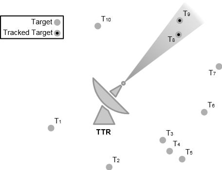
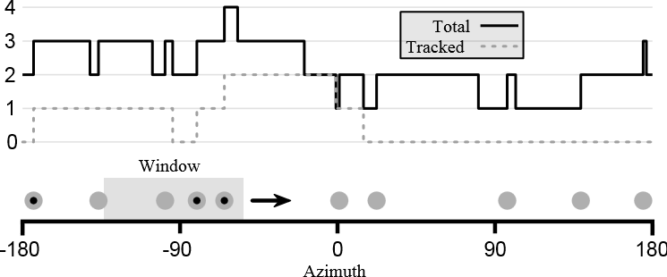

.. ****************************************************************************
.. CUI//REL TO USA ONLY
..
.. The Advanced Framework for Simulation, Integration, and Modeling (AFSIM)
..
.. The use, dissemination or disclosure of data in this file is subject to
.. limitation or restriction. See accompanying README and LICENSE for details.
.. ****************************************************************************

WSF_SENSORS_MANAGER_FOV
-----------------------

.. model:: processor WSF_SENSORS_MANAGER_FOV

**Derives From:** :model:`WSF_SIMPLE_SENSORS_MANAGER`

Script Class: :class:`WsfSensorsManagerFOV`

.. parsed-literal::

   processor <name> :model:`WSF_SENSORS_MANAGER_FOV` 
      :model:`WSF_SIMPLE_SENSORS_MANAGER` Commands ...

      
   end_processor

Overview
========

:model:`WSF_SENSORS_MANAGER_FOV` extends :model:`WSF_SIMPLE_SENSORS_MANAGER` to provide more sophisticated slewing control. It is identical in all other respects. While the simple sensor manager points a TTR directly at assigned targets in an undefined order, the sensor manager FOV slews a TTR to the region of space in which it could see the most targets. The full sensor manager FOV algorithm is given in the `Updating`_ section below. For brevity, this page will often refer to a **WSF_SENSORS_MANAGER_FOV** as simply "the sensor manager" or "the manager."

TTR aux_data
============

The sensor manager queries :command:`_.aux_data` defined in subordinate TTRs to discover additional sensor parameters. Note that these parameters are not defined in a sensor manager's :command:`_.aux_data`, but in that of a TTR :command:`sensor`. If an auxiliary parameter is not specified, it will be set to a default value.

.. _sm_fov_resting_azimuth:

.. command:: unitary RESTING_AZIMUTH = <angle-value>

   The azimuth to which the TTR will return when it has no more assignments. This azimuth is defined in the :ref:`PCS frame <PCS>` of the the TTR (thus, setting this value to 0 degrees points the resting azimuth directly in front of the sensor, 90 degrees points it to the right, -90 to the left, and 180 degrees directly behind). Since this is an azmiuth, it should be in the range [-180, 180] degrees.

   **Default:** 0 degrees

.. _sm_fov_coarse_slew_rate:

.. command:: unitary COARSE_SLEW_RATE_AZIMUTH = <angular-speed-value>

   The speed at which the TTR will slew in azimuth when it does not have targets in its field of view.

   **Default:** Infinity

.. _sm_fov_fine_slew_rate:

.. command:: unitary FINE_SLEW_RATE_AZIMUTH = <angular-speed-value>

   The speed at which the TTR will slew in azimuth when it has targets in its field of view.

   **Default:** Infinity

TTR Restrictions
================

The sensor manager takes control of some aspects of its subordinate TTRs. This includes the :command:`_.platform_part.on`/:command:`_.platform_part.off` state; the :command:`_.articulated_part.azimuth_slew_rate` and :command:`sensor_mode.azimuth_cue_rate`; and the cued location/angle/target. These aspects **should not** be modified from script. Doing so will interfere with the operation of the manager, and produce odd results. The manager also requires that TTR sensors use a default :ref:`sensor scheduler <sensor_detection_scheduling_commands>`. Using another scheduler will also produce odd results.

The sensor manager only cues a TTR sensor to a single location, so it will not operate correctly for sensors with multiple antennas or beams if the antennas/beams can point in multiple directions at the same time. However, it is able manage multiple sensors if they are present on the same platform.

.. _sm_fov_computing_cue_azimuth:

Computing Cue Azimuth
=====================

The major responsibility of the sensor manager is to compute the direction in which to point a TTR by considering its current assignments. This section will refer to an assignment given to a TTR as a *target*. In computing the cue azimuth, the manager considers the azimuth of the target relative to the sensor, and whether or not the sensor is currently tracking the target. The image below is a top-down view of a set of targets around a TTR.

The wedge containing the tracked targets T ``8`` and T ``9`` represents one possible azimuth of the sensor, where the angle of the wedge represents the width of the sensor beam. For radar sensors, this is typically the half-power beam width; for geometric sensors, it is the azimuth field of view; other sensor types may define this width differently. The cue azimuth is determined by finding the wedge that contains the most tracked targets. Given that two wedges contain the same number of tracked targets, the one with more targets (tracked or not) is chosen. Given that two wedges contain the same number of targets, the one with the denser target grouping (in azimuth) is chosen. Within this wedge, the manager cues the TTR to the middle of the target grouping (more precisely, the mean of all the target azimuths).

In the image above, T ``3``, T ``4``, and T ``5`` form a dense group that fit into an azimuth wedge; however, the sensor is already busy tracking two targets, T ``8`` and T ``9``, so the TTR is cued such that its beam contains these two targets instead.

This strategy prevents the TTR from abandoning targets it is already tracking, prioritizes groups with more targets, and favors dense groups over sparse ones.

Updating
========

The sensor manager is updated periodically by the IADS C2 system. Each update, in addition to the base sensor manager duties, the FOV sensor manager performs some additional actions to each subordinate TTR. First, it checks if the TTR has any assignments. If not, the manager makes sure the TTR is turned off, sets its slew rate to the :ref:`coarse slew rate <sm_fov_coarse_slew_rate>`, and cues it to its :ref:`resting azimuth <sm_fov_resting_azimuth>`. Otherwise, the manager :ref:`computes the cue azimuth <sm_fov_computing_cue_azimuth>` for the TTR, and cues the TTR to this azimuth. If the cued azimuth is within the sensor's current field of view, the manager makes sure the TTR is on, and sets its slew rate to the :ref:`fine slew rate <sm_fov_fine_slew_rate>`; otherwise, the manager makes sure the TTR is off, and sets its slew rate to the :ref:`coarse slew rate <sm_fov_coarse_slew_rate>`.

Computing Cue Azimuth - for Developers
======================================

The algorithm for computing the cue azimuth in the AFSIM port diverges from the original HELIOS implementation. The new version is more efficient and produces a more accurate result, though it may be difficult to understand from the code alone. The intent of this section is to explain the confusing parts of the algorithm. A *target* in this section refers to an assignment given to a TTR. 

The image below will be freqeuntly referenced for the remainder of this section.

This image shows a number line from -180 to 180 degrees, representing the azimuth angle around a sensor. Along the number line are a series of targets, represented by circles. The circles with a dot in the center are *tracked* targets. The gray box with an arrow to the right to it represents the azimuth field-of-view (called the *azimuth wedge* in the previous section); this will be called the *azimuth window* in the remainder of this section, or simply the window. It is easy to compute which targets are in a particular window by simply iterating over all targets, and checking if each target is within the minimum and maximum limits of the window. However, there are an infinite number of possible windows, so checking all of them is impossible. HELIOS solves this problem by trying 360 different windows, at 1 degree intervals. However, this is an expensive computation (unless the number of targets is very large, which is not typical). Also, considering that TTRs typically have a field of view of only a few degrees, the 1 degree increments could introduce some significant errors.

Referring to the image again, the graph above the number line shows the number of targets and the number of tracked targets when the right edge of the azimuth window is at a particular azimuth. Recall that azimuths wrap around at 180 degrees, so azimuth windows near -180 degrees also include targets near +180 degrees. The graph is a discrete function (that is, it is not a smooth curve, but a series of rising and falling edges). The graph changes values only when a target enters or exits the window as the window slides forward. We can compute the number of targets efficiently by the following algorithm:

::

   // sort targets in ascending order by azimuth
   sort(targets) 

   windowSize = field of view of window
   minIndex = 0
   maxIndex = 0

   // find which targets are in initial window
   WHILE maxIndex < length(targets) AND targets[maxIndex].azimuth <= windowSize
      maxIndex += 1

   leftEdge = 0
   rightEdge = windowSize
   LOOP
      // handle wraparound
      wrappedMaxIndex = maxIndex mod length(targets)
      wrappedRightEdge = rightEdge
      IF wrappedRightEdge > 180
         wrappedRightEdge -= 360

      minTargetDistance = targets[minIndex].azimuth - leftEdge
      maxTargetDistance = targets[wrappedMaxIndex].azimuth - wrappedRightEdge

      IF maxTargetDistance >= minTargetDistance
         // target entering window
         maxIndex += 1
         slideDistance = maxTargetDistance
      ELSE
         // target exiting window
         minIndex += 1
         slideDistance = minTargetDistance

      // advance the window
      leftEdge += slideDistance
      rightEdge = leftEdge + windowsSize

      IF leftEdge >= 180
         BREAK

      targetCount = maxIndex - minIndex

The algorithm keeps track of the targets in the window using the ``minIndex`` (inclusive) and ``maxIndex`` (exclusive) variables. It keeps track of the location of the window using the ``leftEdge`` and ``rightEdge`` variables, which mark the minimum and maximum azimuth of the window, respectively. The targets are stored in a sequential list called ``targets``. The main loop of the algorithm begins by computing how far to advance window for a target to enter the window, and how far to advance it for a target to exit the window. The minimum of these two distances determines the next rising/falling edge of the target count graph. If a target is entering the window, ``maxIndex`` needs to be incremented; if one is exiting the window, ``minIndex`` needs to be incremented. Then, the window is advanced by the minimum distance. The target count can be computed simply by subtracting ``minIndex`` from ``maxIndex``. The loop is done when the left edge of the window has advanced past the maximum possible azimuth; this means that all possible azimuths have been checked.

The full computation is interested in determining the maximum target count, the maximum tracking count, and the minimum group sparseness, so the real code has some additional bookkeeping to determine these values. However, the meat of the algorithm is contained in the code sample above.
