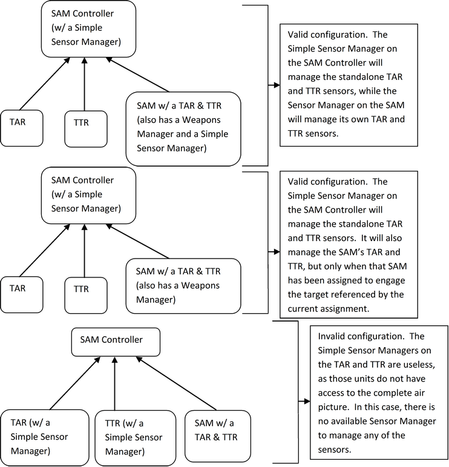
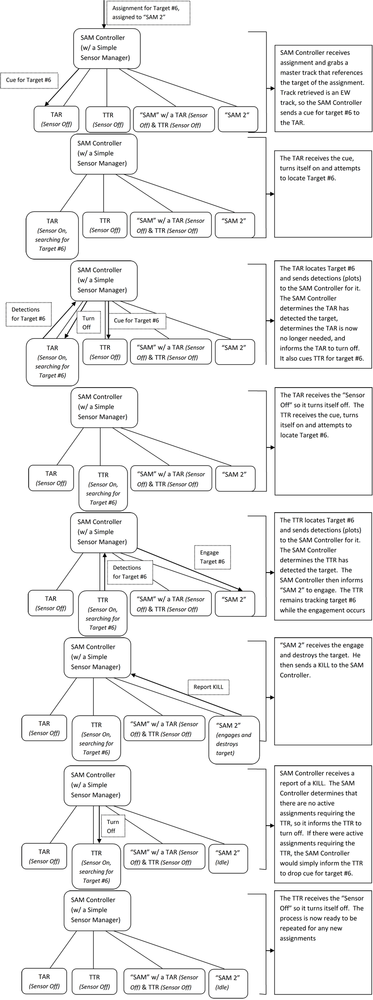

.. ****************************************************************************
.. CUI//REL TO USA ONLY
..
.. The Advanced Framework for Simulation, Integration, and Modeling (AFSIM)
..
.. The use, dissemination or disclosure of data in this file is subject to
.. limitation or restriction. See accompanying README and LICENSE for details.
.. ****************************************************************************

WSF_SIMPLE_SENSORS_MANAGER
--------------------------

.. model:: processor WSF_SIMPLE_SENSORS_MANAGER

**Derives From:** :model:`WSF_SENSORS_MANAGER`

**Script Classes:** :class:`WsfSimpleSensorsManager`

.. parsed-literal::

   processor <name> :model:`WSF_SIMPLE_SENSORS_MANAGER`
      :model:`WSF_SENSORS_MANAGER` Commands ...

   end_processor

Overview
========

:model:`WSF_SIMPLE_SENSORS_MANAGER` is the script class for the HELIOS-based GTISimpleSensorManager port. The Simple Sensors Manager is an Asset Manager subsystem which manages certain sensors either located on that unit or on subordinate units. It is responsible for turning sensors on/off at appropriate times, cuing sensors for certain targets, canceling cues for certain targets, and CANTCOing assignments if cued sensors are unable to locate the desired target. Essentially, it controls all necessary sensor processing and handling for assignments.

Script Interface
================

:model:`WSF_SIMPLE_SENSORS_MANAGER` utilizes capabilities of the
:ref:`Common_Script_Interface` and :model:`WSF_SCRIPT_PROCESSOR`.

Simple Sensors Manager Commands
===============================

The Simple Sensors Manager model doesn't add any functionality above what
is provided by the :model:`WSF_SENSORS_MANAGER`
base class.

Simple Sensors Manager Configuration
====================================

There are various correct ways to setup Simple Sensor Managers on units.  There is only one core requirement for a unit to correctly utilize an attached Simple Sensor Manager: The unit must have access to the complete air picture (i.e. the unit must be able to store master tracks for detected targets).  If the Simple Sensor Manager is connected to a unit that does not meet this requirement, say a TTR that simply disseminates plots to its commander, that Sensor Manager is rendered useless.  It is important to note that such a configuration will not necessarily cause issues.  Instead, that Sensor Manager will simply provide no extra functionality for that unit.

Simple Sensors Manager Processing
=================================

When a Simple Sensor Manager receives an assignment, the following process occurs:

1. The unit ensures it has a handle to a master track that references that assignment.  The Sensor Manager must have a track that references the assignment in order to continue processing for that assignment, as it must be aware of the position of the target. Without knowledge of the target's position, the Sensor Manager is unable to inform cued sensors on the area of the air picture to search for that target. 

2. If the above is satisfied, the master track that references the assignment is checked for track source/quality.  The next sensor type cued for the assignment is dependent on the current track quality.  The order of track quality is as follows: EW, TAR, TTR, TTR/A. Therefore, if the current source is an EW track, the Sensor Manager attempts to cue a TAR on the target.  If there is no TAR available to cue, a TTR is then attempted, and so forth. 

3. Once the next desired track source is determined, the Sensor Manager attempts to cue a sensor of that source for the target.  Certain priority is given to certain sensors.  Whenever a sensor is cued for a target, it is automatically switched on if currently off.  The algorithm below is followed when attempting to locate a sensor of the desired type: 

   a. First priority is given to the assigned unit for that assignment.  If the assigned unit has a sensor of the desired type, it is cued to locate the target. 

   b. If the assigned unit does not have the desired sensor, all subordinates are then checked. Any subordinate (or the current unit itself) that has the desired radar and that does not have a Weapons Manager is cued to locate the target.  Subordinates with Weapons Managers are ignored in this case as it is assumed these units are weapons units and do not function as strictly search sensors. The only exception is when one of these units are actually assigned the target (as mentioned in a. above).  

4. If the Sensor Manager is able to cue a radar to locate the target, that Sensor Manager adds a responsibility for that assignment.  Thus, whenever that assignment is processed again, the Sensor Manager checks the current state of the assignment to determine if the cued sensor has located the target yet.  If the sensor has, the above process is repeated to determine if a higher quality sensor can be cued to locate the target. 

5. If the sensor of the highest available quality has been cued, the Sensor Manager then simply monitors the assignment and waits for the assignment to be completed.  Once the assignment has been completed, the Sensor Manager then removes its responsibility for that assignment.  At this point, the Sensor Manager determines if it is time to turn off the sensor last active for the assignment.  If the user has configured the Sensor Manager to turn off sensors of the current type and the Sensor Manager determines no other active assignments are currently using the current sensor, that sensor is then turned off. 

The algorithm also cancels cue assignments if the "Maximum acquisition time" configured by the user has been exceeded and the sensor has yet to locate the target.  If this occurs, the assignment is then CANTCO'd and the radar drops the cue for the target.

Let’s assume the user has the most traditional setup here, which is the first displayed above.  The typical process the Simple Sensor Manager performs for a single assignment is described step-by-step below:

If the assigned unit for the assignment happened to be the "SAM" unit instead of "SAM 2", the same process would apply, except the SAM Controller would instead manage the TAR and the TTR on the "SAM" and would leave the standalone TAR and TTR off. 

**NOTE: The Sensor Manager should be placed at the level above the TAR and TTR. The TAR and TTR radars should NOT have a Sensor Manager.**